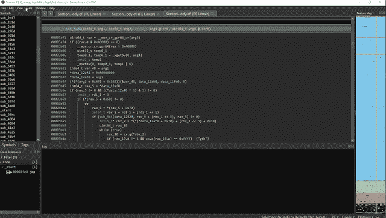

# Bn-Uefi-Helper:用于分析 Uefi 固件的助手插件

> 原文：<https://kalilinuxtutorials.com/bn-uefi-helper/>

Bn-Uefi-Helper 是一个帮助分析 Uefi 固件的工具插件。该插件包含以下功能:

*   将正确的原型应用于入口点功能
*   修复段，使所有段都是 RWX，并且具有正确的语义
    *   这允许正确地呈现全局函数指针
*   核心 UEFI 服务的应用类型(来自新 EDK 协议)
*   找到已知的协议 GUID，并分配 GUID 类型和符号
*   在入口和初始化函数中定位全局赋值，并赋值类型
    *   `**EFI_SYSTEM_TABLE**`、`**EFI_RUNTIME_SERVICES**`、`**EFI_BOOT_SERVICES**`等…
*   简洁可执行文件的加载程序

[**Download**](https://github.com/zznop/bn-uefi-helper)