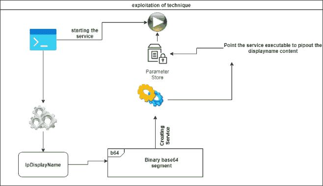
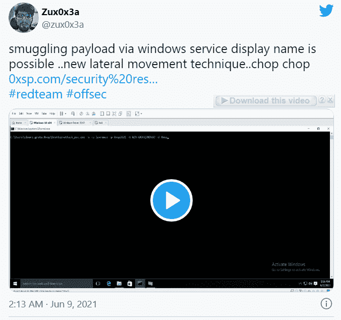

# TChopper:通过利用未过滤的服务显示名称将二进制文件作为块偷偷放入目标机器，进行横向移动攻击

> 原文：<https://kalilinuxtutorials.com/tchopper/>

TChopper 是我最近发现的一项新技术，并给了它一个昵称(Chop chop ),它通过将恶意二进制文件作为 base64 块进行走私，使用 windows 服务显示名称和 WMI 来执行横向移动，并使用 TChopper 工具自动执行该过程。

**工作原理**

*   该工具将获得你想要走私的文件，并将该文件以 base64 编码到内存流中
*   将每行的长度划分为 150-250 个字符长度(250 是服务 lpDisplayname 参数[允许的最大空间 https://docs . Microsoft . com/en-us/windows/win32/API/winsvc/nf-winsvc-create service a](https://docs.microsoft.com/en-us/windows/win32/api/winsvc/nf-winsvc-createservicea))。
*   对于 chop chop 攻击，它将为每个分段的块创建一个唯一的服务= >启动服务= >然后删除它以避免重复，或者您可以通过选择攻击模式选项( **-m** )来选择仅修改服务攻击模式，以使其更加快速和稳定
*   稍后，它将使用所需的命令行修改服务 lpbinarypath 参数，以获取服务显示名称，并将结果输出到 tmp_payload.txt 中
*   最后，在以 base64 格式提交完文件的所有内容后，该工具将创建另一个服务来将内容解码成有效的 executbale 并运行它

而如果你使用 WMI 技术进行横向移动，你也可以使用斩波器

*   Tchopper 将使用 WMI 验证您的会话
*   创建多个进程，并使用 powershell unique 命令将每个段输出到 c:\users\public\chop.enc
*   创建最终进程以使用 certutil 将内容解码为二进制并执行它

**用途**

# **斩斩模式
chopper.exe-s-u 用户名-p 密码-d 域-f 二进制本地路径
#斩斩完成
chopper.exe-m-u 用户名-p 密码-d 域-f 二进制本地路径
#利用 WMI 偷渡
chopper.exe-w-u 域\用户名-p 密码-t 机-f 本地二进制路径**

[**Download**](https://github.com/lawrenceamer/TChopper)