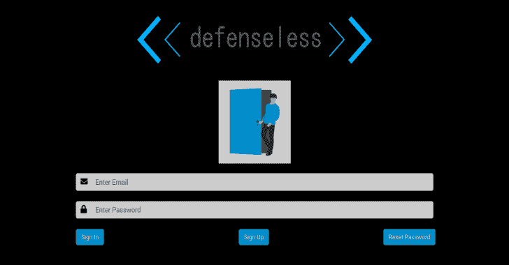

# 毫无防备 1:只是另一个易受攻击的网络应用程序

> 原文：<https://kalilinuxtutorials.com/defenselessv1/>

defenselessV1 是用 PHP/MySQL 编写的易受攻击的 web 应用程序。这是这个应用程序的第一个版本。该应用程序的目的是在开发人员和应用程序安全新手中建立安全意识。它将很快更新更多的错误，一个新的易受攻击的应用程序也正在开发中。请让我知道如何改善这一点。

**设置**

设置这个应用程序很容易。

*   下载并在 phpmyadmin 中创建新的数据库。
*   将数据库命名为 *testapp* 。然后，导入文件 testapp(2)。testapp 数据库中的 sql。
*   刷新它，你就可以开始了。

[**Download**](https://github.com/infosecAK/defenselessV1)