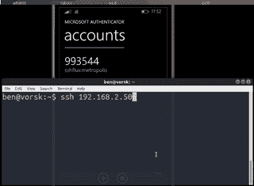

# TotP-SSH-Fluxer:将安全性从默默无闻提升到新的水平

> 原文：<https://kalilinuxtutorials.com/totp-ssh-fluxer/>

Totp-Ssh-Fluxer 将把安全性从默默无闻提升到一个新的高度。有些人改变了他们服务器上的 SSH 端口，这样就更难发现僵尸程序或其他恶意程序，虽然这通常被视为[安全通过隐藏](https://en.wikipedia.org/wiki/Security_through_obscurity)的一种行动，但它在杀死很多你在`**/var/log/auth.log**`中经常看到的自动登录方面确实非常有效

然而，如果我们能把这带到一个荒谬的水平呢？如果我们可以使用通常用作第二因子代码的 [TOTP](https://en.wikipedia.org/wiki/Time-based_One-time_Password_Algorithm) 代码登录网站，以实际了解 sshd 服务器正在监听哪个端口，会怎么样？

为此，我提出了 [totp-ssh-flux](https://github.com/benjojo/totp-ssh-fluxer) ，这是一种确保您的 sshd 端口每 30 秒改变一次的方法，可能会让您的对手有一段时间感到沮丧。

**演示:**

你可以在这里看到我的手机(使用一个通用的 TOTP 客户端)生成代码，然后我可以用它作为 SSH 进入服务器的端口。

其背后的软件相当简单，它在一个循环中运行，执行以下操作

*   生成 TOTP 令牌
*   取最后一位数字，如果结果高于 65536，再做一次
*   添加一个 iptables 预路由规则来重定向上面生成的号码
*   等待 30 秒，删除该规则，重复。

有趣的是，因为这是在`**PREROUTING**`中完成的，所以即使代码过期，已建立的连接仍然保持连接。

**安装**

您很可能会在 [totp-ssh-flux](https://github.com/benjojo/totp-ssh-fluxer) 项目自述文件中找到更多最新的说明

请注意，目前我不会真的推荐运行这个软件，它只是作为一个笑话写的。

在写这个项目的时候只是一个单独的文件，你需要安装 [golang](https://golang.org/) ，然后是`**go get**`和`**go build**`

以 root 身份运行程序(它需要，对不起，它正在编辑 iptables)

第一次运行时，该程序将在`**/etc/ssh-flux-key**`中为主机生成一个令牌(您可以使用`-**keypath**`选项来更改它)，您可以将它输入到您的手机或其他客户端。

您可以通过运行`**watch iptables -vL -t nat**`并等待 iptables 规则被插入和删除来确认它的工作。

[**Download**](https://github.com/benjojo/totp-ssh-fluxer)