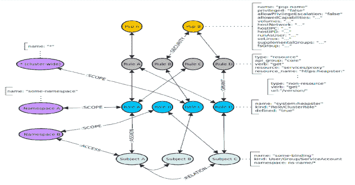

# Krane : Kubernetes RBAC 静态分析和可视化工具

> 原文：<https://kalilinuxtutorials.com/krane/>

Krane 是一个简单的 Kubernetes RBAC 静态分析工具。它确定了 K8s RBAC 设计中的潜在安全风险，并就如何减轻这些风险提出了建议。 *Krane* 仪表盘显示当前 RBAC 的安全态势，并让您浏览其定义。

**特性**

*   **RBAC 风险规则**–*克莱恩*评估一套内置的 RBAC 风险规则。这些可以用一组自定义规则来修改或扩展。
*   **便携性**–*Krane*可以运行在以下模式之一:
    *   本地作为 CLI 或 [docker 容器](https://quay.io/repository/appvia/krane?tab=tags)。
    *   在 CI/CD 管道中，作为在应用到集群之前检测潜在 RBAC 缺陷的分步操作。
    *   作为一个独立的服务，持续分析 Kubernetes 集群中 RBAC 的状态。
*   **报告**–*Krane*以机器可读的格式制作一份易于理解的 RBAC 风险报告。
*   **仪表盘**–*Krane*附带一个简单的仪表盘 UI，帮助您了解集群内 RBAC 设计。仪表板提供 RBAC 安全态势的高级概述，并突出显示检测到的风险。它还允许通过分面树和图形网络视图进行进一步的 RBAC 控制检查。
*   **警报**–它将通过其松散集成对检测到的中高严重性风险发出警报。
*   **图表中的 RBAC**–*Krane*在本地图表数据库中对整个 Kubernetes RBAC 进行索引，这使得通过任意的 CypherQL 查询对 RBAC 数据进行任何进一步的特别查询变得容易。

**本地快速启动**

从本地开始使用 Docker Compose。

**先决条件**

假设您已经在本地机器上运行了 [docker](https://docs.docker.com/get-docker/) 。如果你还没有安装 [docker-compose](https://docs.docker.com/compose/install/#install-compose) 。

**本地运行 Krane】**

Krane 依靠再贴现。 **`docker-compose`** 栈定义了在本地构建和运行 *Krane* 服务所需的一切。它还会处理它的 [RedisGraph](https://oss.redislabs.com/redisgraph/) 依赖关系。

**坞站-合成 up -d**

如果本地机器上没有 docker 映像，则会自动预构建。

注意在本地运行`**docker-compose**`时， *Krane* 不会自动启动 RBAC *报表*和*仪表盘*。相反，默认情况下，容器将休眠 24 小时——该值可在 **`docker-compose.override.yml`中调整。** Exec 到正在运行的 *Krane* 容器中运行命令。Local `**docker-compose**`还将在容器中挂载 kube config **( `~/.kube/config` )** ，使您能够针对您已经可以访问的任何 Kubernetes 集群运行报告。

# **Exec 到一个运行中的 Krane 容器
docker-compose Exec Krane bash
#一旦进入容器，你就可以开始使用`krane`命令。试试`krane -help`。
$ krane -h**

要检查正在运行的服务和相关端口:

**坞站-化合物 ps**

要停止 *Krane* 及其依赖服务:

**坞站-复合下行**

**使用指南**

**命令**

**$ krane–help
名称:
krane
描述:
Kubernetes RBAC 静态分析&可视化工具
命令:
仪表板开始 K8s RBAC 仪表板服务器
帮助显示全局或【命令】帮助文档
报告运行 K8s RBAC 报告
全局选项:
-h，–help
显示帮助文档
-v，–版本
显示版本信息
-t，–trace【跟踪**

**生成 RBAC 报告**

**同当地`kubectl`语境**

要针对正在运行的集群运行报告，您必须提供一个 *kubectl* 上下文

**krane report -k** **<语境>**

如果您计划对多个集群运行该工具，并为每个集群名称分别索引 RBAC 图，您也可以传递 **`-c <cluster-name>`** 标志。

**来自 RBAC 的文件存放在**目录下

要针对本地 RBAC yaml/json 文件运行报告，请提供目录路径

**krane report-d</path/to/RBAC-directory>**

**注意** : *Krane* 期望以下文件(YAML 或 JSON 格式)出现在指定的目录路径中:

*   掌上游戏机
*   角色
*   集群角色
*   角色绑定
*   clusterrolebindings

**Kubernetes 星团内部**

从 Kubernetes 集群中运行的容器运行报告

**krane 报告–包括**

**注意: *Krane* 使用的**服务帐户需要访问 RBAC 资源。详见[先决条件](https://github.com/appvia/krane/blob/master/k8s/one-time/prerequisites.yaml)。

**在 CI/CD 管道中**

验证 RBAC 定义作为 CI/CD 管道中的一个步骤

**krane report–ci-d</path/to/RBAC-directory>**

**注意:** *Krane* 希望本地存储的 RBAC 资源文件遵循一定的命名约定。参见上面的[部分](https://github.com/appvia/krane#from-rbac-files-stored-in-the-filesystem)。为了运行`**krane**`命令，建议 CI 执行程序引用[quay.io/appvia/krane:latest](https://quay.io/repository/appvia/krane?tab=tags)docker 映像。

CI 模式由 **`--ci`** 标志启用。当检测到一个或多个危险时，Krane 将返回非零状态代码以及违反风险规则的详细信息。

**可视化仪表盘**

要查看 RBAC 分面树、网络图和最新报告结果，您需要首先启动仪表板服务器。

**krane 仪表盘**

如果要针对特定集群名称运行仪表板，可以传递集群标志 **`-c <cluster-name>`** 。仪表板将查找与文件系统上缓存的指定集群名称相关的数据。

上面的命令将在默认端口`**8000**`上启动本地 web 服务器，并显示仪表板链接。

**架构**

**在本地图形数据库中索引的 RBAC 数据**

RBAC 实体再贴现指数。这使得我们可以使用由 [RedisGraph](https://oss.redislabs.com/redisgraph/) 支持的 [CypherQL](https://oss.redislabs.com/redisgraph/cypher_support/) 的子集，高效而简单地查询依赖关系网络。

**节点**

在图形中为相关的 RBAC 对象创建了以下节点:

*   `**Psp**`–包含 pod 安全策略相关属性的 PSP 节点。
*   **`Rule`**–规则节点表示围绕 Kubernetes 资源的访问控制规则。
*   `**Role**`–角色节点代表给定的角色或集群角色**。`kind`** 属性定义角色类型。
*   `**Subject**`–Subject 代表集群中所有可能的参与者( **`kind` :** 用户、组和服务帐户)
*   `**Namespace**`—库命名空间节点。

**边缘**

*   **`:SECURITY`**–定义规则和 Psp 节点之间的链接。
*   `**:GRANT**`–定义角色和与该角色相关联的规则之间的链接。
*   **`:ASSIGN`**–定义参与者(主体)和给定角色/集群角色(角色节点)之间的链接。
*   `**:RELATION**`–定义两个不同的 Actor (Subject)节点之间的链接。
*   `**:SCOPE**`–定义角色和名称空间节点之间的链接。
*   `**:ACCESS**`-定义主题和命名空间节点之间的链接。
*   `**:AGGREGATE**`–定义集群角色之间的链接(一个集群角色聚合另一个)`**A-(aggregates)->B**`
*   **`:COMPOSITE`**–定义集群角色之间的链接(一个集群角色可以在另一个集群角色中聚合)`**A<-(is a composite of)-B**`

所有的边都是双向的，这意味着图形可以在任一方向上查询。唯一的例外是单向的`**:AGGREGATE**`和`**:COMPOSITE**`关系，尽管它们涉及相同的边节点。

**查询图形**

为了直接查询图形，你可以进入一个正在运行的 **`redisgraph`** 容器，启动 **`redis-cli`** 并运行你的任意查询。遵循官方[指令](https://oss.redislabs.com/redisgraph/)获取[命令](https://oss.redislabs.com/redisgraph/commands/)的示例。

您也可以从 *Krane* 控制台查询图表。第一个执行进入运行 *Krane* 集装箱，然后

**# Start Krane console–这将打开预先加载了 Krane 代码的交互式 ruby shell】控制台
# Instantiate Graph client
Graph = Krane::Clients::redisgraph . client cluster:' default '
#对索引的 RBAC 图形运行任意的 CypherQL 查询
RES = Graph . query(% Q(
MATCH(r:Rule { resource:" config maps "，动词:" update " })<-[:GRANT]-(ro:Role)<-[:ASSIGN]-(s:Subject)** 

**结果…
+————————————————————————
| subject _ kind | subject _ name | Role _ kind | Role _ name |
+—————————————————————————————————————————————————————————————————————————————————————————————————————————————————**

**注意**:上面的查询示例将选择所有被分配了角色/集群角色的主题，这些角色授予对 **`update configmaps`的访问权限。**

**配置**

**RBAC 风险规则**

RBAC 风险规则在[规则](https://github.com/appvia/krane/blob/master/config/rules.yaml)文件中定义。每个规则的结构在很大程度上是不言自明的。内置设置可以通过添加额外的自定义规则到[自定义规则](https://github.com/appvia/krane/blob/master/config/custom-rules.yaml)文件来扩展/覆盖。

**风险规则宏**

宏是一组公共/共享属性的“容器”，由一个或多个风险规则引用。如果您选择在给定的风险规则中使用宏，您需要通过名称引用它，例如`**macro: <macro-name>**`。请注意，引用的`**macro**`中定义的属性将优先于规则级别上定义的相同属性。

宏可以包含以下任何属性:

*   `**query**`–[再贴现查询](https://github.com/appvia/krane#querying-the-graph)。**优先于`template`。**需要定义`**writer**`。
*   `**writer**`–Writer 是用于格式化`**query**`结果集的 Ruby 表达式。作家优先于`**template**`。
*   `**template**`–内置查询/编写器模板名称。如果未指定`**query**` & `**writer**`，则选择的查询生成器将与匹配的编写器一起使用。

**风险规则属性**

规则可以包含以下任何属性:

*   `**id**`[必需]规则 id 是唯一的规则标识符。
*   **`group_title`** 【必填】标题适用于此风险检查下的所有项目。
*   `**severity**`【必需】严重程度，为:危险，:警告，:信息之一。
*   `**info**`【必填】关于检查的文字信息以及如何降低风险的建议。
*   `**query**`【条件】[再贴现查询](https://github.com/appvia/krane#querying-the-graph)。
    *   优先于`**template**`。需要定义 **`writer`** 。
*   `**writer**`【conditional】Writer 是用于格式化查询结果集的 Ruby 表达式。
    *   作家优先于 **`template`。**需要 **`query`** 来定义。
*   `**template**`【条件】内置查询/编写器模板名称。如果未指定 **`query`** & `**writer**`，则选择的查询生成器将与匹配的编写器一起使用。
    *   一些内置模板要求在单个规则级别上指定`**match_rules**`属性，以便构建正确的查询。当前需要它的模板:
        *   ***——风险角色***——根据 **`match_rules`指定的访问规则构建多匹配图查询。**生成的图形查询返回以下列:
            *   角色名称
            *   角色 _ 种类
            *   namespace_name(如果返回多个项目，则返回一个*数组*)
*   **`match_rules`** 【条件】当`**template**`依赖匹配规则来构建查询时需要。

**举例:**

**match _ rules:
–resources:[' cron jobs ']
动词:['update']**

属性和值遵循 [Kubernetes RBAC 角色规范](https://kubernetes.io/docs/reference/access-authn-authz/rbac/#role-examples)。

`**custom_params**`[可选]要在规则`**query**`和`**writer**`表示中评估和替换的自定义键值对列表。

**举例:**

**custom _ params:
–attrA:valueA
–attrB:valueB**

*   **`{{attrA}}`** 和`**{{attrB}**}`上方按键的模板占位符将分别替换为`**valueA**`和`**valueB**`。

*   `**threshold**`【可选】数值。定义后，它将成为 **`writer`** 表达式中的模板占位符`**{{threshold}}**`。
*   **`macro`** 【可选】引用命名宏中定义的公共参数。
*   `**disabled**`[可选]当设置为`**true**`时，它将禁用给定的规则并将其从评估中排除。默认情况下，所有规则都处于启用状态。

**风险规则示例**

**明确查询&作家表情**

**–id:verbose-rule-Example
group _ title:Example rule
severity::danger
info:Risk description and instructions on how to mitch it go here
query:|
MATCH
(s:Subject)-[:ACCESS]->(ns:Namespace)
其中
不是{{whitelist_subject_names}}
中的 s.name 返回
s.kind 作为 subject_kind，
s.name 作为 subject_name**

上面的例子明确定义了一个用于评估 RBAC 风险的图`**query**`，以及一个用于格式化查询结果集的 **`writer`** 表达式。该查询简单地选择他们有权访问的所有`**Subjects**`(不包括白名单)和 **`Namespaces`** 。注意，结果集将只包括能够访问超过 **`2`** 名称空间的 **`Subjects`** (注意那里的`**threshold**`值？).最后一个**`writer`**的表达式将被捕获为格式化的结果项输出。

`**writer**`可以通过`**result**`对象用匹配查询返回元素的方法访问结果集项，如 **`result.subject_kind`、** **`result.subject_name`** 等。

**注:**

*   `**writer**`表达式中的`**{{threshold}}**`占位符将被规则的`**threshold**`关键字值替换。
*   **`{{whitelist_subject_names}}`** 代表一个自定义字段，该字段将插入为给定规则 **`id`定义的[白名单](https://github.com/appvia/krane#rbac-risk-whitelist)值。**如果白名单中没有定义占位符字段名，默认情况下会用空数组 **`['']`** 替换。阅读以下关于白名单的更多信息。

**模板化风险规则**

内置模板极大地简化了风险规则定义，但是，它们旨在提取特定类型的信息，可能不太适合您的自定义规则。如果您发现自己在多个规则中重复使用相同的`**query**`或`**writer**`表达式，您应该考虑将它们提取到一个`**macro**`中，并在您的自定义规则中引用它来干燥它们。

**–id:Risky-any-verb-secrets
group _ title:Risky Roles/clusters Roles 允许对机密进行所有操作
severity::danger
info:Roles/cluster Roles 允许对机密进行所有操作。这可能很危险。查看列出的角色！
模板:risky-role
match _ rules:
–资源:['secrets']
动词:[' *]**

上面的例子显示了一个内置规则。它引用了 **`risky-role`** 模板，该模板在处理时将通过在规则评估触发之前注入`**query**`和`**writer**`表达式来扩展规则。`**match_rules**`将用于建立合适的匹配查询。

**RBAC 风险白名单**

可选的白名单包含一组自定义的属性名称和相应的(白名单)值。

**白名单属性**

属性名及其值是任意的。它们在[白名单](https://github.com/appvia/krane/blob/master/config/whitelist.yaml)文件中定义，分为三个独立的部分:

*   `**global**`–顶级范围。此处定义的自定义属性将应用于所有风险规则，而不考虑群集名称。
*   `**common**`–无论集群名称如何，自定义属性都将限定在特定风险规则`**id**`的范围内。
*   `**cluster**`(具有集群名称的嵌套列表)–自定义属性将应用于给定集群名称的特定风险规则 **`id`** 。

每个[风险规则](https://github.com/appvia/krane#rbac-risk-rules)在评估后，将尝试插入 **`query`、**中使用的所有参数占位符，例如`**{{your_whitelist_attribute_name}}**`。如果占位符参数名称(即双花括号之间的名称)与该风险规则 **`id`** 的任何白名单属性名称匹配，它将被其计算值替换。如果给定的占位符没有找到值，它将被替换为 **`['']`。**

**白名单示例**

下面的白名单示例为具有与*“某个风险规则 id”*匹配的`**id**`属性值的[风险规则](https://github.com/appvia/krane#rbac-risk-rules)生成了以下`**placeholder-key => value**`映射

**{ {白名单 _ 角色 _ 姓名}} = > ['acp:普罗米修斯:操作员']
{ {白名单 _ 主题 _ 姓名}} = > ['特权-PSP-用户'，'另一个-用户']**

在自定义图表查询中使用时，上面的占位符关键字将在风险规则评估后被其各自的值替换。

示例:

**规则:
全局:#全局范围–适用于所有风险规则和集群名称
白名单 _ 角色 _ 名称:#自定义属性名称
–ACP:Prometheus:操作员#自定义属性值
公共:#公共范围–适用于特定风险规则 id，而不考虑集群名称
some-risk-rule-id: #这对应于 config/rules.yaml
白名单 _ 主题 _ 名称:#自定义属性名称【T7–特权-PSP-用户#自定义属性值【T8 群集范围–适用于特定的风险规则 id 和群集名称
默认值:#示例群集名称
some-risk-rule-id: #风险规则 id
whitelist _ subject _ names:#自定义属性 nane
–另一个用户#自定义属性值**

**Kubernetes 部署**

Krane 可以轻松部署到本地或远程 Kubernetes 集群。

**K8s 先决条件**

Kubernetes 命名空间、服务帐户以及适当的 RBAC 必须存在于集群中。请参考[先决条件](https://github.com/appvia/krane/blob/master/k8s/one-time/prerequisites.yaml)。

默认 *Krane* entrypoint 执行 [bin/in-cluster-run](https://github.com/appvia/krane/blob/master/bin/in-cluster-run) 等待 RedisGraph 实例变得可用，然后启动 RBAC *报告*循环和*仪表板* web 服务器。

您可以使用以下环境变量控制集群内执行的某些方面:

*   `**KRANE_REPORT_INTERVAL**`–以秒为单位定义 RBAC 静态分析报告运行的时间间隔。默认:`**300**`(以秒为单位，即 5 分钟)。
*   `**KRANE_REPORT_OUTPUT**`–定义 RBAC 风险报告输出格式。可能的值`**:json**`、`**:yaml**`、`**:none**`。默认: **`:json`。**

**本地或远程 K8s 集群**

如果您的 K8s 集群带有内置的 [Compose-on-Kubernetes](https://github.com/docker/compose-on-kubernetes) 控制器支持(默认情况下`**docker-desktop**`支持)，那么您可以使用一个 [docker stack](https://docs.docker.com/engine/reference/commandline/stack_deploy/) 命令部署 *Krane* 及其依赖项:

**坞站堆栈部署\
【e policy orchestrator 库】
【起重机命名空间】
【组合式】坞站文件-组合式. yml \
【组合式】坞站文件-组合式. k8s.yml 起重机**

**注意:**在运行上面的命令之前，请确保您当前的 kube 上下文设置正确！

应用程序堆栈现在应该部署到 Kubernetes 集群，并且所有服务都已准备好并公开。请注意， *Krane* 将自动启动其报告循环和仪表板服务器。

**$ docker stack services–orchestrator kubernetes–namespace krane krane
ID NAME MODE REPLICAS IMAGE PORTS
0de 30651-dd5 krane _ redisgraph 复制 1/1 redislabs/redisgraph:1 . 99 . 7 *:6379->6379/TCP
aa 377 a5f-62b krane _ krane 复制 1/1 quay.io/appvia/krane:latest *:8000->8000/TCP**

请访问，检查您的 Kubernetes 集群 RBAC 安全状况

**http://localhost:8000**

**请注意**对于远程集群部署，您可能需要首先转移 *Krane* 服务

**ku bectl–context = my-remote-cluster–namespace = krane port-forward SVC/krane 8000**

要删除堆栈

**坞站栈 RM kra \
–e policy orchestrator 库\
–kra 命名空间**

或者，使用 [kubectl](https://kubectl.docs.kubernetes.io/) 进行部署:

**ku bectl create \
-context docker-desktop \
-namespace krane \
-f k8s/redisgraph-service . YAML \
-f k8s/redisgraph-deployment . YAML \
-f k8s/krane-service . YAML \
-f k8s/krane-deployment . YAML**

**注意**默认情况下 *Krane* 仪表盘服务不公开！

**ku bectl port-forward SVC/Krane 8000 \
–context = docker-desktop \
–namespace = Krane
# Open Krane dashboard
http://localhost:8000**

您可以在 [k8s](https://github.com/appvia/krane/blob/master/k8s) 目录中找到示例部署清单。

根据部署需要修改清单，确保在[部署文件](https://github.com/appvia/krane/blob/master/k8s/krane-deployment.yml)中引用了正确版本的 *Krane* docker 映像。查看 [Krane Docker 注册表](https://quay.io/repository/appvia/krane?tab=tags)获取可用标签，或者直接使用 **`latest`。**

**通知**

Krane 将通过其 Slack integration 通知您检测到的中度和高度异常。

要启用通知，请在 [config/config.yaml](https://github.com/appvia/krane/blob/master/config/config.yaml) 文件中指定 Slack **`webhook_url`** & `**channel**`，或者同时设置`**SLACK_WEBHOOK_URL**`和`**SLACK_CHANNEL**`环境变量。环境变量将优先于配置文件值。

**地方发展**

本节描述支持本地开发的步骤。

**设置**

安装 *Krane* 代码依赖项

**。/bin/setup**

**依赖关系**

*Krane* 依靠[再贴现](https://oss.redislabs.com/redisgraph/)。 **`docker-compose`** 是让 *Krane* 的依赖项在本地运行的最快方法。

**坞站-合成 up -d 重口味**

要检查再贴现服务是否启动:

**坞站-化合物 ps**

**停止服务**

**坞站-复合下行**

**开发**

此时，您应该能够通过调用本地 shell 中的命令来修改 *Krane* 代码库和测试结果。

**。/bin/krane–help #获得帮助
。/bin/krane report-k docker-desktop #为
# local docker-desktop k8s 集群**生成您的第一份报告

启用仪表板 UI 本地开发模式

**cd 仪表板
npm 安装
npm 启动**

这将自动启动仪表板服务器，打开默认浏览器并观察源文件的更改。

Krane 预配置了 [Skaffold](https://skaffold.dev/) 来改善开发者体验。通过在本地或远程 Kubernetes 集群中运行整个堆栈来迭代项目和验证应用程序变得更加容易。代码热重新加载使本地更改能够自动传播到正在运行的容器，从而加快开发生命周期。

**ska ffold dev–kube-context docker-desktop–namespace krane–port-forward**

**测试**

在本地运行测试

**捆绑包执行 rspec**

[**Download**](https://github.com/appvia/krane)