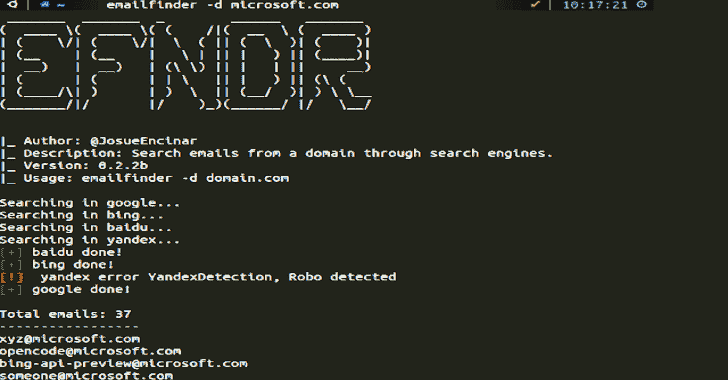
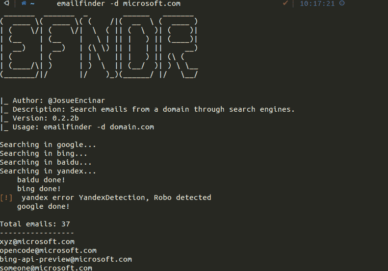

# EmailFinder:通过搜索引擎从一个域中搜索电子邮件

> 原文：<https://kalilinuxtutorials.com/emailfinder/>

EmailFinder 是一款通过搜索引擎搜索电子邮件的工具。该软件旨在检查在*搜索引擎*中发现的一家公司的*封电子邮件*

**|_ 作者:@JosueEncinar
|_ 描述:通过搜索引擎搜索来自一个域的邮件。【domain.com】| _ 版本:0.1b
|_ 用法:email finder-d**

**安装**

**> pip3 安装 emailfinder**

升级也可以使用

**> pip3 安装 email finder–升级**

**搜索引擎**

*   谷歌:好的(注意 cookies 政策和验证码！).
*   宾:好的。
*   百度:还行(请求不多)。
*   宾:狩猎机器人非常快。

**用途**

EmailFinder 有两种使用方式:

CLI

**电子邮件查找器-d domain.com**

参数:

*   d:指定目标域。
*   v:显示 EmailFinder 版本。

代码中的

 **从 emailfinder.extractor 导入*
emails 1 = get _ emails _ from _ Google(" domain . com ")
emails 2 = get _ emails _ from _ bing(" domain . com ")
emails 3 = get _ emails _ from _ Baidu(" domain . com ")

**例子**

[**Download**](https://github.com/Josue87/EmailFinder)**