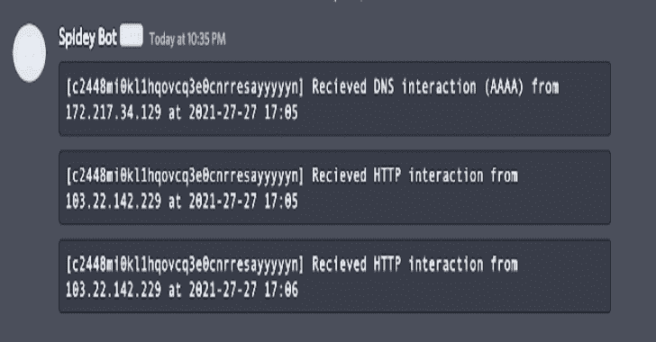
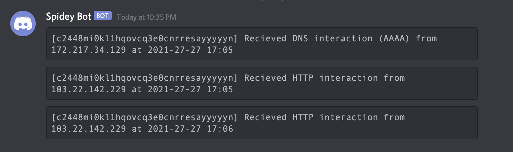

# Interactsh:一个 OOB 交互收集服务器和客户端库

> 原文：<https://kalilinuxtutorials.com/interactsh/>

Interactsh 是一款用于带外数据提取的开源解决方案，该工具旨在检测导致外部交互的错误，例如盲 SQLi、盲 CMDi、SSRF 等。

**特性**

*   DNS/HTTP/SMTP 交互支持
*   CLI 客户端/ Web 仪表板支持
*   零日志 AES 加密
*   基于 ACME 的通配符 TLS 自动续订
*   自托管版本支持

在[https://interact . project discovery . io](https://interact.projectdiscovery.io/)上可以获得带有 WEB UI 的服务的托管实例。

**注意:**由于托管版本不在本地存储任何内容，重启服务器进行维护/意外的服务器崩溃/更新将导致之前的数据丢失。

**安装互动客户端**

Interactsh 客户端需要 **go1.15+** 才能成功安装。运行以下命令获取报告–

**go 111 module = on go get-v github . com/project discovery/interact sh/cmd/interact sh-client**

**用途**

**交互-客户端-h**

这将显示该工具的帮助。这里是它支持的所有开关。

| 旗 | 描述 | 例子 |
| --- | --- | --- |
| n | 要生成的可交互 URL 的数量(默认为 1) | 交互-客户端-n 2 |
| 坚持的 | 启用持久交互会话 | 交互-客户端持久 |
| 轮询间隔 | 每次轮询请求之间的秒数(默认为 5) | 交互-客户端-轮询-时间间隔 1 |
| 全球资源定位器(Uniform Resource Locator) | interactsh 服务器的 URL(默认为“hxxps://interact.sh”) | interact sh-client-URL hx XPS://example . com |
| json | 显示 JSON 输出 | 交互客户端 json |
| o | 将交互日志存储到文件 | interactsh-client -o logs.txt |
| v | 显示详细交互 | 交互-客户端-v |

**运行交互客户端**

这将生成可用于交互的单一 URL。

**交互-客户端
(*)*//*_ _ _ _ _ _**//*//_
//*_ \/*\/*/'/*//*/\
///////////////(_)////
//////_/_ _ _ _ _ _/_，/_ _/_/v 0 . 0 . 1
project discovery . io
[INF]列表 1 OOB 测试 URL
[INF]c 23 b 2 la 0k l 1 krjcrdj 10 cndmnioyyyyyyn . interact . sh
【c 23 b 2 la 0k 1 krjcrdd 2021-26-26 12:26
来自 43.3.192.3【c 23 b 2 la 0k L1 krjcrdj 10 cndmnioyyyyn】2021-26-26 12:26
收到来自 74.32.183.135 的 DNS 交互(TXT)【c 23 b 2 la 0k L1 krjcrdj 10 cndmnioyyyyyn】2021-26-26 12:26***

**向不一致、懈怠、有通知的电报发送交互**

**交互-客户端|通知**

**设置自托管实例**

*   从设置 Debian box 开始，Debian 是必需的，因为你需要设置你自己的域名服务器。
*   导航到 **`https://dcc.godaddy.com/manage/{{domain}}/dns/hosts` >** 高级特性>主机名，添加 **`ns1`** 和`**ns2**`作为主机名，并带有您的服务器的 **IP** 。
*   导航到 **`https://dns.godaddy.com/{{domain}}/nameservers` >** 输入我自己的名称服务器(高级)>添加`**ns1.{{domain}}**`和`**ns2.{{domain}}**`作为名称服务器。
*   在您的服务器上安装 **interactsh-server** 。

**go 111 module = on go get-v github . com/project discovery/interact sh/cmd/interact sh-server**

*   启动 **interactsh-server** ，为了确保服务器始终在后台运行，请确保在屏幕会话中启动服务器。

**interact sh-Server-Domain { { Domain } }-host master admin @ { { Domain } }-IP { { Server _ IP } }**

 **interact sh-服务器-域 example.com-主机 admin@example.com-IP XX。XX.XX.XX**

服务器设置应该完成了，现在客户端可以用来生成你自己的有效载荷。

*   正在安装 **interactsh-client** 以使用 interactsh 服务。

**go 111 module = on go get-v github . com/project discovery/interact sh/cmd/interact sh-client**

*   运行 **interactsh-clien** t 与**自托管**域。

**互动客户端 URL https://example.com**

[**Download**](https://github.com/projectdiscovery/interactsh)