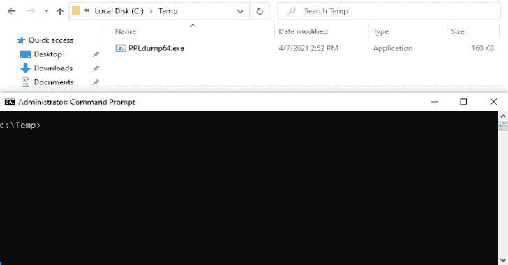

# PPLdump:利用用户空间漏洞转储 PPL 的内存

> 原文：<https://kalilinuxtutorials.com/ppldump/>

PPLdump 实现了一个最初由詹姆斯·福肖(又名[@ tiranido](https://twitter.com/tiraniddo))讨论的**用户空间**漏洞——在这篇[博客文章](https://googleprojectzero.blogspot.com/2018/08/windows-exploitation-tricks-exploiting.html)中——用于**作为管理员转储任何 PPL** 的内存。

我写了两篇关于这个工具的博文。第一部分是关于受保护进程的概念，而第二部分讨论旁路技术本身。

*   **博文第一部分** : [你真的了解 LSA 保护(RunAsPPL)吗？](https://itm4n.github.io/lsass-runasppl/)
*   **博客文章第二部分** : [绕过 LSA 在用户国的保护](https://blog.scrt.ch/2021/04/22/bypassing-lsa-protection-in-userland/)

**用途**

只需不带任何参数运行可执行文件，您将获得详细的帮助/用法。

**c:\ Temp>PPLdump64.exe
*_*
| _ | |*| |*_*_
| | | |。| | | | .| 0.4 版| | | |*| |*| _ _*|*|*|*|*| by @ itm4n
| _ |
描述:
用 *userland* exploit
使用:
PPLdump.exe[-v][-d][-f]转储受保护进程灯(PPL)的内存
参数:
PROC_NAME 要转储的进程的名称
PROC_ID 要转储的进程的 ID
DUMP _ FILE 输出转储文件的路径
选项:
-v(详细)启用详细模式
-d(调试)启用调试模式(暗示详细)
-f(强制)绕过已定义的设备错误检查
示例:
PPLdump.exe lsass.exe lsass . DMP
PPLdump.exe-v 720 out**

**测试**

| Windows 版本 | 建设 | 版本 | 拱门 | 管理 | 系统 |
| --- | --- | --- | --- | --- | --- |
| Windows 10 20H2 | Nineteen thousand and forty-two | 赞成 | x64 | ✔️ | ✔️ |
| Windows 10 20H2 | Nineteen thousand and forty-two | 赞成 | x86 | ✔️ | ✔️ |
| Windows 10 1909 | Eighteen thousand three hundred and sixty-three | 赞成 | x64 | ✔️ | ✔️ |
| Windows 10 1507 | Ten thousand two hundred and forty | 教育的 | x64 | ✔️ | ✔️ |
| Windows 10 1507 | Ten thousand two hundred and forty | 主页 | x64 | ✔️ | ✔️ |
| Windows 10 1507 | Ten thousand two hundred and forty | 赞成 | x64 | ✔️ | ✔️ |
| Windows Server 2019 | Seventeen thousand seven hundred and sixty-three | 标准 | x64 | ✔️ | ✔️ |
| Windows Server 2019 | Seventeen thousand seven hundred and sixty-three | 必需品；要素 | x64 | ✔️ | ✔️ |
| Windows 8.1 | Nine thousand six hundred | 赞成 | x64 | ⚠️ | ⚠️ |
| Windows Server 2012 R2 版 | Nine thousand six hundred | 标准 | x64 | ⚠️ | ⚠️ |

该漏洞在完全更新的 Windows 8.1 / Server 2012 R2 计算机上失败。我还没有弄清楚是哪个补丁导致了这个错误。

**[-]定义的设备失败，错误代码为 6–句柄无效。**

在 Windows 8.1 / Server 2012 R2 上，您可能还需要静态编译二进制文件(请参见下面的“构建说明”)。

**构建指令**

这个 Visual Studio 解决方案包含两个项目(可执行文件和有效负载 DLL ),需要按照特定的顺序进行编译。一切都是预先配置好的，所以你只需要按照这些简单的指示去做。编译后的负载 DLL 会自动嵌入到最终的可执行文件中。

*   用 Visual Studio 2019 打开解决方案。
*   根据目标机器的架构选择`**Release / x64**`或`**Release / x86**`。
*   **`Build > Build Solution`。**

在 Windows 8.1 / Server 2012 R2 上，您可能需要静态编译二进制文件。

*   右键点击 **`PPLdump`** 项目。
*   转到 **`Configuration Properties`** > `**C/C++**` > **`Code Generation`。**
*   选择`**Multi-threaded (/MT)**`作为 **`Runtime Library`** 选项。
*   构建解决方案。

[**Download**](https://github.com/itm4n/PPLdump)