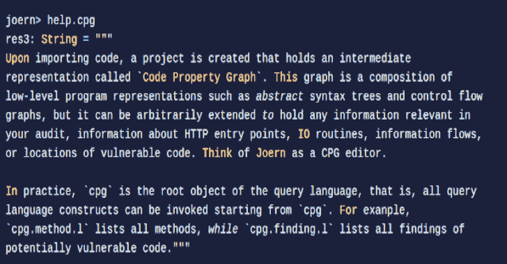

# Joern:基于代码属性图的 C/C++/Java 开源代码分析平台

> 原文：<https://kalilinuxtutorials.com/joern/>

Joern 是一个基于代码属性图的 C/C++/Java 开源代码分析平台。

**快速安装**

**wget https://github . com/shift left security/joern/releases/latest/download/joern-install . sh
chmod+x ./joern-install . sh
sudo。/joern-install.sh
joern
编译(合成)/菊石/predef/inter bridge . sc
编译(合成)/菊石/predef/replBridge.sc
编译(合成)/菊石/predef/DefaultPredef.sc
编译/home/tmp/shiftleft/joern/(控制台)
██╗██████╗███████╗██████╗███╗██╗
██║██║██║█████╗██████╔╝██╔██╗██║
████║██║██║██╔══╝██╔══██╗██║╚██╗██║
╚█████╔╝╚██████╔╝███████╗██║██║██║╚████║
╚════╝╚═════╝╚══════╝╚═╝╚═╝╚═╝╚═══╝
约恩>**

如果安装脚本由于任何原因失败，请尝试

**。/joern-install–交互式**