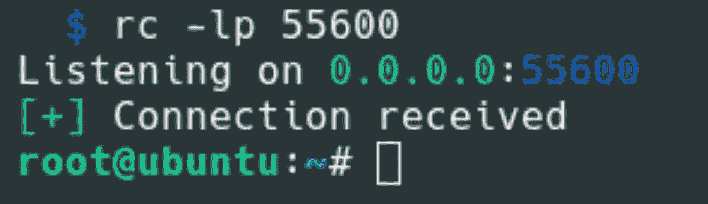

# Rustcat : Netcat 替代方案

> 原文：<https://kalilinuxtutorials.com/rustcat/>

Rustcat 是一个端口监听器，可以用于不同的目的。它基本上类似于 netcat，但选项更少。

**为什么要用 Rustcat？**

*   达到监听端口的目的
*   有命令历史记录
*   它很容易使用
*   支持 udp
*   使用颜色

**安装**

Debian

**wget https://github . com/robiot/rust cat/releases/latest/download/rust cat _ amd64 . deb
sudo apt install。/rustcat_amd64.deb**

**拱门**

**git 克隆 https://aur.archlinux.org/rustcat.git
CD rust cat
make pkg-si**

或者用 yay:

耶-S 锈猫

**其他分配**

从板条箱安装。io:

**货物安装 rustcat**

要安装最新的 github 版本而不自己编译:

**bash<(curl-s https://raw . githubusercontent . com/robiot/rustcat/main/install . sh)**

如果你想在 windows 上使用它，你需要从源代码中删除所有与 termion 和 rustyline 相关的东西

**编译自己**

编译你自己

*   下载源代码
*   Cd 放入目录并运行…

**货物建造-发布**

**用途**

**rc【选项】【目的地】【港口】**

**用法举例**

帮助:

**RC–帮助**

在本地主机上监听端口 **55660** :

rc -lp 55660

使用命令历史在本地主机上监听端口 **55660** :

rc -lpH 55660

监听本地主机 udp 上的端口 **55660** :

**rc -lpu 55660**

监听指定 ip (192.168.1.10)上的端口 **55660** :

rc -l 192.168.1.10 55660

[**Download**](https://github.com/robiot/rustcat#other-distributions)