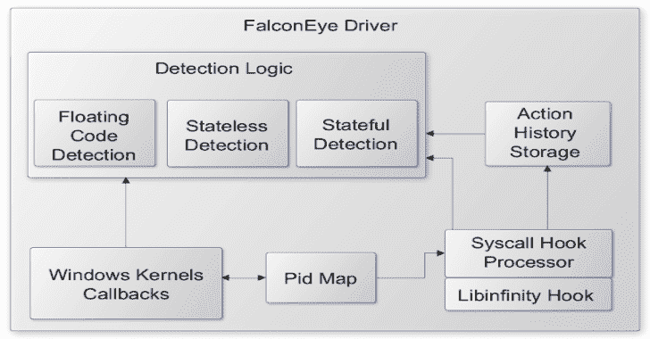
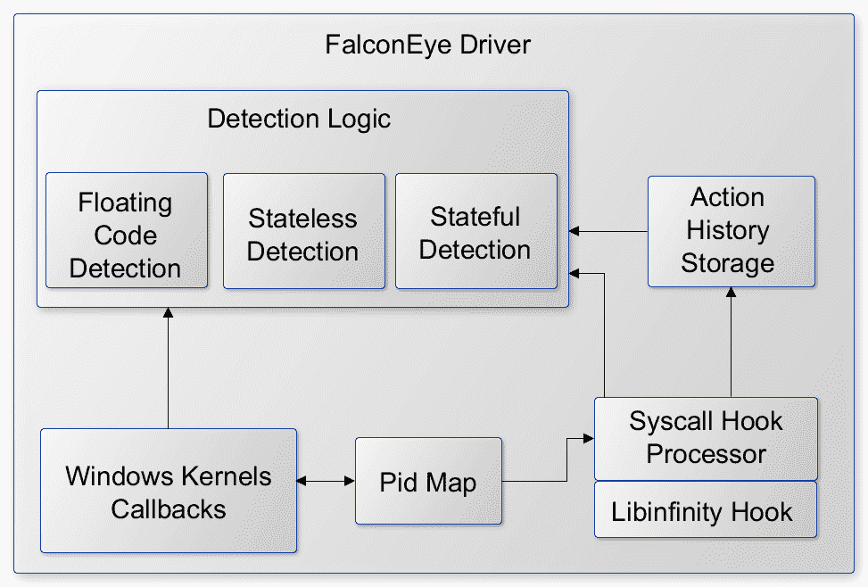

# FalconEye:用于 Windows 过程注入的实时检测软件

> 原文：<https://kalilinuxtutorials.com/falconeye/>

**FalconEye** 是一款用于实时过程进样的 windows 终点检测软件。它是一个内核模式驱动程序，目的是在进程注入发生时(实时)捕捉它们。由于 FalconEye 运行在内核模式，它提供了一个更强大、更可靠的防御机制来抵御试图规避各种用户模式钩子的进程注入技术。

你可以在 [2021 黑帽亚洲兵工厂](https://www.blackhat.com/asia-21/arsenal/schedule/#falconeye-windows-process-injection-techniques---catch-them-all-22612)和[幻灯片](https://github.com/rajiv2790/FalconEye/blob/main/2021BHASIA_FalconEye.pdf)查看我们的演示。

**项目概述**

**检测覆盖范围**

下表显示了各种过程注入技术的实现状态和检测逻辑。WPM 代表 WriteProcessMemory。要测试这种检测，可以参考参考文献部分。

| 技术 | 状态 | 侦查 | 使用的概念证明 |
| --- | --- | --- | --- |
| 原子弹爆炸 | -好的 | 挂钩 QueueUserAPC 并寻找 GlobalGetAtom 函数族 | pinjextra |
| 检测回调注入 | -好的 | 检测新线程是否由浮点代码创建 | [https://github.com/antonioCoco/Mapping-Injection](https://github.com/antonioCoco/Mapping-Injection) |
| 反射 DLL 注入 | -好的 | 检测新线程是否是从浮点代码创建的，PE 头是否被写入牺牲线程 | 微型喷射器 |
| 繁殖 | -好的 | 挂钩 SetProp 以获取正在编写的属性的地址，并与前面的 WPM 调用相关联以获取浮点代码的地址 | 皮涅斯特拉 |
| 过程空洞化 | -好的 | 使用写入目标进程内存的 PE 头检测 | 注射器 |
| 使用加载库创建 RemoteThread | -好的 | 开始地址指向 LoadLibrary 的新线程。MInjector 版本还使用 WPM 写入 DLL 路径，这也是可以检测到的 | 平杰特拉·明杰特 |
| 用 MapViewOfFile 创建 RemoteThread | -好的 | 检测新线程是否由浮点代码创建 | pinjextra |
| 暂停-注入-恢复 | -好的 | 检测一个新线程是否是从浮点代码创建的(MInjector)。通过 WPM (MInjector)写入的 DLL 路径。检测先前挂起的线程上是否设置了上下文(Pinjectra) | 平杰特拉·明杰特 |
| QueueUserAPC | -好的 | 通过 WPM 写入的 DLL 路径 | 注射器 |
| 带有内存集的 QueueUserAPC(堆栈绑定) | -好的 | 挂钩 QueueUserAPC 并查找 memset | pinjextra |
| SetWindowLong(额外窗口内存注入) | -好的 | 挂钩 SetWindowLong 以获取正在编写的函数指针的地址，并与前面的 WPM 调用相关联以获取浮点代码的地址 | pinjextra |
| 取消映射+覆盖 | -好的 | 如果攻击者进程正在取消受害者的 ntdll 映射，则发出警报 | pinjextra |
| 内核控制表 | -好的 | 检测 WPM 是否正在覆盖受害者 PEB 中的 KernelCallbackTable 字段 | [https://github.com/odzhan/injection/blob/master/kct](https://github.com/odzhan/injection/blob/master/kct) |
| USERDATA | -好的 | 检查 WPM 目标地址是否在 conhost.exe 范围内。如果是，检查来自 conhost 的任何相关函数指针是否与先前存储的 WPM 地址相匹配 | [https://github.com/odzhan/injection/blob/master/conhost](https://github.com/odzhan/injection/blob/master/conhost) |
| ctrl-注入 | -好的 | 检测攻击者是否在受害者的 KernelBase.dll 范围内进行 WPM | pinjextra |
| ALPC 回电 | -好的 | 提取 NtConnectPort 呼叫中对 ALPC 端口的受害者 pid。对于攻击者-受害者 pid 元组，检查之前的 WPM 调用并应用浮动代码检测 | 皮涅斯特拉 |
| WNF 回电 | -好的 | WPM 后跟 UpdateWNFStateData 调用 | [https://github.com/odzhan/injection/tree/master/wnf](https://github.com/odzhan/injection/tree/master/wnf) |
| SetWindowsHook | -好的 | 保存在 NtUserSetWindowsHookEx 钩子中注册的模块路径。稍后，当匹配此路径的模块加载到不同的进程中时，生成警报 | 注射器 |
| 代笔 | -好的 | 检测是否在以前挂起的线程上设置了上下文(调用了 NtSetContextThread) | pinjextra |
| 服务控制 | -好的 | WPM 覆盖进程(服务)的服务 IDE | [https://github.com/odzhan/injection/tree/master/svcctrl](https://github.com/odzhan/injection/tree/master/svcctrl) |
| 外壳代码注入 | -好的 | 新线程从浮点代码开始。WPM 正在写入的 DLL 路径 | 微型喷射器 |
| 图像映射 | -好的 | 线程从浮点代码开始。WPM 正在写入 PE 标头。WPM 正在写入的 DLL 路径 | 注射器 |
| 线程重用 | -好的 | 线程从浮点代码开始。WPM 正在写入的 DLL 路径 | 注射器 |

**架构概述**

*   该驱动程序是按需加载驱动程序
*   初始化包括通过 libinfinityhook 设置回调和系统调用挂钩
*   回调维护从跨进程活动(如 OpenProcess)构建的 PID 映射，但不限于 OpenProcess
*   后续的回调和 syscall 钩子使用这个 Pid 映射来减少处理中的噪声。作为降噪的一部分，syscall 钩子过滤掉相同的进程活动。
*   检测逻辑分为子类，即无状态(例如:Atombombing)、有状态(Unmap+Overwrite)和浮动代码(来自多种技术的外壳代码)
*   对于状态检测，syscall 钩子记录一个动作历史，它被实现为一个循环缓冲区。例如，它记录调用方进程不同于目标进程的所有 NtWriteVirtualMemory 调用。
*   检测逻辑具有常见的异常检测功能，例如浮动代码检测和远程进程中外壳代码触发器的检测。回调和 syscall 挂钩都调用这个公共功能进行实际检测。

**注意**:我们的重点是检测，而不是创建一个高性能的检测引擎。在 BlackHat 演示结束后，我们将继续这些努力。

**文件**

**。
【src】
【falkenye】——————【falkenye 用户和内核空间】【libinfinity hook】——【2021 bhasia _ falkenye . pdf】
readme . MD【t】**

**入门**

**先决条件**

*   Windows 10 内部版本 1903/1909
*   微软 Visual Studio 2019 以后
*   虚拟化软件，如 VmWare、Hyper-V(可选)

**安装**

**建造**

*   使用 Visual Studio 2019 打开解决方案
*   选择 x64 作为构建平台
*   构建解决方案。这会在 src\kernel\FalconEye\x64\Debug 或 src \ kernel \ falcon eye \ x64 \ Release 下生成 FalconEye.sys 二进制文件

**测试机器设置**

*   在虚拟机中安装 Windows 10 内部版本 1903/1909
*   配置虚拟机以测试未签名的驱动程序

*   使用 bcdedit，禁用完整性检查:`**BCDEDIT /set nointegritychecks ON**`

*   从 VM 中的 sysinternals 运行 DbgView，或者使用 WinDbg 启动调试连接。

**用途**

*   将 FalconEye.sys 复制到测试机(Windows 10 虚拟机)
*   使用 OSR 加载器或类似工具加载 FalconEye.sys 作为“按需”加载驱动程序
*   运行进样测试工具，如 pinjectra、minjector 或其他样品
*   通过 WinDbg 或 DbgView 监控调试日志

[**Download**](https://github.com/rajiv2790/FalconEye)