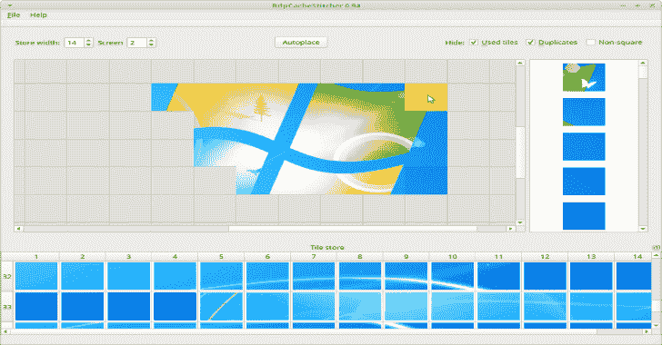

# RdpCacheStitcher:RdpCacheStitcher 是一个支持法医分析师的工具

> 原文：<https://kalilinuxtutorials.com/rdpcachestitcher/>

***RdpCacheStitcher*** 是一个支持法医分析师从 RDP 缓存位图中重建有用图像的工具。使用由诸如安西的*BMC-Tools*([https://github.com/ANSSI-FR/bmc-tools](https://github.com/ANSSI-FR/bmc-tools))之类的工具提取的原始 RDP 缓存块位图作为输入，它提供了图形用户界面和用于将块拼接在一起的若干放置试探法，以便可以重建有意义的图像或者甚至完整的屏幕截图。

**特性**

*   显示所选磁贴最适合视觉效果的提示
*   为所选的空单元格提供一个有序的平铺列表，该列表最适合放置在视觉上
*   将鼠标悬停在单幅图块上时，预览放置时的外观
*   在每个案例中使用多个屏幕
*   排除已使用的、非方形的或重复的瓷砖的选项
*   将属于一个病例的所有重建图像裁剪并导出为 PNG
*   具有所有可用小块的子窗口是可停靠的，即，它可以是它自己的窗口并且移动到不同的显示
*   每个屏幕保留单独的注释

**手动**

在文档[RdpCacheStitcher _ manual . pdf](https://github.com/BSI-Bund/RdpCacheStitcher/blob/main/RdpCacheStitcher_manual.pdf)中可以找到完整的手册，其中描述了所有功能和典型用例的工作流程。

**安装先决条件并启动 RdpCacheStitcher**

你可以在 https://github.com/BSI-Bund/RdpCacheStitcher/releases/的[下载用于 64 位 Linux 和 Windows 的 *RdpCacheStitcher* 的预构建二进制文件。对于每个系统，您必须首先安装一个必要的先决条件。](https://github.com/BSI-Bund/RdpCacheStitcher/releases/)

**Ubuntu**

*   安装包***libqt 5 widgets 5*:**
*   运行`**RdpCacheStitcher**`

**窗户**

*   在您的 Windows 计算机上安装 Microsoft Visual C++ 2017 可再发行(64 位)包([https://aka.ms/vs/16/release/vc_redist.x64.exe](https://aka.ms/vs/16/release/vc_redist.x64.exe))
*   将 *RdpCacheStitcher* 文件解压到系统中的任意位置
*   运行`**RdpCacheStitcher.exe**`

**从源代码构建**

如果您想从源代码构建 *RdpCacheStitcher* ，您需要首先安装 Qt 开发框架。然后，只需在 Qt Creator 中打开文件`**RdpCacheStitcher.pro**`并从那里构建项目。

[**Download**](https://github.com/BSI-Bund/RdpCacheStitcher)