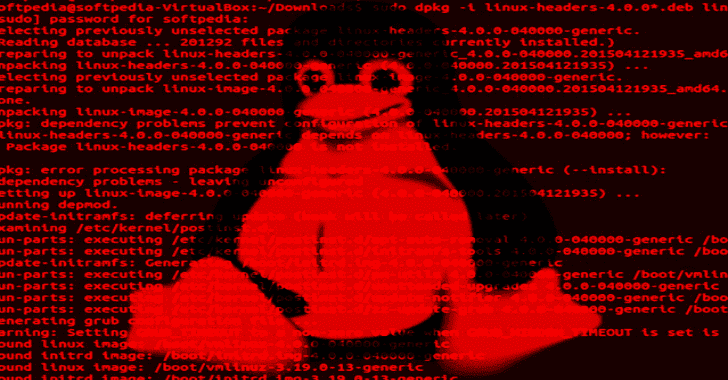

# kconfig:Hardened-Check——用于检查 Linux 内核配置中的硬化选项的工具

> 原文：<https://kalilinuxtutorials.com/kconfig/>

Kconfig 是一个检查 Linux 内核配置中加固选项的工具

有很多 Linux 内核强化配置选项。它们中的许多都不是主流发行版所支持的。我们必须自己启用这些选项，以使我们的系统更加安全。

但是没有人喜欢手动检查配置。所以让计算机做它们的工作吧！

**kconfig-hardened-check . py**帮助我根据我的强化偏好检查 Linux 内核 Kconfig 选项列表，这些偏好基于

*   [KSPP 推荐设置](http://kernsec.org/wiki/index.php/Kernel_Self_Protection_Project/Recommended_Settings)，
*   [剪辑 OS 内核配置](https://docs.clip-os.org/clipos/kernel.html#configuration)，
*   最后一个公共 [grsecurity](https://grsecurity.net/) 补丁(他们禁用的选项)，
*   [安全 _ 锁定 _LSM](https://lwn.net/Articles/791863/) 补丁集，
*   来自 Linux 内核维护者的直接反馈(丹尼尔·维特在[第 38 期](https://github.com/a13xp0p0v/kconfig-hardened-check/issues/38))。

我还创建了 [**Linux 内核防御图**](https://github.com/a13xp0p0v/linux-kernel-defence-map) ，它是这些强化功能和相应的漏洞类别或利用技术之间关系的图形表示。

**支持的微体系结构**

*   X86_64
*   X86_32
*   ARM64
*   手臂ˌ武器ˌ袖子ˌ装备

**安装**

您可以安装软件包:

**pip 安装 git+https://github . com/a 13 XP 0 p0v/kconfig-hardened-check**

或者简单地从克隆的存储库中运行 **`./bin/kconfig-hardened-check`** 。

**用途**

**用法:kconfig-hardened-check[-h][–version][-p { X86 _ 64，X86_32，ARM64，ARM }]
[-c CONFIG]
[-m { verbose，json，show_ok，show_fail}]
检查 Linux 内核配置中的加固选项
可选参数:
-h，–help 显示此帮助信息并退出
–version 显示程序的版本号并退出
-p {X86_64**

**内核配置**的输出

**$ ./bin/kconfig-hardened-check -c kconfig_hardened_check/config_files/distros/ubuntu-focal.config
[+] Config file to check: kconfig_hardened_check/config_files/distros/ubuntu-focal.config
[+] Detected architecture: X86_64
[+] Detected kernel version: 5.4
option name | desired val | decision | reason | check resultCONFIG_BUG | y |defconfig | self_protection | OK
CONFIG_SLUB_DEBUG | y |defconfig | self_protection | OK
CONFIG_GCC_PLUGINS | y |defconfig | self_protection | FAIL: not found
CONFIG_STACKPROTECTOR_STRONG | y |defconfig | self_protection | OK
CONFIG_STRICT_KERNEL_RWX | y |defconfig | self_protection | OK
CONFIG_STRICT_MODULE_RWX | y |defconfig | self_protection | OK
CONFIG_REFCOUNT_FULL | y |defconfig | self_protection | FAIL: “is not set”
CONFIG_IOMMU_SUPPORT | y |defconfig | self_protection | OK
CONFIG_RANDOMIZE_BASE | y |defconfig | self_protection | OK
CONFIG_THREAD_INFO_IN_TASK | y |defconfig | self_protection | OK
CONFIG_VMAP_STACK | y |defconfig | self_protection | OK
CONFIG_MICROCODE | y |defconfig | self_protection | OK
CONFIG_RETPOLINE | y |defconfig | self_protection | OK
CONFIG_X86_SMAP | y |defconfig | self_protection | OK
CONFIG_SYN_COOKIES | y |defconfig | self_protection | OK
CONFIG_X86_UMIP | y |defconfig | self_protection | OK: CONFIG_X86_INTEL_UMIP “y”
CONFIG_PAGE_TABLE_ISOLATION | y |defconfig | self_protection | OK
CONFIG_RANDOMIZE_MEMORY | y |defconfig | self_protection | OK
CONFIG_INTEL_IOMMU | y |defconfig | self_protection | OK
CONFIG_AMD_IOMMU | y |defconfig | self_protection | OK
CONFIG_SECURITY_DMESG_RESTRICT | y | kspp | self_protection | FAIL: “is not set”
CONFIG_BUG_ON_DATA_CORRUPTION | y | kspp | self_protection | FAIL: “is not set”
CONFIG_DEBUG_WX | y | kspp | self_protection | OK
CONFIG_SCHED_STACK_END_CHECK | y | kspp | self_protection | OK
CONFIG_SLAB_FREELIST_HARDENED | y | kspp | self_protection | OK
CONFIG_SLAB_FREELIST_RANDOM | y | kspp | self_protection | OK
CONFIG_SHUFFLE_PAGE_ALLOCATOR | y | kspp | self_protection | OK
CONFIG_FORTIFY_SOURCE | y | kspp | self_protection | OK
CONFIG_DEBUG_LIST | y | kspp | self_protection | FAIL: “is not set”
CONFIG_DEBUG_SG | y | kspp | self_protection | FAIL: “is not set”
CONFIG_DEBUG_CREDENTIALS | y | kspp | self_protection | FAIL: “is not set”
CONFIG_DEBUG_NOTIFIERS | y | kspp | self_protection | FAIL: “is not set”
CONFIG_INIT_ON_ALLOC_DEFAULT_ON | y | kspp | self_protection | OK
CONFIG_GCC_PLUGIN_LATENT_ENTROPY | y | kspp | self_protection | FAIL: not found
CONFIG_GCC_PLUGIN_RANDSTRUCT | y | kspp | self_protection | FAIL: not found
CONFIG_HARDENED_USERCOPY | y | kspp | self_protection | OK
CONFIG_HARDENED_USERCOPY_FALLBACK | is not set | kspp | self_protection | FAIL: “y”
CONFIG_MODULE_SIG | y | kspp | self_protection | OK
CONFIG_MODULE_SIG_ALL | y | kspp | self_protection | OK
CONFIG_MODULE_SIG_SHA512 | y | kspp | self_protection | OK
CONFIG_MODULE_SIG_FORCE | y | kspp | self_protection | FAIL: “is not set”
CONFIG_INIT_STACK_ALL_ZERO | y | kspp | self_protection | FAIL: not found
CONFIG_INIT_ON_FREE_DEFAULT_ON | y | kspp | self_protection | OK: CONFIG_PAGE_POISONING_ZERO “y”
CONFIG_GCC_PLUGIN_STACKLEAK | y | kspp | self_protection | FAIL: not found
CONFIG_DEFAULT_MMAP_MIN_ADDR | 65536 | kspp | self_protection | OK
CONFIG_DEBUG_VIRTUAL | y | clipos | self_protection | FAIL: “is not set”
CONFIG_STATIC_USERMODEHELPER | y | clipos | self_protection | FAIL: “is not set”
CONFIG_EFI_DISABLE_PCI_DMA | y | clipos | self_protection | FAIL: not found
CONFIG_SLAB_MERGE_DEFAULT | is not set | clipos | self_protection | FAIL: “y”
CONFIG_RANDOM_TRUST_BOOTLOADER | is not set | clipos | self_protection | FAIL: “y”
CONFIG_RANDOM_TRUST_CPU | is not set | clipos | self_protection | FAIL: “y”
CONFIG_GCC_PLUGIN_RANDSTRUCT_PERFORMANCE | is not set | clipos | self_protection | FAIL: CONFIG_GCC_PLUGIN_RANDSTRUCT not “y”
CONFIG_STACKLEAK_METRICS | is not set | clipos | self_protection | FAIL: CONFIG_GCC_PLUGIN_STACKLEAK not “y”
CONFIG_STACKLEAK_RUNTIME_DISABLE | is not set | clipos | self_protection | FAIL: CONFIG_GCC_PLUGIN_STACKLEAK not “y”
CONFIG_INTEL_IOMMU_DEFAULT_ON | y | clipos | self_protection | FAIL: “is not set”
CONFIG_INTEL_IOMMU_SVM | y | clipos | self_protection | OK
CONFIG_UBSAN_BOUNDS | y | my | self_protection | FAIL: CONFIG_UBSAN_TRAP not “y”
CONFIG_RESET_ATTACK_MITIGATION | y | my | self_protection | OK
CONFIG_AMD_IOMMU_V2 | y | my | self_protection | FAIL: “m”
CONFIG_SECURITY | y |defconfig | security_policy | OK
CONFIG_SECURITY_YAMA | y | kspp | security_policy | OK
CONFIG_SECURITY_WRITABLE_HOOKS | is not set | my | security_policy | OK: not found
CONFIG_SECURITY_LOCKDOWN_LSM | y | clipos | security_policy | OK
CONFIG_SECURITY_LOCKDOWN_LSM_EARLY | y | clipos | security_policy | OK
CONFIG_LOCK_DOWN_KERNEL_FORCE_CONFIDENTIALITY| y | clipos | security_policy | FAIL: “is not set”
CONFIG_SECURITY_SAFESETID | y | my | security_policy | OK
CONFIG_SECURITY_LOADPIN | y | my | security_policy | FAIL: “is not set”
CONFIG_SECURITY_LOADPIN_ENFORCE | y | my | security_policy | FAIL: CONFIG_SECURITY_LOADPIN not “y”
CONFIG_SECCOMP | y |defconfig | cut_attack_surface | OK
CONFIG_SECCOMP_FILTER | y |defconfig | cut_attack_surface | OK
CONFIG_STRICT_DEVMEM | y |defconfig | cut_attack_surface | OK
CONFIG_ACPI_CUSTOM_METHOD | is not set | kspp | cut_attack_surface | OK
CONFIG_COMPAT_BRK | is not set | kspp | cut_attack_surface | OK
CONFIG_DEVKMEM | is not set | kspp | cut_attack_surface | OK
CONFIG_COMPAT_VDSO | is not set | kspp | cut_attack_surface | OK
CONFIG_BINFMT_MISC | is not set | kspp | cut_attack_surface | FAIL: “m”
CONFIG_INET_DIAG | is not set | kspp | cut_attack_surface | FAIL: “m”
CONFIG_KEXEC | is not set | kspp | cut_attack_surface | FAIL: “y”
CONFIG_PROC_KCORE | is not set | kspp | cut_attack_surface | FAIL: “y”
CONFIG_LEGACY_PTYS | is not set | kspp | cut_attack_surface | FAIL: “y”
CONFIG_HIBERNATION | is not set | kspp | cut_attack_surface | FAIL: “y”
CONFIG_IA32_EMULATION | is not set | kspp | cut_attack_surface | FAIL: “y”
CONFIG_X86_X32 | is not set | kspp | cut_attack_surface | FAIL: “y”
CONFIG_MODIFY_LDT_SYSCALL | is not set | kspp | cut_attack_surface | FAIL: “y”
CONFIG_OABI_COMPAT | is not set | kspp | cut_attack_surface | OK: not found
CONFIG_MODULES | is not set | kspp | cut_attack_surface | FAIL: “y”
CONFIG_DEVMEM | is not set | kspp | cut_attack_surface | FAIL: “y”
CONFIG_IO_STRICT_DEVMEM | y | kspp | cut_attack_surface | FAIL: “is not set”
CONFIG_LEGACY_VSYSCALL_NONE | y | kspp | cut_attack_surface | FAIL: “is not set”
CONFIG_ZSMALLOC_STAT | is not set |grsecurity| cut_attack_surface | OK
CONFIG_PAGE_OWNER | is not set |grsecurity| cut_attack_surface | OK
CONFIG_DEBUG_KMEMLEAK | is not set |grsecurity| cut_attack_surface | OK
CONFIG_BINFMT_AOUT | is not set |grsecurity| cut_attack_surface | OK: not found
CONFIG_KPROBES | is not set |grsecurity| cut_attack_surface | FAIL: “y”
CONFIG_UPROBES | is not set |grsecurity| cut_attack_surface | FAIL: “y”
CONFIG_GENERIC_TRACER | is not set |grsecurity| cut_attack_surface | FAIL: “y”
CONFIG_PROC_VMCORE | is not set |grsecurity| cut_attack_surface | FAIL: “y”
CONFIG_PROC_PAGE_MONITOR | is not set |grsecurity| cut_attack_surface | FAIL: “y”
CONFIG_USELIB | is not set |grsecurity| cut_attack_surface | FAIL: “y”
CONFIG_CHECKPOINT_RESTORE | is not set |grsecurity| cut_attack_surface | FAIL: “y”
CONFIG_USERFAULTFD | is not set |grsecurity| cut_attack_surface | FAIL: “y”
CONFIG_HWPOISON_INJECT | is not set |grsecurity| cut_attack_surface | FAIL: “m”
CONFIG_MEM_SOFT_DIRTY | is not set |grsecurity| cut_attack_surface | FAIL: “y”
CONFIG_DEVPORT | is not set |grsecurity| cut_attack_surface | FAIL: “y”
CONFIG_DEBUG_FS | is not set |grsecurity| cut_attack_surface | FAIL: “y”
CONFIG_NOTIFIER_ERROR_INJECTION | is not set |grsecurity| cut_attack_surface | FAIL: “m”
CONFIG_X86_PTDUMP | is not set |grsecurity| cut_attack_surface | OK
CONFIG_DRM_LEGACY | is not set |maintainer| cut_attack_surface | OK
CONFIG_FB | is not set |maintainer| cut_attack_surface | FAIL: “y”
CONFIG_VT | is not set |maintainer| cut_attack_surface | FAIL: “y”
CONFIG_AIO | is not set |grapheneos| cut_attack_surface | FAIL: “y”
CONFIG_STAGING | is not set | clipos | cut_attack_surface | FAIL: “y”
CONFIG_KSM | is not set | clipos | cut_attack_surface | FAIL: “y”
CONFIG_KALLSYMS | is not set | clipos | cut_attack_surface | FAIL: “y”
CONFIG_X86_VSYSCALL_EMULATION | is not set | clipos | cut_attack_surface | FAIL: “y”
CONFIG_MAGIC_SYSRQ | is not set | clipos | cut_attack_surface | FAIL: “y”
CONFIG_KEXEC_FILE | is not set | clipos | cut_attack_surface | FAIL: “y”
CONFIG_USER_NS | is not set | clipos | cut_attack_surface | FAIL: “y”
CONFIG_X86_MSR | is not set | clipos | cut_attack_surface | FAIL: “m”
CONFIG_X86_CPUID | is not set | clipos | cut_attack_surface | FAIL: “m”
CONFIG_IO_URING | is not set | clipos | cut_attack_surface | FAIL: “y”
CONFIG_X86_IOPL_IOPERM | is not set | clipos | cut_attack_surface | OK: not found
CONFIG_ACPI_TABLE_UPGRADE | is not set | clipos | cut_attack_surface | FAIL: “y”
CONFIG_EFI_CUSTOM_SSDT_OVERLAYS | is not set | clipos | cut_attack_surface | OK: not found
CONFIG_LDISC_AUTOLOAD | is not set | clipos | cut_attack_surface | FAIL: “y”
CONFIG_X86_INTEL_TSX_MODE_OFF | y | clipos | cut_attack_surface | OK
CONFIG_EFI_TEST | is not set | lockdown | cut_attack_surface | FAIL: “m”
CONFIG_BPF_SYSCALL | is not set | lockdown | cut_attack_surface | FAIL: “y”
CONFIG_MMIOTRACE_TEST | is not set | lockdown | cut_attack_surface | OK
CONFIG_TRIM_UNUSED_KSYMS | y | my | cut_attack_surface | FAIL: not found
CONFIG_MMIOTRACE | is not set | my | cut_attack_surface | FAIL: “y”
CONFIG_LIVEPATCH | is not set | my | cut_attack_surface | FAIL: “y”
CONFIG_IP_DCCP | is not set | my | cut_attack_surface | FAIL: “m”
CONFIG_IP_SCTP | is not set | my | cut_attack_surface | FAIL: “m”
CONFIG_FTRACE | is not set | my | cut_attack_surface | FAIL: “y”
CONFIG_VIDEO_VIVID | is not set | my | cut_attack_surface | FAIL: “m”
CONFIG_INPUT_EVBUG | is not set | my | cut_attack_surface | FAIL: “m”
CONFIG_INTEGRITY | y |defconfig |userspace_hardening | OK
CONFIG_ARCH_MMAP_RND_BITS | 32 | clipos |userspace_hardening | FAIL: “28”
[+] Config check is finished: ‘OK’ – 58 / ‘FAIL’ – 81**

**kconfig-hardened-check 版本控制**

我通常在每个 Linux 内核发布后更新内核强化建议。

所以 **`kconfig-hardened-check`** 的版本是与相应的内核版本相关联的。

版本格式为:**【专业 _ 编号】。[内核版本]。【内核补丁级别】**

[**Download**](https://github.com/a13xp0p0v/kconfig-hardened-check#installation)