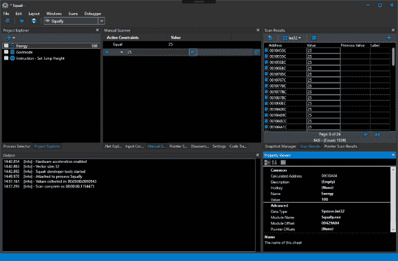

# Squalr : Squalr 内存编辑器——用 C#编写的游戏黑客工具

> 原文：<https://kalilinuxtutorials.com/squalr/>

Squalr 是一款高性能的内存编辑软件，允许用户在他们的 windows 桌面游戏中创建和分享作弊软件。这包括内存扫描、指针、x86/x64 程序集注入等等。

Squalr 通过多线程结合 SIMD 指令实现快速扫描。[见此文:SIMD 在。网](https://instil.co/2016/03/21/parallelism-on-a-single-core-simd-with-c/)。为了利用这些优势，您的 CPU 需要支持 SSE、AVX 或 AVX-512。

**文档**

你可以在 [Wiki](https://squalr.github.io/SqualrDocs/) 上找到详细的文档。使用 Squalr 有三种方式:

*   前端 GUI
*   脚本 API
*   后端 NuGet 包

下面是一些关于 NuGet 包 API 的简短文档

**接收发动机输出**

如果使用 NuGet 包，连接到引擎的输出以接收事件日志是很重要的。这些对于诊断问题是非常宝贵的。

**使用角鲨烯。发动机。记录；
…
//接收来自引擎的日志
记录器。subscribe(new enginelog events())；
…
类 EngineLogEvents:ILoggerObserver
{
public void on log event(log level log level，string message，string innerMessage)
{
控制台。WriteLine(消息)；
控制台。WriteLine(inner message)；
}
}**

**安装发动机**

**使用角鲨烯。Engine . OS
…
IEnumerable processes =进程。default . get processes()；
//挑选一个流程。对于这个例子，我们只是抓住第一个。
工艺流程=流程。FirstOrDefault()；
流程。Default . OpenedProcess = process**

**操纵记忆**

**使用角鲨烯。引擎。内存；
……
读者。Default.Read(地址)；
作家。Default.Write(地址)；
分配器。Alloc(地址，256)；
IEnumerable regions = Query。GetVirtualPages(required protection，excludedProtection，allowedTypes，startAddress，end address)；
IEnumerable modules = Query。get modules()；**

**组装/拆卸**

Squalr 可以利用 NASM 汇编和反汇编 x86/x64 指令。

**使用角鲨烯。引擎。架构；
使用角鲨烯。发动机、建筑、装配工；
…
//执行汇编
汇编器 Result result =汇编器。default . Assemble(assembly:“mov eax，5”，isProcess32Bit: true，base address:0x 10000)；
控制台。WriteLine(BitConverter。ToString(结果。字节)。替换("-"，" "))；
//反汇编结果(我们会得到同样的指令返回)
Instruction[] instructions =反汇编器。Default . Disassemble(字节:结果。Bytes，isProcess32Bit: true，base address:0x 10000)；
控制台。WriteLine(指令[0])。助记符)；**

**扫描**

Squalr 有一个用于执行高性能内存扫描的 API:

**使用角鲨烯。引擎。扫描；
使用角鲨烯。引擎。扫描。扫描仪；
利用污秽。引擎.扫描.扫描器.约束；
使用角鲨烯。引擎。扫描。快照；
…
数据类型数据类型=数据类型。Int32
//收集值
trackable task valueCollectorTask = value collector。CollectValues(
快照管理器。GetSnapshot(快照。SnapshotRetrievalMode . from activesnapshotorprefilter，dataType))；
//对值收集完成执行手动扫描
valueCollectorTask。CompletedCallback+=((completedValueCollection)=>
{
Snapshot Snapshot = completedValueCollection。结果；
//约束
ScanConstraintCollection scan Constraints = new ScanConstraintCollection()；
扫描约束。AddConstraint(新的 ScanConstraint(ScanConstraint。ConstraintType.Equal，25))；
可跟踪任务 scanTask =手动扫描仪。扫描(
快照，
allScanConstraints)；
快照管理器。保存快照(扫描任务。结果)；
})；
for(uint 64 index = 0；索引<快照。ElementCountindex++)
{
SnapshotElementIndexer element = snapshot[index]；
对象当前值=元素。HasCurrentValue()？元素。LoadCurrentValue():null；
对象前一值=元素。HasPreviousValue()？元素。LoadPreviousValue():null；
}**

**调试**

**//示例:跟踪浮点上的写事件
BreakpointSize size = Debugger。default . SizeToBreakpointSize(sizeof(float))；
取消令牌源取消令牌源=调试器。default . findwatwrites(0x 10000，size，this。CodeTraceEvent)；
…
//完成后，取消指令集合
cancellationtokensource . cancel()；
…
私有 void CodeTraceEvent(CodeTraceInfo CodeTraceInfo)
{
控制台。WriteLine(codeTraceInfo。指令.地址. tostring(" X "))；
控制台。WriteLine(codeTraceInfo。指令.助记符)；
}**

**推荐的 Visual Studio 扩展**

| 参考 | 描述 |
| --- | --- |
| [XAML 格式化程序](https://marketplace.visualstudio.com/items?itemName=TeamXavalon.XAMLStyler) | XAML 应该通过这个格式化程序运行 |
| [造型警察](https://marketplace.visualstudio.com/items?itemName=ChrisDahlberg.StyleCop) | 强制执行代码约定。请注意，我们偏离了一些标准约定。我们对变量使用完整的类型名(例如 Int32 而不是 Int)。原因是这是一个内存编辑器，所以我们更喜欢使用最显式的类型名，以避免编码错误。 |

**建造**

为了编译 Squalr，你应该只需要 **Visual Studio 2017** 。这应该是最新的，我们经常更新 Squalr 以使用最新版本的。NET 框架。以下是该项目使用的重要第三方库:

| 图书馆 | 描述 |
| --- | --- |
| [EasyHook](https://github.com/EasyHook/EasyHook) | 托管/非托管 API 挂钩 |
| [锐度主义](https://github.com/spazzarama/SharpDisasm) | 移植到 C#的 Udis86 汇编程序 |
| [CsScript](https://github.com/oleg-shilo/cs-script) | C#脚本库 |
| [AvalonEdit](https://github.com/icsharpcode/AvalonEdit) | 代码编辑库 |
| [SharpDX](https://github.com/sharpdx/SharpDX) | DirectX 包装 |
| [CLRMD](https://github.com/Microsoft/clrmd) | 。网络应用检查库 |
| [阿瓦隆多克](https://avalondock.codeplex.com/) | 停靠库 |
| [树脂](https://github.com/beto-rodriguez/Live-Charts) | WPF 图表 |

**计划功能**

| 图书馆 | 描述 | 目的 |
| --- | --- | --- |
| [AsmJit](https://github.com/hypeartist/AsmJit) | x86/x64 汇编程序 | 取代 FASM，大幅改进脚本 |
| [AsmJit](https://github.com/asmjit/asmjit) | x86/x64 汇编程序 | 原 C++项目。如果上面的版本不工作，可以移植/互操作这个(两个版本都不完全工作，可能需要一些自定义) |
| [WpfHexEditorControl](https://github.com/abbaye/WpfHexEditorControl) | 十六进制编辑器 | 十六进制编辑器/内存十六进制编辑器 |
| [开启](https://github.com/opentk/opentk) | OpenGL 包装器 | 图形注入 |
| [SharpDX](https://github.com/sharpdx/SharpDX) | DirectX 包装 | 图形注入(目前使用 SharpDX 只是为了输入) |
| [sharpcap](https://github.com/chmorgan/sharppcap) | 数据包捕获 | 数据包编辑器 |
| [Packet.Net](https://github.com/antmicro/Packet.Net) | 数据包捕获 | 数据包编辑器 |

[**Download**](https://github.com/Squalr/Squalr)