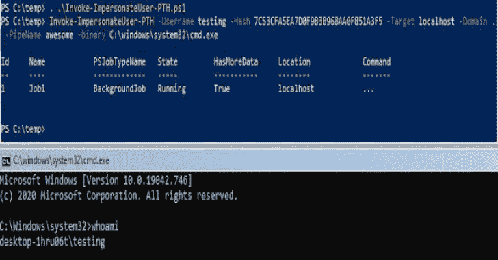
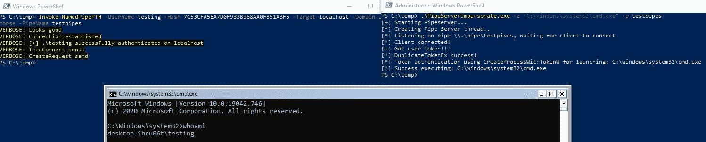
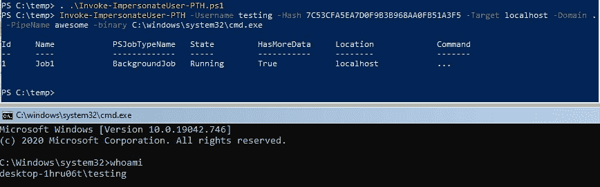

# NamedPipePTH:将哈希传递给命名管道以进行令牌模拟

> 原文：<https://kalilinuxtutorials.com/namedpipepth/>

**NamedPipePTH** 项目是一个 PoC 代码，使用 Pass-the-Hash 在本地命名管道用户模拟上进行身份验证。还有一篇博文对此进行了解释:

[https://s3cur3th1ssh1t.github.io/Named-Pipe-PTH/](https://s3cur3th1ssh1t.github.io/Named-Pipe-PTH/)

它主要基于来自项目 [Invoke-SMBExec.ps1](https://github.com/Kevin-Robertson/Invoke-TheHash/blob/master/Invoke-SMBExec.ps1) 和 [RoguePotato](https://github.com/antonioCoco/RoguePotato) 的代码。

我在过去面临过某些攻击性安全项目的情况，我已经有了一个用户账户的 NTLM 散列，并且需要在当前被入侵的系统上为该用户提供一个 shell 但是这对于当前的公共工具来说是不可能的。想象一下另外两个情况——NTLM 散列无法被破解*和*没有受害用户在其中执行外壳代码或迁移到该进程的进程。对你们中的一些人来说，这听起来像是一个荒谬的边缘案例。我还是经历了很多次。不仅仅是在一个项目中，我花了很多时间在特定的情况下寻找合适的工具/技术。

我对工具/技术的个人目标是:

*   全功能外壳或 C2 连接作为受害者用户帐户
*   它还必须能够模拟 **`low privileged`** 账户——根据项目目标，可能需要特定用户(如首席执行官、人力资源账户、SAP 管理员或其他人)访问系统
*   该工具可用作 C2 模块

不幸的是，被模拟的用户*不允许网络认证*，因为新进程正在使用一个受限的模拟令牌。因此，您只能对另一个用户的本地操作使用这种技术。

有两种方法可以使用这种技术。您可以编译`**\Resources\PipeServerImpersonate.sln**`并将可执行文件放到远程主机上，然后通过 **`\Resources\Invoke-NamedPipePTH.ps1` :** 连接到命名管道

或者您可以使用独立脚本驻留在内存中:

如果您不想删除要执行的二进制文件，只需传递本机 Windows 二进制文件(如 Powershell)的参数

**Invoke-impersonate user-PTH-Username Username-Hash NTLM Hash-Domain Domain-PipeName my pipe-binary
" C:\ WINDOWS \ System32 \ WINDOWS powershell \ v 1.0 \ powershell . exe "-argument "-nop-w1-sta-enc base blob "**

[**Download**](https://github.com/S3cur3Th1sSh1t/NamedPipePTH)