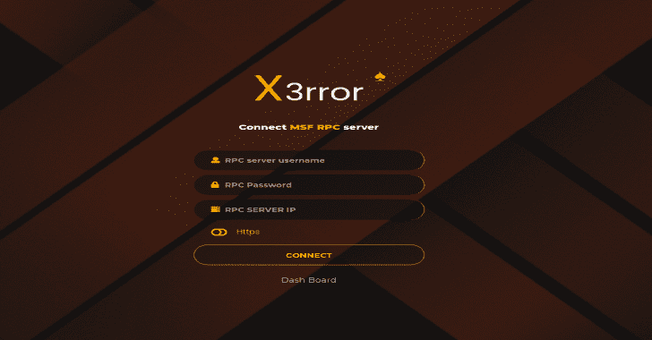
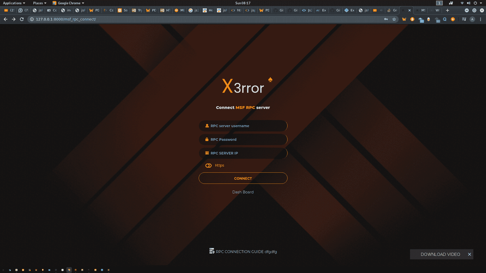
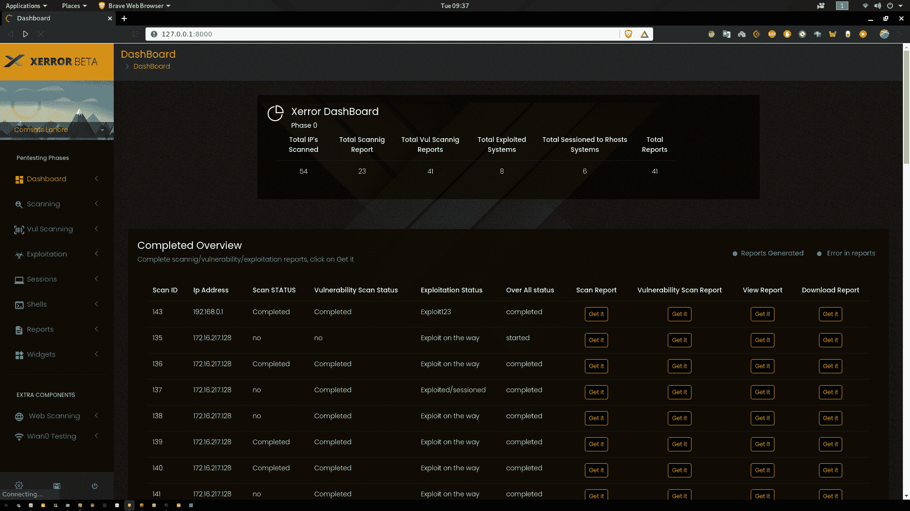
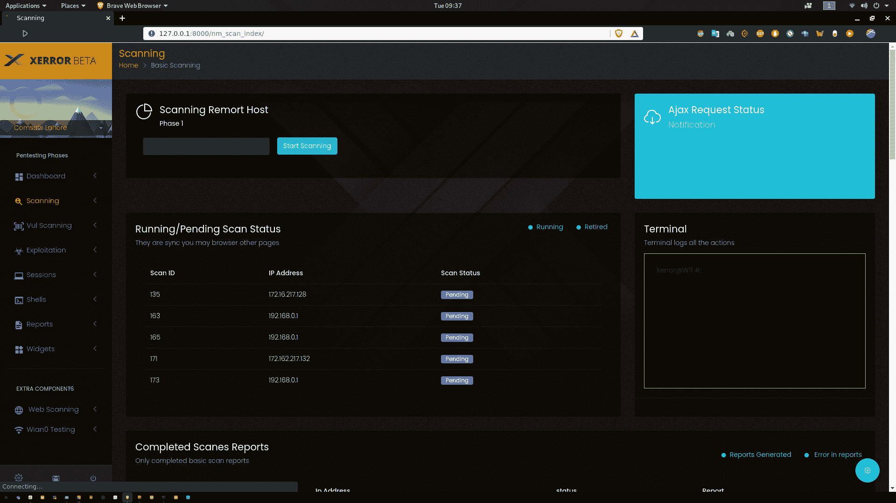
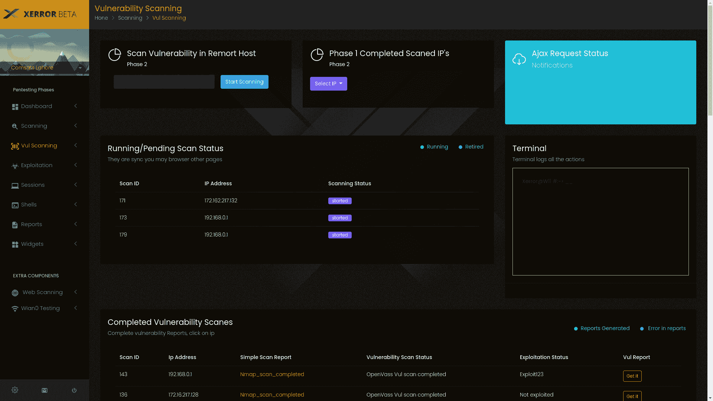
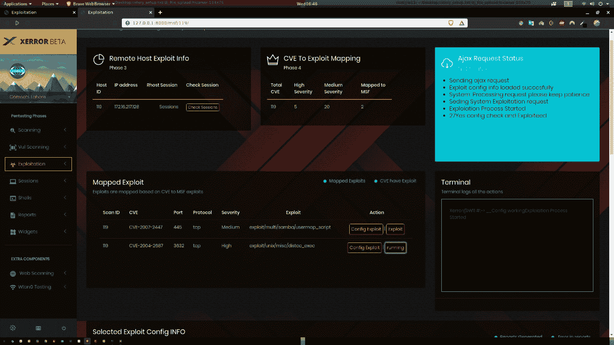
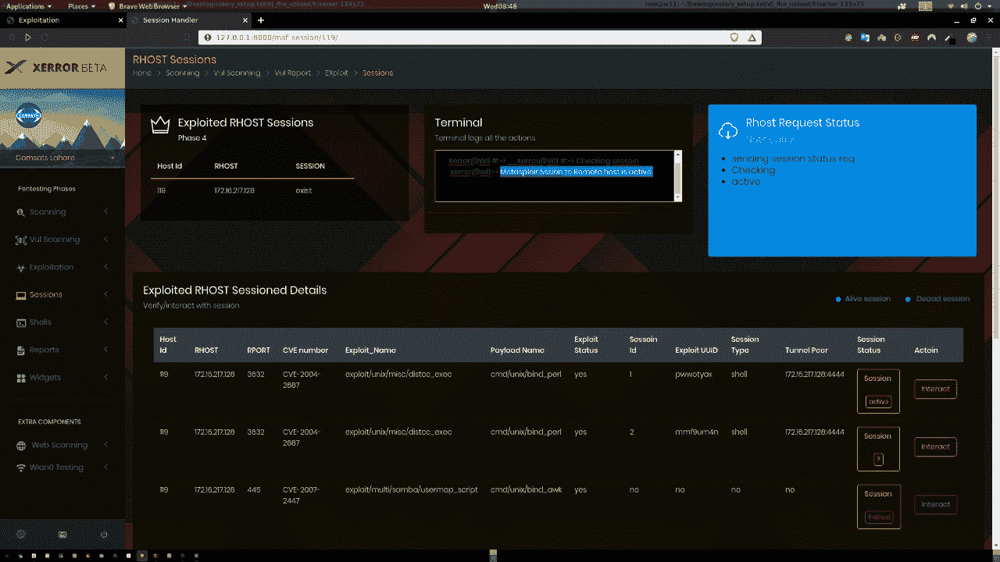
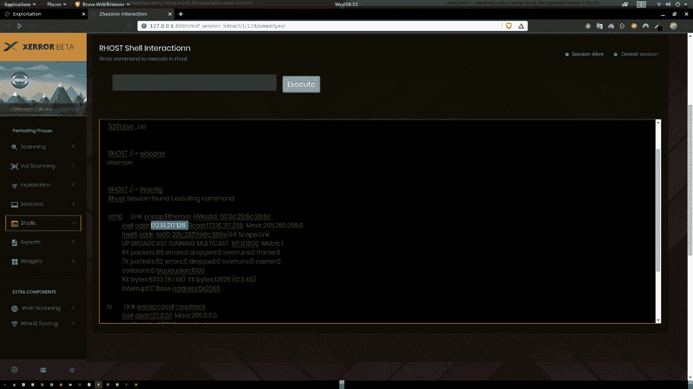
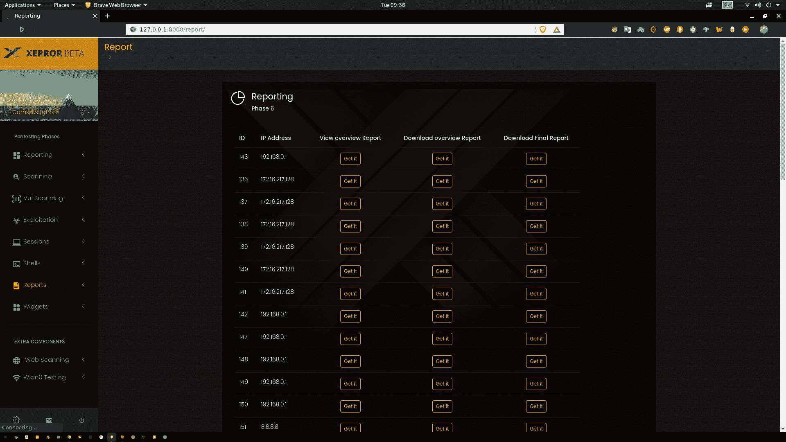
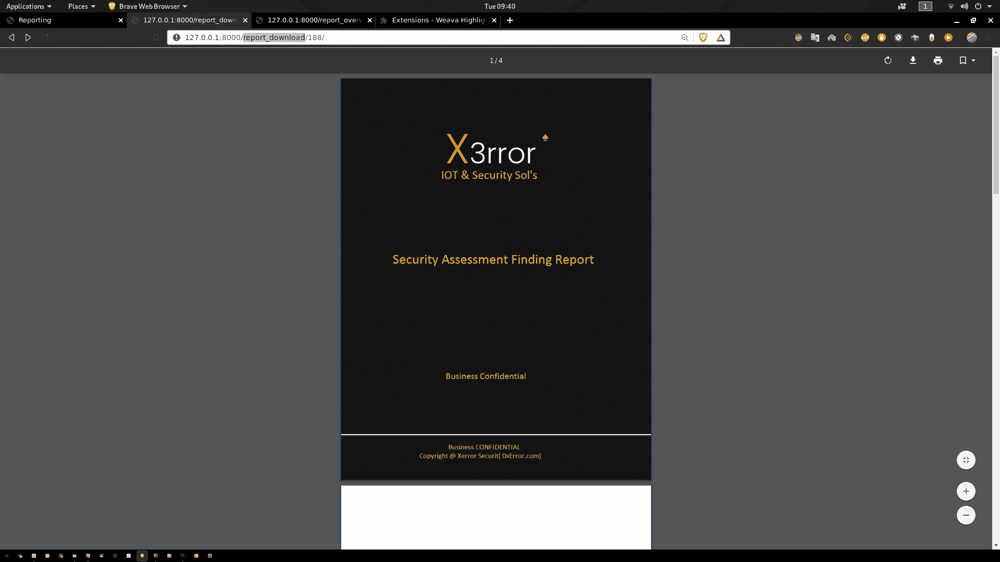

# Xerror:一个自动化渗透工具

> 原文：<https://kalilinuxtutorials.com/xerror-an-automated-penetration-tool/>

Xerror 是一个自动化渗透工具，它将帮助安全专业人员和非专业人员自动化他们的笔测试任务。Xerror 将执行所有的测试，并最终为高管和分析师生成两份报告。

Xerror 提供了 GUI 易用的菜单驱动选项。在内部，它支持 openVas 进行漏洞扫描，Metasploit 进行攻击，并在成功攻击后提供基于 GUI 的选项，例如 Meterpreter 会话。以 python 为专业构建。

Xerror 以 python2 作为主要语言，Django2 作为 web 框架，在 celery 服务器和 Redis 服务器上使用 websockets(django channel)来实现异步。在前端，它支持 Djanog 默认模板引擎语言，即 jinga2 和 jquery。

**如何使用这个项目？**

*   使用以下命令激活虚拟环境(确保您已经预安装了 py virtual env)
*   源环境/媒体夹/激活
*   启动重定向服务器
    *   redis 服务-服务器启动
*   启动 python 服务器
    *   cd xerror
    *   python manage.py runserver
*   启动 celery 服务器(在新终端中运行)
    *   cd xerror
    *   芹菜-一个 xerror 工人-l 信息
*   为 metasploit 启动 msfrpc 服务器
    *   msfrpcd -P 123 -S -a 127.0.0.1
*   启动 openvas 服务器，并将 OMP 服务器证书设置为 admin@admin 127.0.0.1 9392
*   你可以走了

这是 xerror 测试版，很快将上传完整版本，包括完整的解释和每个步骤的细节。

[**Download**](https://github.com/Chudry/Xerror)