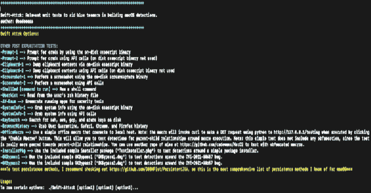
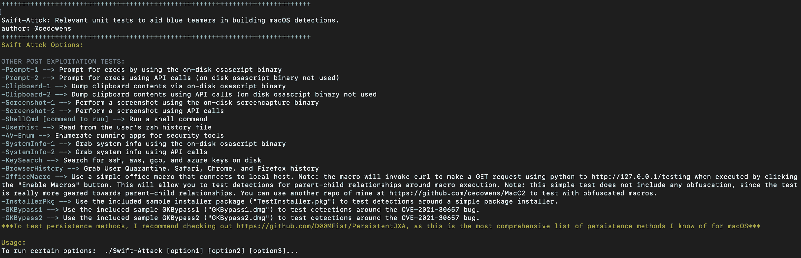

# 快速攻击:蓝队的单元测试，以帮助建立一些常见的 macOS 后开发方法的检测

> 原文：<https://kalilinuxtutorials.com/swift-attack/>

**Swift-Attack** 是蓝队的一个单元测试，用于帮助建筑检测一些常见的 macOS 后期开发方法。我提供了一些利用命令行历史和磁盘二进制文件的攻击后示例(这应该更容易检测到)，以及仅使用 API 调用的攻击后示例(这将更难检测到)。这里包括的利用后的例子并不全面。相反，这些只是一些我认为对进行单元测试有用的普通例子。随着时间的推移，我计划继续增加额外的单元测试。

所有这些测试都在本地运行，并将结果返回到 stdout(即 Swift-Attack 不连接到服务器)。

**步骤**

https://github.com/cedowens/Swift-Attack

*   确保您已经安装了 swift 和开发者工具(可以从 mac app store 安装)
*   在 XCode 中打开 xcodeproj 文件
*   在 XCode 中构建
*   编译后的 app 会下降到类似于:***Users//Library/Developer/Xcode/derived data/Swift-Attack-[random]/Build/Products/Debug/Swift-Attack . app***
*   cd 到上面的目录
*   CD Swift-Attack.app/Contents/MacOS(你可以从这里运行大男子主义或复制到其他地方，然后运行…取决于你)
*   授予 Swift-Attack macho 全磁盘访问权限，以确保您可以运行所有测试，而不会出现 TCC 问题
*   运行以下命令删除任何隔离属性:

xattr -c 快速攻击

*   快跑-进攻:

。/Swift-Attack -h

**用途**

你可以用一个或多个选项运行快速攻击

。/Swift-Attack[选项 1][选项 2]…

*   我还包含了一个简单的 macro.txt 文件(unobfuscated ),用于测试 macOS 上 office 宏执行的父子关系。我没有混淆它，因为重点是父子关系的可见性/检测。如果你想用一个模糊的宏进行测试，我在 github.com/cedowens/MacC2 有一个回购，其中包含一个模糊的宏。
*   我也没有包括任何持久性项目，因为在我看来，最好的方法是使用利奥·皮特的 https://github.com/D00MFist/PersistentJXA 的 JXA 持久性回购[来克隆和测试持久性。这个回购是迄今为止我所知道的 macOS 持久性最全面和最新的回购。](https://github.com/D00MFist/PersistentJXA)
*   我最近把一些持久的 JXA 回购移植到了 Swift:[https://github.com/cedowens/Persistent-Swift](https://github.com/cedowens/Persistent-Swift)

**单元测试包括**

*   使用 osascript 二进制文件提示
*   通过 API 调用提示
*   使用 osascript 二进制文件进行剪贴板转储
*   使用 API 调用的剪贴板转储
*   使用屏幕捕获二进制文件的屏幕截图
*   使用 API 调用的屏幕截图
*   Shell 命令
*   转储 zsh 历史
*   安全工具枚举
*   使用 osascript 二进制文件获取系统信息
*   通过 API 调用获取系统信息
*   将 ssh、aws、gcp 和 azure 密钥转储到磁盘上
*   转储浏览器历史记录(Chrome、Safari、Firefox)
*   倾倒检疫历史记录
*   Office 宏:我包含了一个简单的连接到本地主机的 office 宏。注意:当通过点击“Enable Macros”按钮执行时，该宏将调用 curl 使用 python 向 [http://127.0.0.1/testing](http://127.0.0.1/testing) 发出 GET 请求。这将允许您围绕宏执行测试父子关系的检测。注意:这个简单的测试不包括任何混淆，因为这个测试实际上更适合于父子关系。你可以用我在 https://github.com/cedowens/MacC2[的另一个回购来测试混淆的宏。使用时，只需将“macro.txt”的内容粘贴到 office 文档中，保存为启用宏的文档或 97-2004 文档格式(例如:。doc，。xls 等。)，并在打开文档时点击“启用宏”执行。](https://github.com/cedowens/MacC2)
*   安装包:我包含了 TestInstaller.pkg 文件来测试基本安装包的检测。该安装程序包包含一个预安装脚本，该脚本在 bash 中运行，并将 com.simple.agent.plist 放到/Library/LaunchDaemons/中，并将 test.js(简单弹出提示)放到/Library/Application Support/中。com.simple.agent.plist 文件只是针对/Library/Application Support/test . js 运行 osascript，它还包含一个在 bash 中运行的 postinstall 脚本，并使用 launchctl load 加载 com.simple.agent.plis。按住 Control 按钮，单击 TestInstaller.pkg 上的 Open 来运行它。TestInstaller.pkg 将以 root 身份删除上述文件。
*   cve-2021-30657 旁路有效载荷:两个样本有效载荷(都在引爆时向本地主机发出 curl 请求)来测试滥用 CVE-2021-30657 的两种不同类型的有效载荷。更多信息请点击此处:[https://cedowens . medium . com/MAC OS-gate keeper-bypass-2021-edition-5256 a 2955508](https://cedowens.medium.com/macos-gatekeeper-bypass-2021-edition-5256a2955508)

[**Download**](https://github.com/cedowens/Swift-Attack)