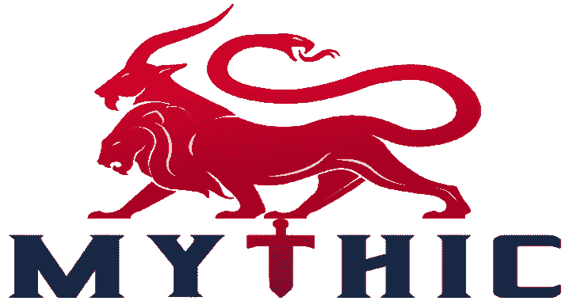

# 神话:一个协作的，多平台的，红色团队框架

> 原文：<https://kalilinuxtutorials.com/mythic/>

Mythic 是一个跨平台、后开发、red teaming 框架，由 python3、docker、docker-compose 和一个 web 浏览器 UI 构建。它旨在为整个 red 团队的操作员、经理和报告人员提供一个协作和用户友好的界面。

**安装代理和 C2 配置文件**

神话库本身不包含任何有效载荷类型或任何 C2 配置文件。相反，Mythic 提供了一个命令， **`./mythic-cli install github <url> [branch name] [-f]`，**，可以用来将代理安装到当前的 Mythic 实例中。

有效载荷类型托管在[神话代理](https://github.com/MythicAgents)组织上，C2 档案托管在[神话 2 档案](https://github.com/MythicC2Profiles)组织上。

要安装代理，只需运行脚本并在 GitHub 上提供代理路径的参数:

**sudo。/mytic-CLI 安装 github https://github . com/mythicles/apple**

安装 C2 配置文件也是如此:

**须藤。/mythic-cli 安装 github https://github.com/MythicC2Profiles/http**

这与以前的神话版本略有不同，以前的版本在这个库中包含了一些默认的有效载荷类型和 C2 配置文件。这一变化允许代理和 c2 档案以更有规律的速度更新，并最终将 Mythic 的核心组件从 Mythic 的其余部分中分离出来。

**神话集装箱配置& PyPi 包装**

Mythic 的所有组件都使用 Docker 和 Docker-compose，这允许 Mythic 提供广泛的组件和特性，而不需要在主机上存在需求。然而，深入了解容器是如何配置的会很有帮助。Mythic 的所有 docker 容器都托管在 DockerHub 的 [itsafeaturemythic](https://hub.docker.com/search?q=itsafeaturemythic&type=image) 下。

此外，Mythic 使用许多定制的 PyPi 包来帮助控制和同步所有容器之间的信息，并提供一种简单的方法来编写对服务器的访问。

所有这些都可以在 [MythicMeta](https://github.com/MythicMeta) 上找到:

*   上传到 DockerHub 的所有 Docker 图像的 Docker 文件配置
*   上传到 PyPi 的所有包的 PyPi 源代码
*   编写源代码脚本

**当前集装箱 PyPi 包装要求**

受支持的有效负载类型必须有 0.0.43 的`**mythic_payloadtype_container**` PyPi 包。

*   有效负载类型容器将此报告为版本 7。

受支持的 c2 概要文件必须有 0.0.22 的`**mythic_c2_container**` PyPi 包。

*   C2 配置文件容器将其报告为版本 3。

受支持的翻译容器必须有 0.0.10 的`**mythic_translator_containter**` PyPi 包。

*   翻译器容器将此报告为版本 3。

[**Download**](https://github.com/its-a-feature/Mythic#mythic-container-configurations--pypi-packages)