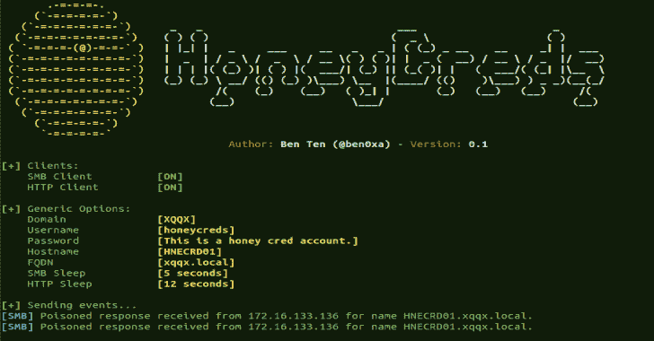
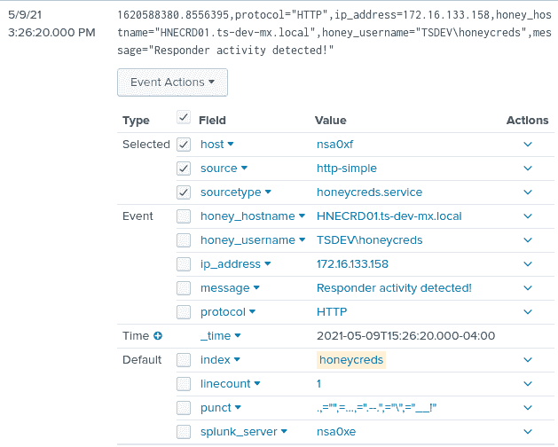

# HoneyCreds:检测响应者和其他网络投毒者的网络凭证注入

> 原文：<https://kalilinuxtutorials.com/honeycreds/>

**HoneyCreds** 网络凭证注入，检测响应者和其他网络投毒者。

**要求**

**需要 Python 3.6+(在 Python 3.9 上测试)
SMB protocol
cffi
splunk-SDK**

**安装**

**git 克隆 https://github.com/Ben0xA/HoneyCreds.git
CD honey creds
pip 3 install-r requirements . txt**

**运行中**

**python 3 honeyreds . py**

**设置**

建议您更改这些设置以最适合您的环境。

**注意:**可以使用现有账号，只需更改密码即可。

在 honeycreds.conf 中更改这些内容

选择一个合法的用户名

**def _ username = ' honey creds '**

这可以匹配您当前的短域名

**def_domain = 'XQQX'**

你想怎么做就怎么做。注意:HTTP 请求将以明文形式发送

def_password = '这是一个蜂蜜信用账户。'

FQDN。离开。本地在最后。

**def _ FQDN =‘xqqx . local’**

不存在但看起来合法的主机名。

**def _ hostname =‘hncrd 01’**

日志文件和位置

**def _ log file = ' honey creds . log '**

能够打开或关闭 SMB 或 HTTP。设置为“关”以关闭。

**SMB = 'ON'
HTTP = 'ON'**

请求之间的暂停时间(秒)。

**SMB _ SLEEP = 5
HTTP _ SLEEP = 12**

[**Download**](https://github.com/Ben0xA/HoneyCreds)