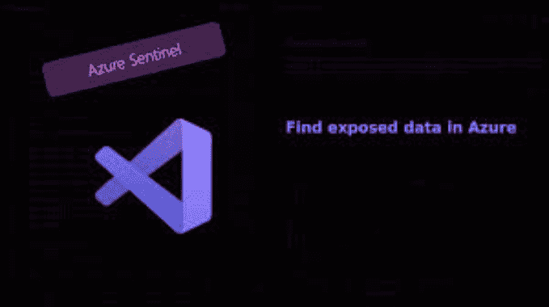

# BlobHunter:使用这个公共 Blob 扫描器在 Azure 中查找公开的数据

> 原文：<https://kalilinuxtutorials.com/blobhunter/>

BlobHunter 是一个开源工具，用于扫描 Azure blob 存储帐户，查找公开打开的 blob。
blobhuter 是“猎取 Azure Blobs 暴露数百万敏感文件”研究的一部分:
[https://www . cyberark . com/resources/threat-research-blog/Hunting-Azure-Blobs-Exposes-million-of-Sensitive-Files](https://www.cyberark.com/resources/threat-research-blog/hunting-azure-blobs-exposes-millions-of-sensitive-files)

**概述**

BlobHunter 帮助您识别 Azure blob 存储容器，这些容器存储的文件对任何有互联网连接的人都是公开的。该工具将通过识别存储敏感数据的配置不佳的容器来帮助降低风险，这在大规模 Azure 订阅中特别有用，因为其中有大量存储帐户可能很难跟踪。
BlobHunter 生成一个信息性的 csv 结果文件，提供扫描环境中每个公开打开的容器的重要细节。

**要求**

1.  Python 3.5 以上版本
2.  Azure CLI
3.  [`**requirements.txt**`](https://github.com/cyberark/BlobHunter/blob/main/requirements.txt) 套餐
4.  具有以下[内置角色](https://docs.microsoft.com/en-us/azure/role-based-access-control/built-in-roles)之一的 Azure 用户:
    *   [所有者](https://docs.microsoft.com/en-us/azure/role-based-access-control/built-in-roles#owner)
    *   [投稿人](https://docs.microsoft.com/en-us/azure/role-based-access-control/built-in-roles#contributor)
    *   [存储帐户贡献者](https://docs.microsoft.com/en-us/azure/role-based-access-control/built-in-roles#storage-account-contributor)或角色允许执行以下 Azure 操作的任何 Azure 用户:

**Microsoft.Resources/subscriptions/read
Microsoft.Resources/subscriptions/resourceGroups/read
Microsoft.Storage/storageAccounts/read
Microsoft.Storage/storageAccounts/listkeys/action
微软。storage/storage accounts/blob services/containers/read
微软。存储/存储帐户/blob 服务/容器/blob/read**

**建造**

**安装在 Ubuntu 上的示例**

**https://aka.ms/InstallAzureCLIDeb | sudo bash**

**pip 3 install-r requirements . txt**

**用途**

简单地跑

**python3 BlobHunter.py**

如果您没有登录 Azure CLI，浏览器窗口将提示您插入 Azure 用户凭据。

[**Download**](https://github.com/cyberark/BlobHunter)