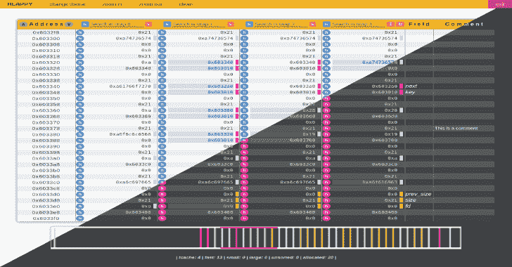

# Heappy:一个支持开发过程的快乐堆编辑器

> 原文：<https://kalilinuxtutorials.com/heappy/>

Heappy 是一个基于 gdb/gef 的编辑器，帮助你在开发过程中处理堆。
这个项目应该被认为是一个有助于理解流程生命周期中堆的演变的教学工具。它的创建是为了简化对最常见的堆利用技术的研究，并支持您解决一些与这个奇妙主题相关的二进制利用 CTF。

**主要特点**

这就是 Heappy 实现的功能:
✅拍摄堆快照并相互比较
✅立即识别堆箱的类型和字段
✅通过十进制、十六进制或字符串搜索和编辑堆值
✅发现自己拥有堆状态的全景图
✅在评论栏中记录一个单元格
✅享受明暗模式

**入门**

这些说明将帮助您快速安装和运行 Heappy。

**先决条件**

如果没有，请在 GDB 安装 GEF:

https://github.com/hugsy/gef/raw/master/scripts/gef.sh |上海

*MD5(GEF . sh):EB 053864d 050048 CB 001 c 80 c 79 FDE 7 b 5*

**安装**

安装 Node.js 和 npm:

**apt 更新
【sudo apt 安装 nodejs NPM】**

下载并安装 Heappy:

**git 克隆 https://github . com/gand 3lf/heappy
CD heappy/
NPM 安装**

在 GDB 内部加载服务器:

**gef➤source/my/path/heappy/server/heappy . py**

建议在目标堆初始化之后运行 Heappy GUI。
例如:

**gef➤破主
gef➤跑路**

从另一个终端启动 GUI:

**cd /my/path/heappy/
npm 开始**

[**Download**](https://github.com/gand3lf/heappy)