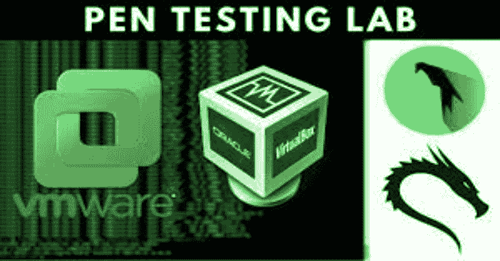
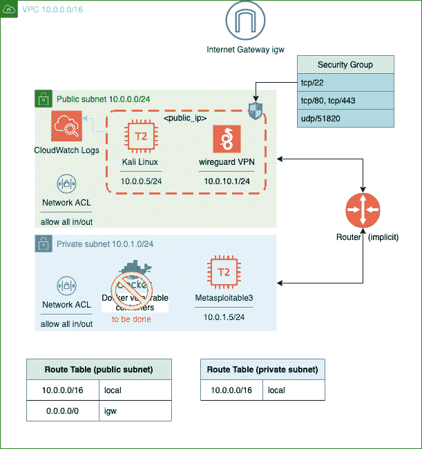

# AWS Pen-Testing Laboratory:Pentesting Lab 带有一个可通过 Ssh 和 Wireguard VPN 访问的 Kali Linux 实例，并且带有位于私有子网中的易受攻击实例

> 原文：<https://kalilinuxtutorials.com/aws-pen-testing-laboratory/>

**AWS 笔测试实验室**部署为 IaC，在 AWS 上使用 Terraform。它部署了一个可通过 ssh & wire guard VPN 访问的 Kali Linux 实例。私有子网中易受攻击的实例。

**注:**

*   仅针对区域“欧盟-西方-1”定义的 id
*   对于其他区域，必须指定 kali ami id 和 metasploitable3 id(在构建之后)

**变更日志**

*   [2021-06-02]AMI id 更改为使用 Kali 2021.2
*   使用新的卡利版本 2021.1

**图**

**组件**

*   Kali 2021.2 实例(私钥保存在 kali.pem 中)
    *   Wireguard VPN 服务:客户端文件 client_vpn.wg
    *   可通过 ssh/scp 访问
    *   *公共*子网 10.0.0.5/24
*   易受攻击的机器“metasplogiable”(ami 内部版本是公共的)
    *   *私有*子网 10.0.1.5/24
*   更易受攻击的实验室/机器/码头(待完成)

**新增功能**

*   用户管理
    *   使用 rsa 在 kali 实例中自动创建非特权用户
    *   每个用户的 Wireguard VPN 客户端文件
*   系统日志中的命令行审核日志记录
*   使用 sudo_log 和 users_log 关键字启用 auditd，用于审核用户操作(另请参见 ausearch 命令)
*   ToDO:将终端审核转发到 CloudWatch 或具有一次写入策略的 S3 存储桶

**操作指南**

*   要求:
    *   Terraform CLI [安装指南](https://learn.hashicorp.com/terraform/getting-started/install.html)
    *   AWS CLI [安装指南](https://docs.aws.amazon.com/cli/latest/userguide/cli-chap-install.html)
    *   为 AWS CLI 和 Terraform 配置的 PATH
    *   AWS 帐户并通过 aws cli 配置凭据:`**aws configure**`
    *   AWS 市场中的 Kali Linux 订阅(版本 2020.04)
    *   先前构建的 Metasploitable3 AMI 映像(eu-west-1 地区可用的公共 AMI)[参见](https://github.com/juanjoSanz/aws-pentesting-lab/blob/main/metasploitable3)

**展开**

在`**variables.tf**`中设置 **`0`** 或 **`1`** 启用/禁用待部署的易受攻击实例:

**变量" deployment-Control " {
type = map
default = {
# " instance " = 0 或 1，禁用或启用
" metasploitable 3 " = 1
" dvca " = 0
}
description = "控制部署哪些 EC2 实例，0 表示不部署，1"
}**

使用 terraform 部署基础架构

**地形初始化
地形计划
地形申请-自动审批**

**输出**

Terraform 输出将显示以下条目:

*   kali 用户的 ssh 连接命令(root 通过 sudo)
*   kali 用户的 wireguard 客户端文件将自动从 kali 服务器中检索
*   用于检索 wireguard 客户端文件的 scp 命令(以防定义的 terraform local-exec 命令失败)
*   对于在 Kali 实例中创建的每个普通用户
    *   ssh 连接的私钥文件
    *   用于 VPN 连接的 Wireguard 客户端文件

**用途**

通过 ssh 或 wireguard 连接到 Kali:

*   SSH:(仅命令行)使用自动生成的私钥(参见 terraform 输出)

**KALI _ IP = # configure KALI public IP
ssh-I KALI . PEM-o stricthostkey checking = no-o identities only = yes KALI @ $ { KALI _ IP }**

*   Wireguard:通过 wireguard 连接您的本地 kali 实例(参见 client_vpn.wg 生成的文件)

**KALI _ IP = # configure KALI public IP
scp-I KALI . PEM-o stricthostkey checking = no identities only = yes KALI @ $ { KALI _ IP }:/home/KALI/client _ VPN . WG。
####**

**(local _ kali)$ sudo apt-get install–y wire guard
(local _ kali)$ sudo gedit/etc/wire guard/wg0 . conf #复制 client_vpn.wg 的内容
(local _ kali)$ sudo chmod 700/etc/wire guard/wg0 . conf
(local _ kali)$ sudo WG-quick up wg0
(local _ kali)$ ping 10 . 0 . 5 #测试与 kali 的连通性**

**摧毁**

**地形破坏-自动批准**

[**Download**](https://github.com/juanjoSanz/aws-pentesting-lab)