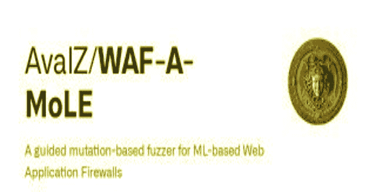
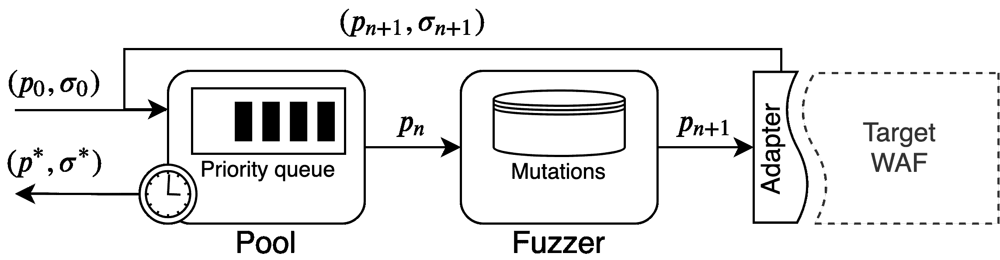
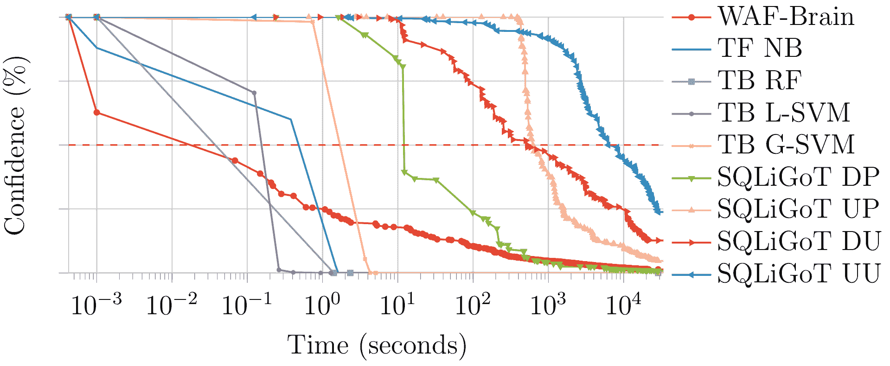

# WAF-A-MoLE:用于基于 ML 的 Web 应用防火墙的基于引导变异的 Fuzzer

> 原文：<https://kalilinuxtutorials.com/waf-a-mole/>

WAF-A-MoLE 是一个*引导的基于变异的 fuzzer* ，用于基于 ML 的 Web 应用防火墙，它受到 AFL 的启发，并基于 Andreas Zeller 等人的 [FuzzingBook](https://www.fuzzingbook.org/) 。

给定一个输入 SQL 注入查询，它试图产生一个能够绕过目标 WAF 的*语义不变的*查询。您可以通过让 WAF-A-MoLE 探索解决方案空间来找到目标分类器未覆盖的危险“盲点”,从而使用该工具来评估产品的健壮性。

**架构**

WAF-A-MoLE 获取一个初始有效载荷，并将其插入到有效载荷池**中**，该池管理一个优先级队列，该队列根据每个有效载荷的 WAF 置信度得分排序。

在每次迭代中，有效负载池的头被传递给 **Fuzzer** ，通过应用一个可用的变异操作符，它在这里被随机变异。

**变异算子**

突变操作符都是*语义保留的*，它们利用了 SQL 语言(在这个版本中是 MySQL)的强大表达能力。

下面是当前版本的 WAF-A-MoLE 中可用的变异操作符。

| 变化 | 例子 |
| --- | --- |
| 案例交换 | **`admin' OR 1=1#`** ⇒ **  `admin' oR 1=1#`** |
| 空白替换 | `**admin' OR 1=1#**`  ⇒  `**admin'\t\rOR\n1=1#**` |
| 注释注入 | **`admin' OR 1=1#`** ⇒  `**admin'/**/OR 1=1#**` |
| 注释重写 | `**admin'/**/OR 1=1#**`  ⇒  `**admin'/*xyz*/OR 1=1#abc**` |
| 整数编码 | `**admin' OR 1=1#**`  ⇒  `**admin' OR 0x1=(SELECT 1)#**` |
| 操作员交换 | `**admin' OR 1=1#**`  ⇒  `**admin' OR 1 LIKE 1#**` |
| 逻辑不变量 | `**admin' OR 1=1#**`  ⇒  `**admin' OR 1=1 AND 0<1#**` |

**如何引用我们**

WAF-A-MoLE 实现了[“WAF-A-MoLE:通过对抗性机器学习规避 Web 应用防火墙”](https://www.researchgate.net/publication/340917525_WAF-A-MoLE_Evading_Web_Application_Firewalls_through_Adversarial_Machine_Learning)中介绍的方法。

如果要引用我们，请使用以下(BibTeX)参考:

**@ in Proceedings { Demetrio 20 wafa MoLE，
title={WAF-A-MoLE:通过对抗性机器学习规避 web 应用防火墙}，
作者={Demetrio，Luca 和 Valenza，Andrea 和 Costa，Gabriele 和 Lagorio，Giovanni}，
book title = {第 35 届 ACM 应用计算年会论文集}，
pages = { 1745–1752 }，
year={2020}
} 【T7**

**运行晶圆片**

**先决条件**

*   [numpy](https://numpy.org/)
*   [keras](https://keras.io/)
*   [scikit-learn](https://scikit-learn.org/stable/)
*   [joblib](https://github.com/joblib/joblib)
*   [sqlparse](https://github.com/andialbrecht/sqlparse)
*   [网络 x](https://networkx.github.io/)
*   [点击](https://click.palletsprojects.com/en/7.x/)

**设置**

**pip install-r requirements . txt**

**样品用途**

您可以评估自己的 WAF 的健壮性，或者针对一些示例分类器尝试 WAF-A-MoLE。第一种情况，看一下[模型](https://github.com/AvalZ/waf-a-mole/blob/master/wafamole/models/model.py)类。您的定制模型需要实现这个类，以便被 WAF-A-MoLE 评估。我们已经为 *sci-kit learn* 和 *keras* 分类器提供了包装器，可以扩展以适合您的特征提取阶段(如果有的话)。

**帮助**

**wafa mole–帮助**

**用法:wafa mole[选项]命令[ARGS]…
选项:
–帮助显示此消息并退出。
命令:
躲避对目标分类器发射的地鼠。**

**瓦法莫尔躲避——帮助**

**用法:wafamole 规避【选项】MODEL_PATH 有效载荷
对目标分类器发射 WAF-A-MoLE。
选项:
-T，–model-Type 文本类型分类器加载
-t，–timeout 整数 time out 规避 model
-r，–max-rounds 整数最大模糊轮数
-s，–round-size 整数每轮模糊步长(并行模糊
步)
–目标 WAF 的阈值浮点分类阈值【0.5】
–random-engine 文本使用随机变换而不是进化
引擎。设置试验次数
–输出路径文本位置，以保存随机
引擎的结果。不用于常规进化引擎
–帮助显示此消息并退出。**

**规避示例模型**

我们在[wafa mole/models/custom/example _ models](https://github.com/AvalZ/waf-a-mole/tree/master/wafamole/models/custom/example_models)中提供了一些预先训练好的模型，您可以从中获得乐趣。下表列出了我们使用的分类器。

| 分类器名称 | 算法 |
| --- | --- |
| [WafBrain](https://github.com/BBVA/waf-brain) | 递归神经网络 |
| 基于令牌的 | 朴素贝叶斯 |
| 基于令牌的 | 随机森林 |
| 基于令牌的 | 线性 SVM |
| 基于令牌的 | 高斯 SVM |
| [SQLiGoT](https://www.sciencedirect.com/science/article/pii/S0167404816300451)–定向比例 | 高斯 SVM |
| [SQLiGoT](https://www.sciencedirect.com/science/article/pii/S0167404816300451)–定向不成比例 | 高斯 SVM |
| [SQLiGoT](https://www.sciencedirect.com/science/article/pii/S0167404816300451)–无向比例 | 高斯 SVM |
| [SQLiGoT](https://www.sciencedirect.com/science/article/pii/S0167404816300451)–无方向不成比例 | 高斯 SVM |

**WAF-BRAIN–递归神经网络**

使用等效的`**admin' OR 1=1#**`绕过预先训练的 WAF-Brain 分类器。

**wafa mole escape–模型类型 waf-brain wafa mole/models/custom/example _ models/waf-brain . H5 " admin ' OR 1 = 1 # "**

**基于令牌的原生贝叶斯**

使用等效的`**admin' OR 1=1#**`绕过预先训练的基于令牌的朴素贝叶斯分类器。

**wafa mole escape–模型类型令牌 wafa mole/models/custom/example _ models/naive _ Bayes _ trained . dump " admin ' OR 1 = 1 # "**

**基于令牌的随机森林**

使用等效的`**admin' OR 1=1#**`绕过预先训练的基于令牌的随机森林分类器。

**wafa mole escape–模型类型令牌 wafa mole/models/custom/example _ models/random _ forest _ trained . dump " admin ' OR 1 = 1 # "**

**基于令牌的线性 SVM**

使用等效的`**admin' OR 1=1#**`绕过预训练的基于令牌的线性 SVM 分类器。

**wafa mole escape–模型类型令牌 wafa mole/models/custom/example _ models/Lin _ SVM _ trained . dump " admin ' OR 1 = 1 # "**

**基于令牌的高斯 SVM**

使用等效的`**admin' OR 1=1#**`绕过预训练的基于令牌的高斯 SVM 分类器。

**wafa mole escape–模型类型令牌 wafa mole/models/custom/example _ models/gauss _ SVM _ trained . dump " admin ' OR 1 = 1 # "**

**SQLiGoT**

使用等效的 **`admin' OR 1=1#`** 绕过预训练的 SQLiGOT 分类器。使用 **DP** 、 **UP** 、 **DU** 或 **UU** (分别)表示定向比例、非定向比例、定向非比例和非定向非比例。

**wafa mole escape–模型类型 DP wafa mole/models/custom/example _ models/graph _ directed _ proportional _ sqligot " admin ' OR 1 = 1 # "**

**在 SQLiGoT 上启动评估之前**

这些分类器比其他分类器更健壮，因为特征提取阶段产生具有更复杂结构的向量，并且所有预训练的分类器都被强正则化。一些变体可能需要数小时才能产生达到规避的有效载荷(参见基准测试部分)。

**定制适配器**

首先，创建一个实现了`**extract_features**`和`**classify**`方法的定制模型类。

**class YourCustomModel(Model):
def extract _ features(self，value:str):
# TODO:extract features
feature _ vector = your _ custom _ feature _ function(value)
return feature _ vector
def classify(self，value):
# TODO:compute confidence
confidence = your _ confidence _ eval(value)
return confidence**

然后，从模型中创建一个对象，并实例化一个使用您的模型类的 **`engine`** 对象。

**model = YourCustomModel()# your init
engine = evasion engine(model)
result = engine . evaluate(payload，max_rounds，round_size，timeout，threshold)**

**基准**

我们针对所有的示例模型评估了 WAF-A-MoLE。

下图显示了 WAF-A-MoLE 变异`admin' OR 1=1#`有效载荷直到被每个分类器接受为良性所用的时间。

在 *x* 轴上我们有时间(以秒为单位，对数刻度)。在 *y* 轴上，我们有*置信度*值，即分类器对于给定有效载荷是 SQL 注入的确信程度(百分比)。

请注意，“50%确定”有效载荷是 SQL 注入相当于抛硬币。这是通常的分类阈值:如果置信度较低，则有效载荷被分类为良性。

实验在[数字海洋*标准*液滴](https://www.digitalocean.com/products/droplets/)上进行。

[**Download**](https://github.com/AvalZ/WAF-A-MoLE)