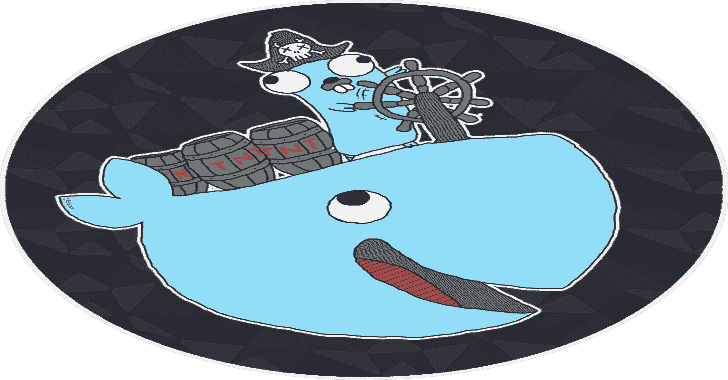

# Gorsair:侵入公开 API 的远程 Docker 容器

> 原文：<https://kalilinuxtutorials.com/gorsair/>

Gorsair 是一款渗透测试工具，用于从易受攻击的 Docker 容器中发现并远程访问 Docker APIs。一旦它可以访问 docker 守护进程，您就可以使用 Gorsair 直接在远程容器上执行命令。

在互联网上暴露 docker API 是一个巨大的风险，因为它可以让恶意代理获得所有其他容器、映像和系统的信息，如果映像使用 **`root`** 用户，还可能获得对整个系统的特权访问。

**安装**

**从发布**

设置:

*   到你感兴趣的任何版本
*   `OS`到你的操作系统( **`linux`、`windows`或`darwin`** )
*   `ARCH`到你的架构( **`amd64`、`arm`、**或 **`ppc64le`** )

然后运行以下命令来安装 gorsair。

**curl-sS https://github . com/ulla Kut/gors air/releases/download/$ gors air _ VERSION/gors air _ $ OS _ $ ARCH–output/usr/local/bin/gors air&chmod+x/usr/local/bin/gors air**

**来源于**

*   确保您拥有支持模块的 go 版本(版本 1.11 及更高版本)
*   确保您的环境包含设置为`**on**`的 **`GO111MODULE`** 变量
*   从这个库的根目录运行`**go build -o /usr/local/bin/gorsair cmd/*.go**`

**命令行选项**

*   **`-t`、`--targets`** :根据 [nmap 目标格式](https://nmap.org/book/man-target-specification.html)设置目标。必需的。例子:`--targets="192.168.1.72,192.168.1.74"`
*   **`-p`、`--ports`、**:(默认:`2375,2376`)设置自定义端口。
*   **`-s`、`--speed`** :(默认:`4`)设置自定义 nmap 发现预设以提高速度或准确性。如果你试图扫描一个不稳定和缓慢的网络，建议降低它，如果在一个非常高性能和可靠的网络，建议增加它。你可能还想保持低调，以保持你的发现隐秘。有关 nmap 时序模板的更多信息，请参见。
*   **`-v`、`--verbose`** :启用更详细的日志。
*   **`-D`、`--decoys`** :要使用的诱饵 IP 地址列表(参见 nmap 文档的[诱饵部分](https://nmap.org/book/man-bypass-firewalls-ids.html))
*   **`-e`、`--interface`** :要使用的网络接口
*   **`--proxies`** :用于解除连接的 HTTP/SOCKS4 代理列表([参见文档](https://nmap.org/book/man-bypass-firewalls-ids.html)
*   **`-S`、`--spoof-ip`** :用于 IP 欺骗的 IP 地址
*   **`--spoof-mac`** :用于 MAC 欺骗的 MAC 地址
*   **`-v`、`--verbose`** :启用详细日志记录
*   **`-h`、`--help`** :显示使用信息

**我如何保护我的容器免受这种攻击**

*   避免将可以访问 docker 套接字的容器放在互联网上
*   避免在 docker 容器中使用 **`root`** 账户

[**Download**](https://github.com/Ullaakut/Gorsair)