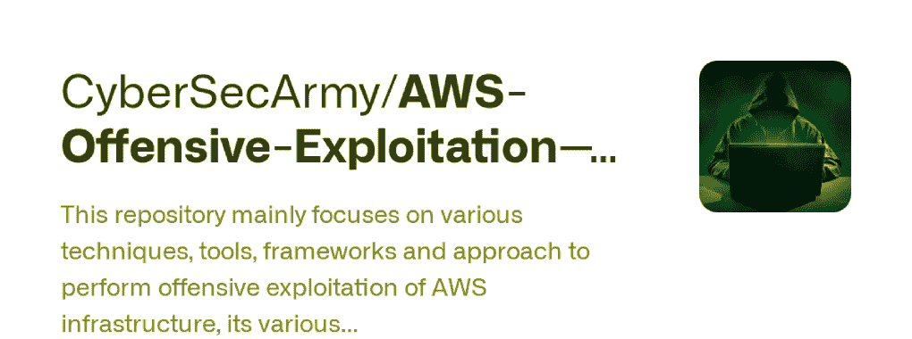

# Scour : AWS 开发框架

> 原文：<https://kalilinuxtutorials.com/scour/>

Scour 是一个基于现代模块的 AWS 开发框架，用 golang 编写，为红队测试和蓝队分析而设计。冲刷包含现代技术，可用于攻击环境或建立防御检测。

**特性**

*   命令完成
*   动态资源列表
*   命令历史
*   蓝队模式(用唯一用户代理标记攻击)

**安装**

冲刷是用 golang 编写的，所以很容易作为二进制文件发布。

# #可获取

去找 github.com/grines/scour

# #构建

去建主建筑，去

要获得更详细和用户友好的用户说明，请查看 Wiki 的[安装指南](https://github.com/grines/scour/wiki/Installation)。* *即将推出

**冲刷模块**

Scour 使用一系列模块:

*   [操作](https://github.com/grines/scour#Operations) (2)
*   [枚举](https://github.com/grines/scour#Enumeration) (7)
*   [权限提升](https://github.com/grines/scour#PrivilegeEscalation) (3)
*   [横向移动](https://github.com/grines/scour#LateralMovement) (2)
*   [闪避](https://github.com/grines/scour#Evasion) (5)
*   [凭证发现](https://github.com/grines/scour#CredentialDiscovery) (4)
*   [执行](https://github.com/grines/scour#Execution) (2)
*   持久性 (7)
*   [渗出](https://github.com/grines/scour#Exfiltration) (1)

**注释**

*   所有 Linux/OSX 都支持 Scour。
*   Scour 是一个开源软件，它是以 BSD-3 条款许可证发布的。

**入门**

第一次启动冲刷时，

**冲刷中的基本命令**

*   `**token profile <profile_name> <region>**`将列出存储在~/aws/credentials 中的可用 aws 配置文件。
*   `**token AssumeRole <role_name> <region>**`将承担相同或交叉账户的角色。**需要活动会话
*   `**help module**`将返回指定模块的适用帮助信息。* *帮助 TBD
*   `**attack evasion <tactic>**`将用其默认参数运行指定的模块。

**从命令行运行冲刷**

*   `**scour**`将进入 cli 模式
*   `**Not Connected <> token profile apiuser us-east-1**`设置用于需要一个会话的命令的会话
*   `**Connected <apiuser/us-east-1>**`从(地区)中的(~，/aws/credentials)主动连接到 aws 配置文件
*   **`Connected <apiuser/us-east-1> attack enum <attack>`** 标签页补全，列出可用的枚举战术
*   `**Connected <apiuser/us-east-1> attack privesc <attack>**`选项卡完成，列出可用的权限提升策略
*   `**Connected <apiuser/us-east-1> attack lateral <attack>**`选项卡完成，列出可用的横向策略
*   `**Connected <apiuser/us-east-1> attack evasion <attack>**`制表完成，列出可用的规避策略
*   `**Connected <apiuser/us-east-1> attack creds <attack>**`选项卡完成，列出可用的凭据发现策略
*   `**Connected <apiuser/us-east-1> attack execute <attack>**`选项卡完成，列出可用的执行策略
*   `**Connected <apiuser/us-east-1> attack persist <attack>**`制表完成，列出可用的坚持策略
*   `**Connected <apiuser/us-east-1> attack exfil <attack>**`选项卡完成，列出可用的渗透策略

**枚举**

**连接< apiuser/us-east-1 >攻击**enum IAMIAM 发现

**+——————+————————+——————+——————————+——————+
|用户|托管策略|内联策略|组| is privileged |
+————————————————————+——————————+———
| admin | administrator access | AllEKSInlineuser | security audit | true |
| EC2 | amazone**

**`Connected <apiuser/us-east-1> attack enum Roles`** 角色发现

UA Tracking:exec-env/evswayidc 4/o 18 htf PE 1 p/ROLE-enum
**+——————————————————————————————————————————————————————
| ROLE | PRINCIPAL TYPE | IDENTITY/SERVICE | is privileged |
+————————————————————**

`**Connected <apiuser/us-east-1> attack enum EC2**` EC2 发现

**UA Tracking:exec-env/evswayidc 4/dud qw 7 y1 XB/ec2-enum
+————————————————————————————————————
| INSTANCE id | INSTANCE PROFILE | VPC | public IP | private IP |安全组|安全组
| I-03657 Fe 3 b 9 decdf 51 | arn:AWS:iam::861293084598:instance-profile/org admin | VPC-7e 830 C1 a | None | 172 . 31 . 45 . 96 | SG-61 B1 FD 07 | All * | stopped | true | true |
| | | | | | 8888 * | | | |
| I-01b 265 a5 FD I-0d 95790 b5 e 7 ddff 23 | None | VPC-7e 830 C1 a | None | 172 . 31 . 12 . 57 | SG-E1 a 50 DAC | 33391 * | stopped | false | true |
+————————————————————————————————————————————————————————————————————————————————————————————————————————**

`**Connected <apiuser/us-east-1> attack enum S3**` S3 的发现

**UA Tracking:exec-env/evswayidc 4/gdgzayquo/S3-enum
+———————————————————————————
| BUCKET | has policy | is website | ALLOW PUBLIC | PERMISSIONS | ALLOW AUTHENTICATED | PERMISSIONS | REPLICATION | REGION |【T3+】—— | false | | | connect-6ecad67 | false | false | false | false | | false | | false | |
| connect-*| 5337 C3 | false | false | false | false | | false | | false | | false | | false | |赎金*| true | false | false | | false | | false | | false ||
| red * | false | false | false | | false | | false | | rep-* * | false | false | false | | false | | false | us-west-2 |
| terra form***| false | false | false | false | | false | | false | | false | |
+—————————————————————————————————————————————————————————————————————————————————————————————————————————————————————————**

`**Connected <apiuser/us-east-1> attack enum Groups**`团体发现

**UA Tracking:exec-env/evswayidc 4/jAIKVdESpU/groups-enum
+——————————————————
| GROUP | POLICIES | is privileged | INLINE POLICIES | is privileged |
+——————————————————————————————————————————————————————————————————————————————————————————————**

`**Connected <apiuser/us-east-1> attack enum Network**`网络发现

**TBD**

**特权扩展**

*   从 EC2 窃取元数据凭证。停止实例/更新用户数据以将凭据发布到提供的 url /启动实例(将 EC2 令牌发送到 url。)

**【Sun May 9 06:10:16 2021】INF 正在停止实例 i-0f5604708c0b51429–状态:已停止
【Sun May 9 06:10:46 2021】INF 正在修改 I-0f 5604708 c0b 51429 上的实例属性 user data
【Sun May 9 06:10:47 2021】INF 正在启动实例 I-0f 56047029**

**凭证发现**

从 EC2 用户数据中获取凭证

**UA Tracking:exec-env/yzaqx 9 hfvp/ol 1 oho 99 ZP/user data-creds
+————————————————————————
| instance id | RULE | FINDING |
+——————————————————————————————————————————————————————————————————————————————————————————————————**

从系统管理员那里获取凭证

**UA Tracking:exec-env/yzaqx 9 hfvp/fasonguccig/SSM-params-creds
+——+————————————————+
| PARAM NAME | DATATYPE | VALUE |
+————————————————————————+
| Test | text | thismightbeapassword |
+————————————————————————————————————**

从 ECS 中抢夺凭证

**UA Tracking:exec-env/9 tsjfripmw/rega mff 5 ai/ECS-creds
+——————————+————+
| en vars NAME | VALUE | DEFINITION |
+——————————————————+
| Secret | heere | sample-app |
+——————————————————————————————+——————+**

[**Download**](https://github.com/grines/scour)