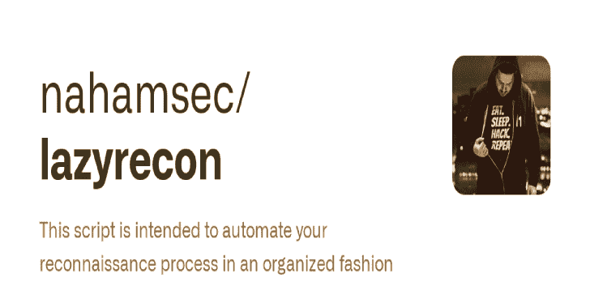
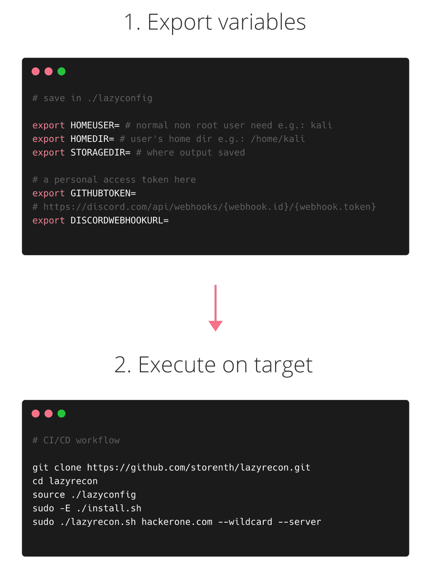

# Lazyrecon:以一种有组织的方式自动化你的侦察过程的工具

> 原文：<https://kalilinuxtutorials.com/lazyrecon/>

**Lazyrecon** 是一个子域发现工具，它可以找到并解析有效的子域，然后执行 SSRF/LFI/SQLi 模糊化、暴力破解和端口扫描。它具有简单的模块化架构，并在与 github 和 wayback machine 一起工作时针对速度进行了优化。

**特性**

*   超快速异步执行
*   CI/CD 就绪
*   HTML/pdf 报告
*   不和谐整合
*   后台监听服务器
*   域名、域名列表、IP、CIDR 输入–符号支持
*   拆卸和程序退出内务处理

**工作流程**

**关于**

该脚本旨在通过执行以下操作，以有组织的方式自动化您的侦察过程:

*   为目标创建一个带有侦察笔记的日期文件夹
*   使用`**subfinder**`、**、`assetfinder`、**、`**gau**`、`**waybackurls**`、`**github-subdomains**`抓取子域名
*   此外，使用`**dnsgen**`通过变更和置换找到新的子域
*   使用数学搜索子网和新资产`**Mode**`
*   使用`**shuffledns**`从主机列表中过滤掉活动子域
*   使用 **`httpx`** 检查 1-200、8000-10000 的 http(s)探测器
*   使用`**headless chromium**`获取可视部分
*   在实时服务器上执行 **`masscan`**
*   使用`**nuclei**`扫描已知路径和 cv
*   基于 wayback 机器数据的 [SSRF](https://www.hackerone.com/blog-How-To-Server-Side-Request-Forgery-SSRF) / [LFI](https://www.allysonomalley.com/2021/02/11/burpparamflagger-identifying-possible-ssrf-lfi-insertion-points/) /SQLi 的镜头
*   使用`**smuggler**`检查潜在的请求走私漏洞
*   基于 [top10000.txt](https://github.com/danielmiessler/RobotsDisallowed/blob/master/top10000.txt) 使用自定义单词表执行由`**interlace**`增强的`**ffuf**`
*   生成报告并将其发送给 Discord

重点是获得一个活 IP 的列表(以套接字地址的形式)，攻击可用的网络协议，检查常见的 CVE，执行非常简单的目录暴力，然后使用提供的报告进行手动研究。

**安装**

**`Linux`** & **`Mac`** 接受测试

**前置要求**

**python>= 3.7
pip 3>= 19.0
go>= 1.14**

**CI/CD 方式**

您可以使用有状态/无状态构建代理(worker)。调配不需要额外的时间。这看起来很棘手，因为需要 masscan/nmap/naabu root 用户。

*   在里面填入这些需要的环境变量: **`./lazyconfig` :**

**export HOMEUSER= #您的普通非 root 用户:例如:kali
export HOMEDIR= #用户的主目录例如:/HOME/kali
export storage dir = #输出保存的位置例如:$ { HOMEDIR }/lazy targets
export GITHUBTOKEN = xxxxxxxxxxxxxxxxxxxxxxxxxxxxxx #此处为个人访问令牌
export DISCORDWEBHOOKURL = # https://discord . com/API/web hooks/{ web hook . id }/{ web hooklocal/bin:＄HOME/go/bin:＄HOMEDIR/go/bin
export go 111 module = on**

*   启用新环境 **`source ./lazyconfig`**
*   呼叫`**sudo -E ./install.sh**`
*   执行`**sudo -E ./lazyrecon.sh "hackerone.com"**`

**Github 动作方式**

自定义`**.github/workflows/test-recon-action.yaml**`使用`**DISCORDWEBHOOKURL**`**[秘密](https://docs.github.com/en/actions/reference/encrypted-secrets)，启用 **`--discord`** 接收报告**

 ****–name:安装&Recon
env:
go 111 module:on
DISCORDWEBHOOKURL:$ { { secrets。DISCORDWEBHOOKURL } }
GITHUBTOKEN:$ { { secrets。GITHUBTOKEN } }
run:|
export HOMEDIR = $ HOME
export HOMEUSER = $ RUNNER _ USER
export storage dir = " $ { HOMEDIR } "/lazy targets
sudo-E ./install . sh
sudo-E ./lazy recon . sh " hacker one . com "–quiet–discord**

**艰难之路**

使用 [INSTALL 配置您的环境变量和依赖项。MD](https://github.com/storenth/lazyrecon/blob/ci-cd-feature/INSTALL.md)

如果你面临一些问题，请随时加入 [Discord](https://discord.gg/fR2QVrWBTq) ，打开 PR 或归档 bug。

**用途**

用`**sudo**`执行是因为 **`masscan`** :

sudo-E ./lazy recon . sh tesla.com–通配符

| **参数** | **描述** | **例子** |
| --- | --- | --- |
| –通配符 | 子域侦察' *.tesla.com '(默认) | 。/lazy recon . sh tesla.com-通配符 |
| –单身 | 一个目标实例' tesla.com ' | 。/lazy recon . sh tesla.com–单身 |
| –IP | 目标机器的单个 IP | 。/lazy recon . sh 192 . 168 . 0 . 1-单 ip |
| –列表 | 要处理的子域列表 | 。/lazyrecon.sh "。/testa . txt”-列表 |
| –CIDR | 执行网络侦察，CIDR 符号 | 。/lazy recon . sh " 192 . 168 . 0 . 0/16 "-CIDR |
| 疯了 | Wayback 机器的东西 | 。/lazy recon . sh tesla.com——疯了 |
| –模糊 | SSRF/LFI/SQLi fuzzing | 。/lazy recon . sh tesla.com–疯狂–模糊 |
| –alt | 另外置换子域名(仅限*.tesla.com) | 。/lazy recon . sh tesla.com–通配符–alt |
| 蛮力 | 基本目录暴力(时间敏感) | 。/lazy recon . sh tesla.com–单身–野蛮 |
| 不和谐 | 向 discord 发送通知 | 。/lazy recon . sh tesla.com-不和谐 |
| 安静 | 启用安静模式 | 。/lazy recon . sh tesla.com–安静 |

**方法论**

*   使用 [dnsperftest](https://github.com/cleanbrowsing/dnsperftest) 了解您的最佳解决方案
*   运行`**./lazyrecon.sh**`
*   检查 chromium、nuclei、masscan、server_log、ssrf、lfi 的输出报告
*   探索文件上传漏洞
*   执行 Google、Trello、Atlassian、Github、Bitbucket dorking
*   检查 JS 源的凭证、API 端点
*   调查`**XHR**`请求、模糊参数和变量
*   检查 exploit-db.com 的目标特定的 CVE
*   获取/发布目录的暴力:fuzbo 0om-top 10000 –> raft –>目标特定
*   继续使用自定义头强制(X-Custom-IP-Authorization:127 . 0 . 0 . 1；x-原始-URL:)
*   使用[值得注意的](https://github.com/filedescriptor/Unicode-Mapping-on-Domain-names)方法 **( `%23`** 、`**/%2e/**`、`**admin.php%2500.md**`等)尝试绕过 401/403 错误
*   寻找 XSS [xsscrapy.py](https://github.com/DanMcInerney/xsscrapy) 或 [XSSTRON](https://github.com/RenwaX23/XSSTRON)

[**Download**](https://github.com/storenth/lazyrecon)**