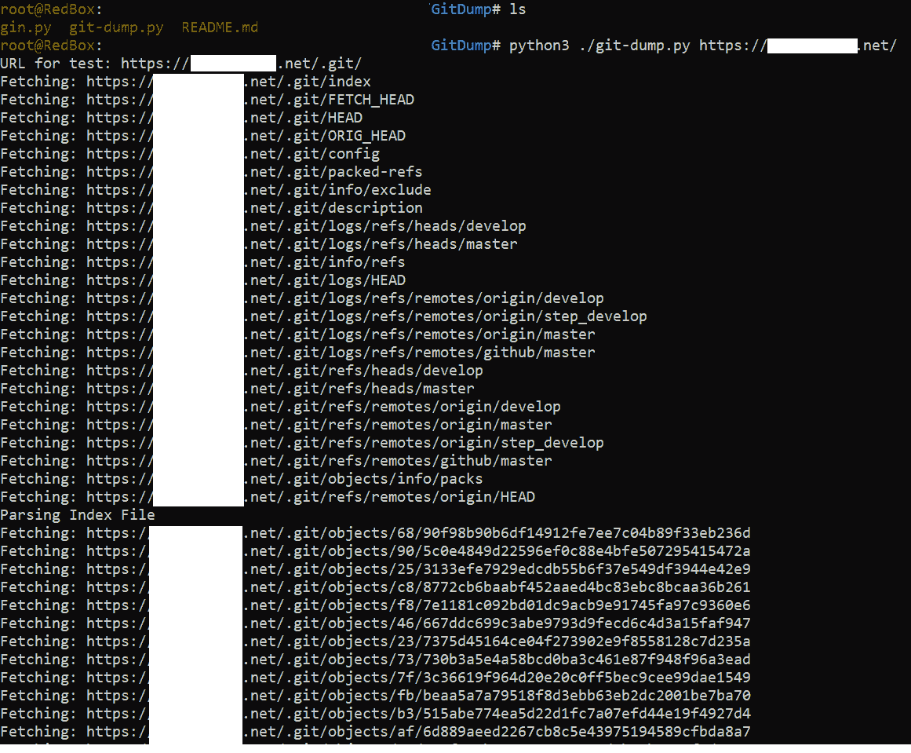

# GitDump:一个测试工具，从。Git 即使在目录遍历被禁用的情况下

> 原文：<https://kalilinuxtutorials.com/gitdump/>

**GitDump 转储源代码。禁用目录遍历时的 git**

**要求**

Python3

**测试于**

*   Windows 操作系统
*   Kali Linux

**它的作用**

从网站/转储源代码。禁用目录遍历时的 git 目录。

**工作原理**

*   获取所有常用文件(。git/index，。git/HEAD，。git/ORIG_HEAD 等。).
*   通过分析找到尽可能多的对象(sha1)。git/packed-refs，。git/index 等。
*   下载 idx 并打包文件。
*   现在你可以运行 git checkout 了。来检索源代码。

**如何使用**

*   python 3 git-dump . py[https://website.com/.git/](https://website.com/.git/)
*   创建输出目录并转储所有。git 文件在里面。
*   运行以上脚本后键入:`**cd output && git checkout -- .**`
*   它将恢复所有源代码。

**截图**

[**Download**](https://github.com/Ebryx/GitDump)