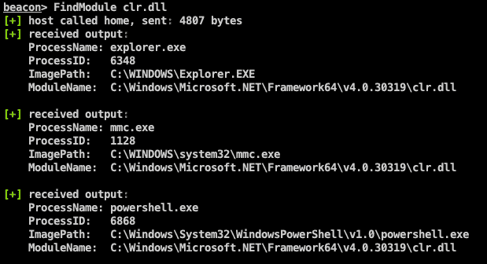
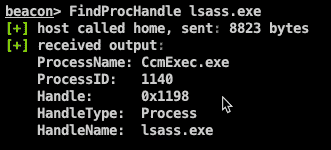

# 一个钴打击信标对象文件(BOF)

> 原文：<https://kalilinuxtutorials.com/findobjects-bof/>

[ Project Which Uses Direct System Calls To Enumerate Processes For Specific Loaded Modules Or Process Handles")](https://1.bp.blogspot.com/-yDnh1hP3GpQ/YOmqmvB0VLI/AAAAAAAAJ8I/-8XgMeW27G0d8-PXp9XiwMbgOLw_Ad_nQCLcBGAsYHQ/s728/FindObjects-BOF_1_FindObjects-700101%25281%2529.png)

FindObjects-BOF 是一个 Cobalt Strike Beacon 对象文件(BOF)项目，它使用[直接系统调用](https://outflank.nl/blog/2019/06/19/red-team-tactics-combining-direct-system-calls-and-srdi-to-bypass-av-edr/)来枚举特定模块或进程句柄的进程。

这个仓库是做什么用的？

*   使用信标对象文件中的直接系统调用来枚举特定加载模块(如 winhttp.dll、amsi.dll 或 clr.dll)的进程。
*   使用信标对象文件中的直接系统调用来枚举特定进程句柄(例如 lsass.exe)的进程。
*   尽可能避免使用 Windows 和本机 API(以避免用户区挂钩)。
*   使用[信标对象文件](https://www.cobaltstrike.com/help-beacon-object-files)在信标进程中执行这段代码，以避免分叉&运行。

我为什么需要这个？

在 BOF 代码中通过内嵌汇编使用[直接系统调用提供了一种更安全的与系统交互的方式。使用直接系统调用可以避免反病毒/EDR 软件拦截用户模式 API 调用。](https://outflank.nl/blog/2020/12/26/direct-syscalls-in-beacon-object-files/)

*   bof 可用于识别加载了某个模块的进程，例如。NET 运行时`**clr.dll**`或`**winhttp.dll**`模块。当使用钴击的`**execute-assembly**`或者在使用`**shinject**`命令注入一个 exfill 信标外壳代码之前，这些信息可以用来选择一个更安全的候选种子。

*   `**FindProcHandle**` bof 可用于识别使用特定进程句柄的进程，例如使用`**lsass.exe**`进程句柄的进程。如果系统中有一个带有 **`lsass.exe`** 进程句柄的进程，我们可以使用这个现有的进程/句柄来读写内存，而不用打开一个新的进程句柄。这会绕过某些反病毒/EDR 检测和阻止 LSASS 进程/内存访问的功能。

我该如何设置？

我们不会提供编译的二进制文件。你必须自己做这件事:

*   克隆此存储库。
*   确保安装了 Mingw-w64 编译器。以 Mac OSX 为例，你可以使用 ports 集合来安装 Mingw-w64 ( `**sudo port install mingw-w64**`)。
*   运行`**make**`命令来编译信标对象文件。
*   在 Cobalt Strike 中，使用`**Script Manager**`来加载 **FindObjects.cna** 脚本。
*   在 Cobalt Strike beacon 上下文中，使用带有所需参数(如模块或进程名称)的 **`FindProcHandle`** 或`**FindModule**`命令。

[**Download**](https://github.com/outflanknl/FindObjects-BOF)