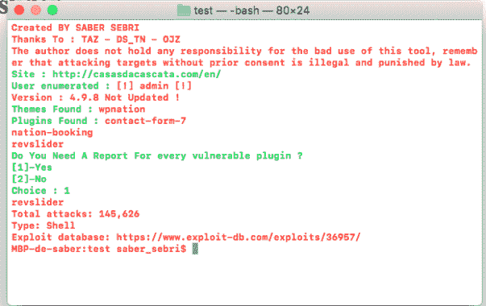

# Wpscvn : Wpscvn 是一个工具，用于测试网站所有者的网站是否有一些易受攻击的插件或主题

> 原文：<https://kalilinuxtutorials.com/wpscvn/>

wpscvn 是一个工具，用于测试网站所有者的网站是否有一些易受攻击的插件或主题

作者对这个工具的不良使用不承担任何责任，记住未经事先同意攻击目标是违法的，要受到法律的制裁。

**需要**

python3

**用途**

python3 script.py http://site\n

[**Download**](https://github.com/sabersebri/wpscvn)