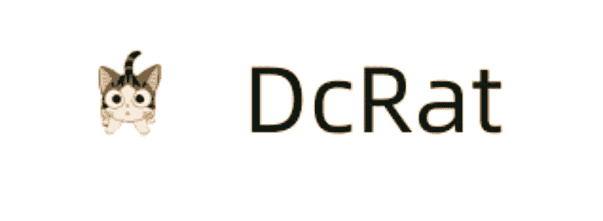

# DcRat:一个用 C#编写的简单远程工具

> 原文：<https://kalilinuxtutorials.com/dcrat/>

**DcRat 是一个用 C#** 编写的简单远程工具。

**简介**

**特性**

*   带证书验证的 TCP 连接，稳定安全
*   服务器 IP 端口可以通过链接存档
*   多服务器、多端口支持
*   通过 Dll 实现插件系统，具有很强的扩展性
*   超小型客户端大小(大约 40~50K)
*   使用 msgpack 进行数据转换(优于 JSON 和其他格式)
*   记录系统记录所有事件

**功能**

*   远程外壳
*   远程桌面
*   远程摄像机
*   注册表编辑器
*   文件管理
*   进程管理
*   Netstat
*   遥控记录
*   流程通知
*   发送文件
*   注入文件
*   下载并执行
*   发送通知
*   闲谈
*   打开网站
*   修改壁纸
*   键盘记录器
*   文件查找
*   deputy director of ordnance services 军火服务司副司长
*   勒索软件
*   禁用 Windows Defender
*   禁用 UAC
*   密码恢复
*   打开 CD
*   锁定屏幕
*   客户端关闭/重启/升级/卸载
*   系统关闭/重启/注销
*   绕过 Uac
*   获取计算机信息
*   拇指甲
*   自动任务
*   互斥（体）…
*   过程保护
*   阻止客户端
*   使用 schtasks 安装
*   等等

**部署**

*   版本:vs2019
*   运行时:

| 项目 | 运行时间 |
| --- | --- |
| 计算机网络服务器 | 。NET 框架 4.61 |
| 客户和其他人 | 。NET 框架 4.0 |

**支持**

*   支持以下系统(32 位和 64 位)
    *   Windows XP SP3
    *   Windows Server 2003
    *   Windows Vista
    *   Windows Server 2008
    *   Windows 7
    *   Windows Server 2012
    *   Windows 8/8.1
    *   Windows 10

[**Download**](https://github.com/qwqdanchun/DcRat)