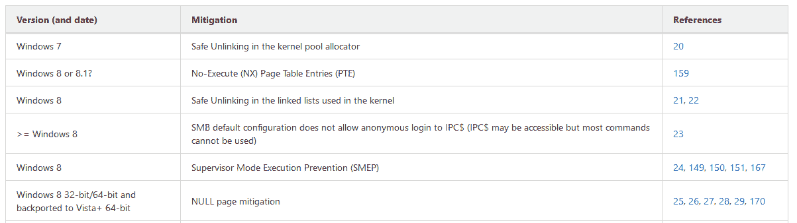

# 漏洞利用缓解:在众多操作系统、架构、应用程序和版本中可用的漏洞利用缓解知识库

> 原文：<https://kalilinuxtutorials.com/exploit_mitigations/>

**Exploit_Mitigations** 目标是列出在各种操作系统、软件、库或硬件中随时间增加的缓解措施。根据现有的漏洞利用缓解措施，了解给定漏洞是否容易被利用变得非常方便。

下面是一个例子:

**支持的目标**

我们目前支持以下操作系统:

*   微软视窗软件
*   Linux 操作系统
*   谷歌安卓
*   苹果 iPhone 操作系统(iOS)
*   OpenBSD
*   FreeBSD

和以下软件:

*   Mozilla Firefox
*   微软 Edge
*   谷歌浏览器
*   微软办公

和以下库:

*   glibc

和以下硬件:

*   手臂ˌ武器ˌ袖子ˌ装备

**动机**

当某些缓解措施被添加到各种软件和硬件的更新和/或后移植到一些旧版本时，遵循这些措施变得具有挑战性。

有时，由于缓解措施的更改，在线内容会被弃用，很难跟上。此外，如果你不在特定的软件/硬件上工作，很容易在短时间内忘记。

我们一直在填补这一空白，方法是在保存缓解措施名称的汇总表中跟踪所有缓解措施，并链接到在线参考资料以获取有关它们的技术信息。

几年来，共享信息已经被证明对开发人员很有用。

**我当前的环境有缓解 X 吗？**

这是任何漏洞开发者在试图为给定目标开发漏洞时都可能遇到的常见问题。

例如，假设您想利用 Windows 7 x64 上的一个包含内核空指针取消引用错误的 Windows 内核驱动程序。有可利用性吗？

查看我们的表格，我们了解到“零页面缓解”是在“Windows 8 32 位/64 位和后移植到 Vista+ 64 位”中引入的。现在我们知道这取决于我们的目标 Windows 7 x64 是否是最新的，更准确地说，我们可以专注于找出哪个知识库引入了这种缓解，并根据该知识库检查我们的目标。

[**Download**](https://github.com/nccgroup/exploit_mitigations)