# Bastion:SSH 访问的认证、授权、可跟踪性和可审计性

> 原文：<https://kalilinuxtutorials.com/the-bastion-authentication-authorization-traceability-and-auditability-for-ssh-accesses/>

**Bastions** 是一个机器集群，运营团队(如系统管理员、开发人员、数据库管理员)将其用作唯一的入口点，以安全地连接到设备(服务器、虚拟机、云实例、网络设备等)，通常使用 **`ssh`。**

Bastions 为整个基础架构提供了身份验证、授权、可跟踪性和可审核性机制。

通过阅读宣布发布的博客文章系列了解更多信息:

*   第 1 部分–起源
*   第 2 部分-代表团头晕
*   第 3 部分–安全是核心
*   第 4 部分–新时代

**ovh cloud Bastion–第一部分**

在 OVHcloud，我们相当多的基础设施都是基于 Linux 平台构建的。我们有许多不同的口味；比如 Debian、Ubuntu、Red Hat……不胜枚举。我们甚至曾经有过很好的老巴布亚企鹅！这些都存储在裸机服务器、虚拟机和任何地方的容器中。只要它有 CPU(或 vCPU)，我们可能会在它上面引导某种 Linux 发行版。但这还不是故事的全部。我们还有 Solaris 盒子，后来变成了 OmniOS 盒子，现在变成了闪亮的 FreeBSD 盒子。我们也有许多网络设备，针对不同的构造者，跨越广泛的模型世代。

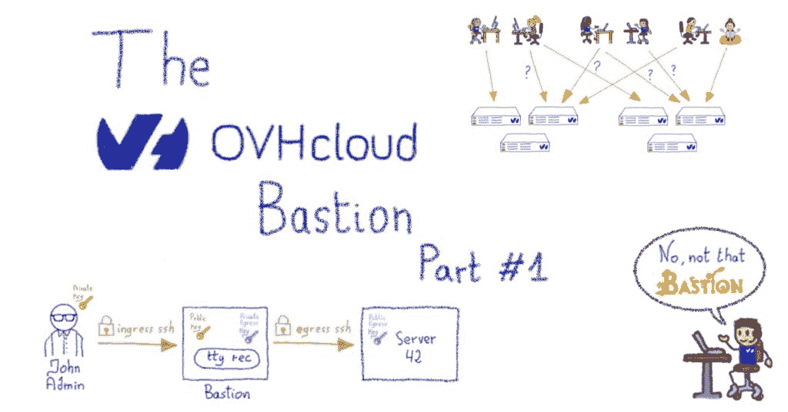

正如您可能已经猜到的那样，我们有异构系统在运行，以提供一些不同的服务。但抛开这种异质性不谈，你知道它们都有什么共同点吗？是的，它们都是 ***`ping`*** ，但是还有更有趣的事情:它们都可以通过`**ssh**`来管理。

**问题**

SSH 成为事实上的管理标准已经有一段时间了——取代了过时的程序，如`**rlogin**`,它们很乐意在网络上以明文形式传输您的密码——所以我们一直在使用它，就像大多数行业一样。

有两种常规的使用方法:要么在远程服务器要求时键入您的帐户密码，这或多或少类似于`**rlogin**`(没有您的密码在线路上以明文传输)；或者您使用公钥认证，通过生成所谓的“密钥对”，私钥放在您的桌面上(或智能卡中)，对应的公钥放在远程服务器上。

问题是这两种方法在企业环境中都不令人满意。

**密码认证**

第一，密码方式。我们都知道密码很糟糕。要么你选一个太容易破解的，要么你选一个你永远不会记得的非常复杂的。这迫使你使用一个受…主密码保护的密码管理器。即使是像“正确的马电池钉书钉”这样的强有力的密码，到头来也不过是一个精心设计的密码。它们带来了一系列的问题，例如它们总是会受到暴力攻击，一些用户可能会受到密码重复使用的困扰。作为一名系统管理员，当你知道你的系统的安全性只差一个密码时，你永远不会睡得安稳。当然，有一些方法可以降低风险，例如强制定期更新密码、设定最小密码长度和/或复杂性，或者在多次失败后禁用某个帐户等。但是您只是给用户增加了额外的负担，并且仍然没有达到令人满意的安全级别。

**公钥认证**

第二，pubkey 方式。它对修复密码问题大有帮助，但是问题变成了可伸缩性。将您的公钥推送到您的家庭服务器是很容易的，但是当您有成千上万的服务器/设备，以及成千上万的员工，管理这些服务器/设备的一些不断变化的子集时，事情很快就变得复杂了。事实上，在企业环境中正确地做并长期维护它是一个真正的挑战。

**基于 PKI 的认证**

为了完整起见——因为我可以在这里听到你们的声音，宋承宪大师们！–在 SSH 服务器的最新版本中，还有第三种方式，即基于 PKI 和可信证书颁发机构(CA)的身份验证。你在你的所有服务器上安装你的 CA 的公共证书，它们将接受由所述 CA 交付的证书认证的任何连接，依赖于证书的`subjectName`。这指定了可以在服务器上访问哪个帐户，等等。这是一种非常集中的管理访问的方式，所有的权力都掌握在控制 CA 的人手中。如果做得非常仔细，并且围绕证书交付工作流有很多安全性和流程，那么它可能会非常成功。正确管理 CA 可不是闹着玩的，如果处理不当，可能会给你带来很大的伤害。这也恰好是 OpenSSH 的一个新功能，考虑到我们上面提到的异构性，它可能会将许多系统搁置一旁。还有一个原因是我们没有选择这种方法，但在深入研究之前，我们先来谈谈我们的需求。

**我们需要什么**

在 OVHcloud，我们有各种技术团队来管理他们自己的基础架构，而不是依赖一般的内部 IT 部门。这一原则是公司文化和 DNA 的一部分。它确实有缺点；例如，维护我们自己的资产的详尽和最新清单会增加复杂性，但它的优势远远超过它们:多个团队可以更快地迭代，因为他们可以使用现有的 OVHcloud 产品作为构建块来创建新的创新产品。但是，这不能以牺牲安全性为代价，安全性是我们在 OVHcloud 所做的一切的基础。

但是，我们如何在不妨碍各种运营团队的情况下，围绕所有这些服务器的 SSH 管理开发安全系统呢？

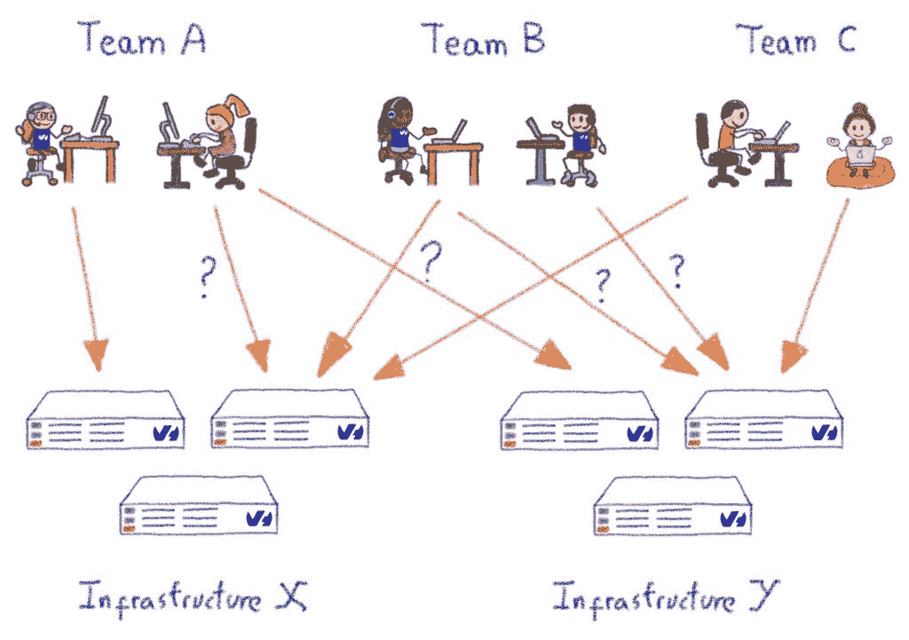

需要几个重要的项目:

**代表团**

*   任何负责为整个公司处理访问许可的集中式“安全团队”都是行不通的。不管你怎么做，它都不会扩展。
    *   就服务器/系统/设备而言，管理人员或技术负责人在管理他们自己的边界时应该完全自主，并考虑那些被授权在其边界内访问的人员。
    *   一个团队的成员转移到另一个团队或者离开公司应该是一个完全无缝的过程，不管这个人可以访问哪种系统(还记得上面的异构性吗？).
    *   允许接触一个新的团队成员也必须是无缝的，这样他们就可以尽快上手。
    *   在有限的时间内临时授权团队(或公司)之外的人访问给定的资产应该很容易。
    *   所有这些动作都应该很容易自动完成。

**可审计性&可追溯性**

*   每一个行动都必须有大量的细节记录；无论是间隙修改还是系统连接；不管成功与否。我们还希望它能被推到某个 SIEM。
    *   应该记录每个终端会话。是的，你没看错。这是一种你永远都不需要的特性..直到你明白。
    *   必须很容易生成报告来进行访问检查。

**安全&恢复能力**

*   我们必须在不增加成本的情况下，提供比直接 SSH 访问更高的安全性。
    *   我们为满足这些需求而添加的任何组件都必须在任何时候都是启动和运行的，即使(尤其是)当您的基础设施的其余部分崩溃时，因为那正是您需要 SSH 的时候。

那么我们没有选择 PKI 方式的另一个原因是什么呢？这将限制团队领导的自主权:只有 CA 能够交付或撤销证书，但是我们希望这种权力掌握在团队领导手中。使用 PKI 的方式，如果我们想给他们一些权力，我们将不得不围绕 CA 实现一个复杂的逻辑来实现这一点，我们不想走这条路。

**进入堡垒**

为了响应我们的复杂需求，我们在管理员和基础设施之间设置了一台专门的机器——一个堡垒——它的工作是处理上述所有重要事项，此外还要分离身份验证和授权阶段。我们将在双方使用公钥认证。让我们花点时间来看看使用这种设计的连接工作流的简单示例:

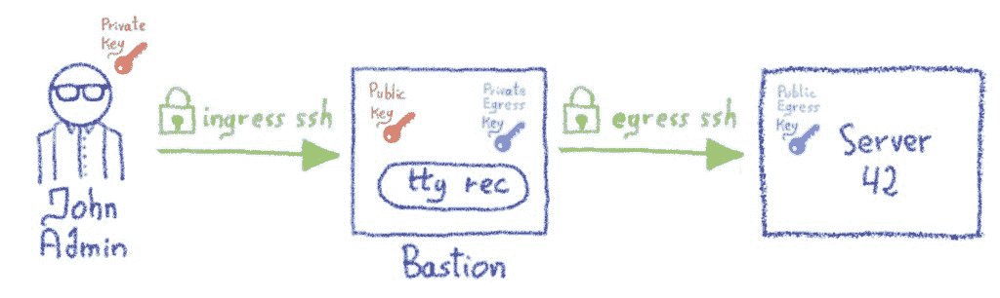

*   管理员想要连接到名为 server42 的机器
*   他不能从公司的笔记本电脑直接 SSH 到服务器 42，因为服务器 42 有防火墙，只允许来自公司堡垒集群的 SSH 连接
*   管理员使用他的记名帐户启动了一个到 bastion 的 SSH 会话。他的笔记本电脑使用他的私钥协商 SSH 会话。这是认证阶段:bastion 确保显示自己为 John Admin 的管理员确实是这个人，这是可能的，因为 John Admin 的公钥位于他的 bastion 帐户中。我们称之为“入口”连接。
*   一旦 John Admin 通过了身份验证，他就要求 bastion 打开一个到 server42 上 root 帐户的连接。
*   堡垒验证是否允许 John Admin 访问 server42 上的 root 帐户，这是授权部分。为了这个例子，让我们假设 John Admin 确实被允许连接到这个服务器，使用他的团队的 bastion 私钥(稍后会有更多细节)。
*   bastion 代表 John Admin 使用他的团队的 bastion 私钥启动了到 server42 的 SSH 连接。
*   server42 的防火墙允许从堡垒传入 SSH 连接，当 John Admin 团队的堡垒公钥安装在 server42 的 root 帐户上时，连接协商成功。我们称之为出口连接。

我们现在已经建立了两个 SSH 连接:入口连接，位于 John Admin 和 bastion 之间，出口连接，位于 bastion 和 server42 之间。

现在，奇迹发生了，bastion 将这两个连接“插”在一起，在它们之间使用一个伪终端(a `pty`)。John Admin 现在感觉他直接连接到了 server42，并且可以像这样与它交互。
同时，bastion 可以记录 John Admin 输入的所有内容(或者更准确地说，John Admin 看到的所有内容，我们不会记录他在`**no echo**`终端上输入的密码！)，这是由`ovh-ttyrec`程序处理的。

非常清楚的是，server42 不知道 John Admin 是谁，也不需要知道:我们已经分离了认证和授权部分。只有堡垒需要知道并认证管理员，远程服务器只知道并信任堡垒(或者，更准确地说，John Admin 的团队存在于堡垒上)。这开启了一系列的可能性…但是在下一篇文章中会有更多的内容！

这篇文章是关于堡垒系列文章的第一篇。在接下来的文章中，我们将深入研究授权部分，即个人密钥和访问、组以及与之相关的一切。我们也将看看堡垒上存在的不同角色，让它如此多才多艺。我们将讨论一些设计选择，以及我们希望安全性如何成为这些选择的核心——以及一些血淋淋的技术细节。

**ovh cloud SSH Bastion–第二部分:代表团眩晕**

这是博客系列的第二部分，这是第一部分。我们之前已经发现 bastion 不是通常的 SSH jumphost(事实上，我们发现它根本不是 jumphost ),我们讨论了委托是我们最初需要的核心特性之一。所以，让我们深入这些概念。bastion 上有两种兼容的访问模型:个人的和基于组的。

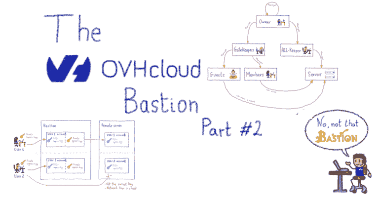

**个人访问–小菜一碟**

在堡垒上，每个账户(至少)有一套**个人出口钥匙**。这些野兽是首次创建帐号时生成的。个人出口**私钥**放在堡垒账号家里。帐户用户没有办法看到它，或者把它导出堡垒，但是他们可以通过堡垒的代码逻辑使用它。用户可以在任何时候检索相应的**公钥**，并将其安装——或者让其安装——在他需要访问的远程服务器上。根据您的用例——以及您希望给予团队的自治级别——有两种方式来管理这些个人访问。

**请自便**

第一种方法模拟了如果您根本没有使用 SSH 堡垒，您将如何管理访问。这是在简单的层次上处理访问的一种非常有效的方法，不需要太多的用户和有限数量的机器。这允许任何人授予自己对 bastion 的个人访问权，而不必要求其他人这样做。这听起来像是一个安全漏洞，但它不是。如果有人给自己添加了对远程服务器的个人访问权限，那么只有当他的个人出口公钥已经安装在远程服务器上时，这个权限才会生效。换句话说，他要么已经可以访问远程服务器来做这件事——使用 bastion 之外的手段——要么可以访问远程服务器的某个人接受了他的密钥的添加。不管怎样，没有远程服务器的管理员首先允许他的密钥，他不能神奇地授予自己个人访问权。

**询问 IT 人群**

另一种处理方法是授予有限数量的人(如安全团队)向其他人添加个人访问权限的权利。这种方式会降低人们的自主性，但是如果添加访问必须通过规范化的流程来执行，这可能会很有用。它也有一些不错的效果:作为一名系统管理员，好处之一是你可以在远程机器上创建 3 个独立的帐户，并将它们映射到你正在添加的每个 bastion 帐户。这是实现**端到端可追溯性**的好方法；包括在远程服务器上；你可能想要安装**审计**或类似工具的地方。这在*自助*模式下也是可行的，但可能更难实施。

明确地说，当我们处理整个团队或大型基础设施时，这种访问模式并不那么有效——这就是基于组的访问方便的地方。

**团体访问–让我们摇滚起来**

一个组有三个组成部分:

*   成员列表(代表个人的帐户)
*   至少一组组出口密钥
*   服务器列表(实际上是 IP)

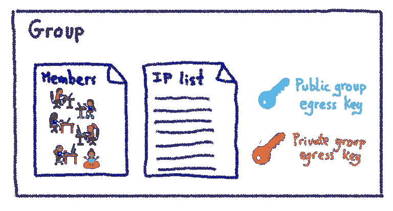

**服务器列表**

服务器列表实际上是 IP 或 IP 块的列表。它们映射到您的服务器、网络设备或任何其他具有 SSH 功能的设备，这些设备有一个 IP(在其上安装了出口组密钥)。从技术上讲，这个列表实际上是由三元组条目组成的:*远程用户*、*远程 IP* (或 IP 块)、*远程端口*。适用于个人访问的内容在这里也适用:将服务器添加到列表中并不会神奇地授予对它的访问权，首先需要安装**出口组公钥**。当然，手动管理这些密钥的安装很快变得不切实际，但是您可以考虑服务器配置的这些部分，因此应该使用您已经使用的任何集中式配置系统来管理它们(Puppet、Chef、Ansible、/bin/cp… *等等，不，去掉最后一个*)。

**成员列表**

成员是可以连接到组服务器列表中列出的任何服务器的人。作为所述组的成员，他们将使用他们有权访问的**私有出口组密钥**。当然，他们没有办法在堡垒之外提取这个私钥供自己使用，他们只能通过堡垒的代码逻辑来使用它。

有新队员了吗？只需将他们添加为您的群组成员，他们就可以立即访问所有群组服务器。有人离开了公司？只需删除堡垒上的账户，所有的访问都将立即消失。这是因为您的所有服务器都应该将传入的 SSH 会话限制在您的堡垒中。这样，任何可能被添加的非法 SSH 密钥都不再有用。

**还有一些更**

我们已经介绍了基于小组的方法的基础，但是由于我们需要大量的灵活性和授权，所以还需要介绍更多。记得我说过一个团体有三个组成部分吗？好吧，我撒谎了。一个团体不仅仅有*个成员*。其他组角色包括:

*   客人
*   门卫
*   Aclkeepers
*   业主

所有这些都是在集团中具有特定角色的客户列表。

首先，**嘉宾**。这些人有点像**成员**，但是特权更少:他们可以使用组密钥连接到远程机器，但是不能连接到组中的所有机器，只能连接到一个子集。当团队之外的某个人需要对特定服务器的特定访问时，这很有用，可能是在有限的时间内(因为这种访问可以设置为过期)。

然后，**守门**。这些人管理这个团体的成员和客人的名单。换句话说，*他们有权给予*获取权限的权利。这里没什么太复杂的。然后，还有 **aclkeepers** 。正如您可能已经猜到的，他们管理属于该组的服务器列表。如果您碰巧有一些自动化管理您的基础设施的服务器供应，这个角色可以被授予一个机器人帐户，它的唯一目的是以与您的供应完全集成的方式更新 bastion 上的服务器列表。您甚至可以标记这样的帐户，这样他们将永远无法通过堡垒使用 SSH，即使有人错误地授予他们！

最后但同样重要的是，**所有者**在组中拥有最高的特权级别，这意味着他们可以管理网关守护设备、aclkeepers 和所有者列表。他们被允许给予权利*以给予权利*以获得访问权。此外，用户可以累积这些角色，例如，这意味着一些帐户可能同时是成员和看门人。

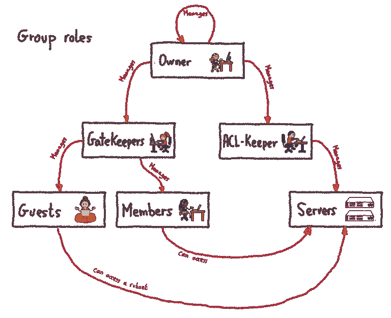

**全球角色–来获取一些**

除了我们刚刚描述的角色——这些角色都在一个组的范围内——还有两个额外的角色，它们在整个堡垒的范围内:“超级所有者”和“堡垒管理员”。

简而言之，一个**超级所有者**是堡垒上所有群组的隐含所有者。如果这个群体变成无主的，这就派上用场了，因为超级所有者可以指定一个全新的所有者。明白我要去哪里了吗？超级所有者被允许授予权限授予权限*授予权限获取权限*。

头晕了吗？现在，对于最强大的角色:堡垒管理员。这个角色应该只授予少数几个人，因为他们可以扮演任何人(当然，即使当他们这样做时，这被记录下来，并使我们的 SIEM 变红)，并且在实践中不应该授予任何不是 bastion 操作系统本身的 root 用户的人。在其他事情中，它们管理堡垒的配置，在那里声明超级所有者。屏住呼吸。准备好了吗？他们被允许授予权限授予权限授予权限*授予权限*以获取访问权限。这就是为什么授权是系统的核心:每个人都有自己的一套职责，以及潜在的行动，而不必问堡垒管理员。

**结束**

我们谈到的所有访问管理概念都映射到实际的命令。这些可以在用户认证自己之后在堡垒上运行(著名的入口连接)。他们在堡垒行话中被称为 ***奥什命令*** 。在这种情况下，没有出口连接，因为这些命令与堡垒本身交互:

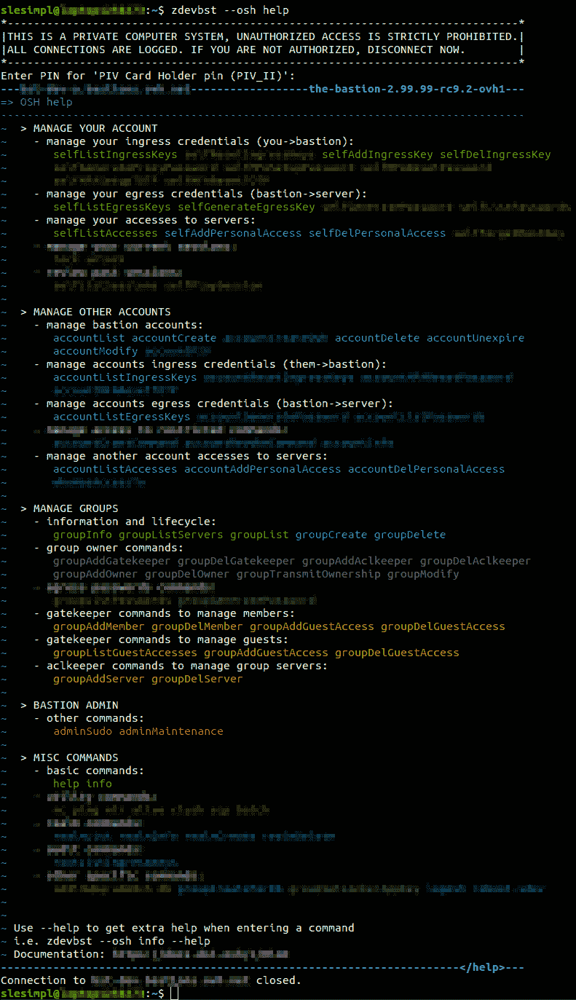

你可能在上面的截图中注意到了，堡垒软件的版本似乎非常接近 **3.00.00** ！或许，一个有趣的里程碑即将到来？

在本博客系列的下一部分中，我们将深入探讨其中一个 ***osh 插件*** 的一些实现细节，更准确地说，是关于我们的安全和防御编程方法。

**堡垒——第三部分——核心安全**

在前面的部分中，我们已经介绍了堡垒的基本原理。然后，我们解释了委托是如何成为系统的核心的。这一次，我们将深入探讨如何编写堡垒的一些管理原则。

简而言之，堡垒的主要目的是在所有情况下确保**安全性**、**可审计性**和**可靠性**。为此，堡垒是以一种非常特殊的方式设计的，在实现新特性时必须遵守一些原则。今天，我们将重点介绍如何实现堡垒的一项功能，以确保深度安全。前面有技术细节，建议观众自行判断！

**操作系统不仅仅是一个调度程序**

堡垒的工程原则之一是利用底层操作系统的安全特性，作为代码逻辑本身之上的额外防护。

通常，当开发一个程序时，人们并不真的需要考虑它将在什么操作系统上运行，因为所有的业务逻辑都直接进入了代码。在最基本的层面上，操作系统的工作是通过抽象程序，确保程序运行在它所负责的硬件之上，以及共享该硬件的其他软件。换句话说，大多数时候操作系统主要是一个调度程序，它的工作是确保所有的程序正常运行，并且不会互相影响。

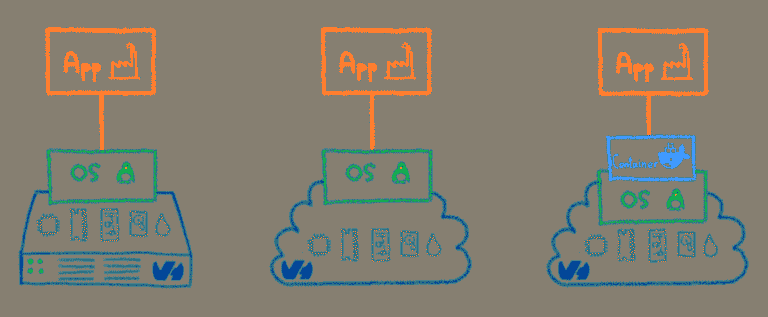

为此，除了(用户的)**组**的概念之外，操作系统还具有**用户**(或“帐户”)的概念，用户可能是文件系统上一些正在运行的程序和一些文件的所有者，因此，例如一个文件夹可以由几个用户写入。我们几分钟后会回到这个话题。

现在，我们来谈谈应用程序。大多数情况下，需要处理用户的应用程序都有一个带有“users”表的数据库，其中详细列出了每个用户的信息。在这种情况下，应用程序的代码逻辑处理程序必须对其用户具有的所有行为。例如，为了验证用户，它将每个用户密码的散列存储在数据库中，并检查输入的密码散列是否与存储在数据库中的匹配。如果是，那么它认为用户成功登录。所有这些逻辑都完全用代码表达，操作系统在这个过程中不扮演任何角色。

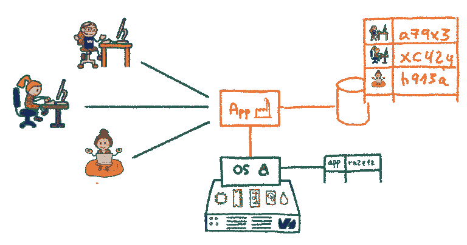

这样，无论应用程序的数据库中有多少用户，都只有一个操作系统用户专用于该应用程序。应用程序将在该操作系统用户下运行，并且在应用程序的功能视图中逻辑上属于不同用户的所有文件将由该操作系统用户拥有。它之所以有效，是因为功能用户之间的隔离完全是由代码完成的:即使应用程序在技术上能够访问所有用户的文件，它也只允许适当的用户通过其代码逻辑访问适当的文件。

**代码有 bug，但应该没关系**

现在，让我们想象我们正在谈论一个程序——让我们把它命名为*my supercloudapp*——它的工作是为用户存储文件，以便他们以后可以从云中获取它们。我们假设代码中有一个缺陷(当然，这种情况从来不会发生)，它没有正确地对用户请求的文件名进行转义。如果作为我的用户登录后，我请求下载名为`myfile.txt`的文件，应用程序会允许，因为我已经登录了。

但是如果我请求`**../somebodyelse/herfile.txt**`，会发生什么呢？如果代码没有被设计为检测和过滤掉这种奇怪的请求，它只会将 read 命令传递给底层文件系统，这将允许它，因为请记住，应用程序在一个操作系统用户下运行，所有实际的用户逻辑都由应用程序本身处理。所有的应用程序文件都属于同一个操作系统用户，所以从操作系统的角度来看，这个请求是完全合法的。我刚刚找到了一种窃取所有其他用户文件的方法。这种缺陷被称为路径遍历，不幸的是，这种缺陷非常普遍。

对于 bastion 来说，操作系统不仅仅是一个调度程序:每个 bastion 用户实际上都映射到下面的一个操作系统用户。同样，每个 bastion 组都映射到下面的操作系统组。我们在上一篇文章中谈到的所有组角色也是如此。这是一个强有力的设计选择:我们最终得到了一个与运行它的操作系统深深交织在一起的应用程序，这也带来了一些缺点。然而，作为一种安全资产，堡垒是，专业人士远远超过他们。

如果 *MySuperCloudApp* 采用了这种设计，将其应用程序用户映射到实际的操作系统用户，那么我们之前讨论过的攻击就不会成功。即使应用程序的代码有缺陷，并将读取请求传递给下面的操作系统，操作系统也会拒绝它，因为在操作系统级别上，`**../somebodyelse/herfile.txt**`是同一用户拥有的**而不是**。这就是操作系统拯救有缺陷的代码部分的地方(当然，在任何情况下都需要被纠正！).

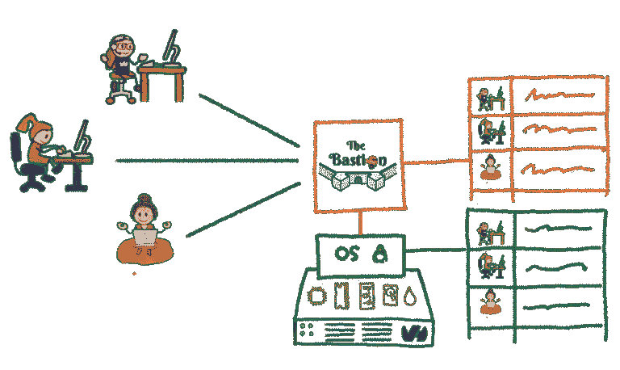

举一个更像堡垒的例子，如果一个用户属于`groupA`，并欺骗代码认为它也属于`groupB `(因为堡垒的代码逻辑中的一个缺陷)，那么这并没有太大关系，因为操作系统将拒绝这个用户访问`groupB`的密钥，因为他将没有权限读取操作系统级别的文件。所以他仍然无法访问`groupB`的任何服务器。从技术上来说，这是通过将认证部分交给`sshd`来完成的，众所周知，它做得相当好。当这个阶段成功时，`sshd `在适当的 OS 用户下创建一个会话，并在这个会话下启动 bastion 代码入口点。

> 我们使用操作系统作为额外的安全网，以防代码中出现逻辑错误或漏洞:即使代码被欺骗做出错误的决定，底层操作系统也会拒绝该操作，从而消除影响。

换句话说，所有 OS bastion 用户都将 bastion 代码声明为他们的系统外壳(而不是通常的`**/bin/sh**`)。我们甚至走得更远:代码是以这样一种方式设计的，如果用户成功地在 bastion 上获得了一个真正的 shell，即能够在 OS 本身上运行他想要的任何命令，完全绕过 bastion 代码的所有逻辑和检查，那么他不应该能够做比正常 bastion 代码逻辑允许他做的更多的事情。这是另一个强大的设计原则，但有助于大幅降低安全漏洞的影响，如果它发生的话。

### 不要相信任何人

为了让一些特性正常工作，我们上面概述的设计选择意味着堡垒有时必须在操作系统级别创建和删除用户。这不能使用非特权帐户来完成，因此部分代码需要在提升的特权下运行。

在 bastion 行话中，这些代码部分被称为*助手*，并与代码的其他部分分开，通常在运行它们的功能 Bastion 用户对应的操作系统用户下运行。

*助手*不信任其余的 bastion 代码，所以他们从不盲目信任作为输入传递给他们的内容，即使理论上，这个输入已经被启动助手的 bastion 代码验证过。使用`sudo `命令授予他们更高的特权，使用非常严格的`sudoers `配置确保调用者只能运行它应该运行的助手，并且使用它应该被允许指定的参数。一旦助手完成工作，它就使用 JSON 将信息传递给调用者。

让我们以`groupAddServer `命令为例。顾名思义，这个命令被一个组`aclkeeper `用来向一个堡垒组添加一个新的服务器。假设用户`guybrush`是堡垒组`island`的看门人。在操作系统级别，操作系统用户`guybrush `将是`island-aclkeeper`系统组的成员。`sudoers `配置的一部分会这样说:

**% island-ACL keeper ALL =(island)no passwd:/usr/bin/env perl-T/opt/bastion/bin/helper/Osh-group addserver–group island ***

这一行翻译过来就是:

> `island-aclkeeper`系统组的所有成员(即`island ` bastion 组的所有 aclkeepers)都可以作为`island `系统用户运行`osh-groupAddServer` perl 脚本，但命令行选项强制从`--group island`开始

`island `系统用户没有映射到堡垒的逻辑用户，这是一个代表`island `堡垒组的技术帐户。列出`island ` bastion 组的服务器的文件归这个系统用户所有，只有`aclkeepers`通过这个`sudo `规则可以模拟这个系统用户将服务器添加到他们的组中。还要注意，这里使用了 Perl 污点模式(-T)。这是一种特殊的模式，它指示 Perl 在试图使用一个受外部环境影响的变量时立即停止程序的执行(这里是*助手*),而不先检查它的有效性。这是一种额外的保护，以确保未经适当净化的输入不能通过程序的执行流。

**和迷你监狱一起下兔子洞**

对于一些插件，我们甚至更深入了一层。例如，我们有一个插件，允许用户使用经典的`psql `客户端连接到 PostgreSQL 数据库，但是直接从 bastion 连接。这个想法是，访问数据库的密码是堡垒知道的，而不是用户知道的，所以密码可能非常复杂，如果需要的话，每天都要更改。这对用户来说是完全透明的，用户只需连接到 bastion 并请求运行数据库插件。这个方案与在两端使用 SSH 的方案相同:正如在本系列的第一篇文章中所看到的，入口连接是在用户和堡垒(SSH)之间，出口连接是在堡垒和远程服务器之间。唯一的区别是，在这种情况下，出口连接不是 SSH，而是 SQL。

但是如何保证`psql `的安全，使得在堡垒上运行时，用户无法逃离？这个问题与`mysql `客户端是一样的。这些程序被设计为从本地计算机运行，用户已经可以在本地计算机上运行任何命令，因此没有真正的理由为这些程序添加一个配置选项来禁止本地执行任意命令(shell escape)。然而在堡垒上，我们不允许这样。当然，维护这些 SQL 客户端的分叉版本是完全不允许的，因为我们分配来维护这些分叉的时间在其他项目中会有更好的用途。相反，我们使用了一个名为`**minijail**`的工具，它的目的是让任何程序都可以容易地获得 Linux 内核的最新特性——比如名称空间、功能、seccomp、no_new_privs `prctl()`标志等。我们不打算详细描述这些特性，网上有很多关于它们的资料，但是可以放大一下我们是如何在 Bastion 的环境中使用它们的。

让我们从结论开始:当有人使用数据库插件时，它在 bastion 系统上看起来是这样的:

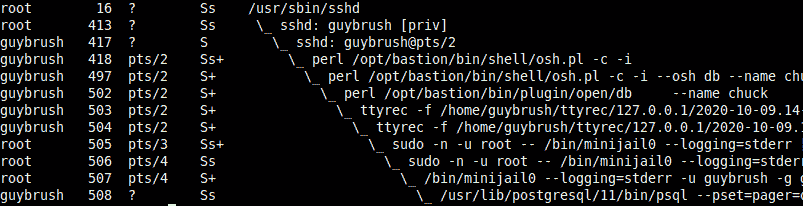

先不要慌，让我们一行一行地过一遍。

第一行(PID `16`)是`sshd `系统守护进程。这里没有什么特别的，这是您通常使用的友好守护进程，在端口 22 监听传入的 SSH 连接。

第二行(PID `413`)是当`guybrush `成功登录到服务器时专门产生的特权进程。这也是完全标准的 SSH 行为:当有人登录时，守护进程会产生两个`sshd `进程，一个特权进程和一个非特权进程。两者都致力于处理用户，而父进程(守护进程)继续监听新的连接。

第三行(PID `417`)是`guybrush`对应的非特权`sshd `进程。这个负责在`guybrush`登录后立即启动他的 shell。请注意，从现在开始，直到另行通知，所有代码都在自己的用户(不存在)权限下执行。

第四行(PID `418`)是`guybrush`的外壳。这就是它开始与您通常的服务器不同的地方。在这种情况下，外壳不是`/bin/bash `或`/bin/zsh`，而是堡垒代码的一部分。如上所述，bastion 被声明为用户的 shell，所以当有人登录时，执行的是这个 shell，而不是更常规的 POSIX shell。这部分代码负责解析用户指定的命令行，并执行相应的操作(如果允许的话)。在本例中，用户传递了`-i`参数，该参数要求堡垒以交互模式启动。这是一种特殊的模式，在这种模式下可以更容易地启动几个 bastion 命令，而不必每次都重新验证自己。因此，这个进程正在监听来自用户的命令。请注意，在这个阶段，用户已经通过了系统的认证，因为这完全委托给了`sshd`。如果认证失败，用户的 shell(这里是 bastion 代码)永远不会被执行。

第五行(PID `497`)是交互进程的子进程，使用新参数`--osh db`重新执行用户 shell ( `osh.pl`)，这将指示这个 shell 实例用户想要运行`db ` bastion 命令。

第六行(PID `502`)是用户正在执行的当前 bastion 命令。这是`db `插件，我们可以看到部分命令行:`--name lechuck`，它告诉插件用户想要连接到名为`lechuck`的数据库。

第七行(PID `503`)是`ttyrec `父进程，正如在第一篇文章系列中解释的，会话的整个控制台输出由 bastion 记录——这个进程负责记录。

第八行(PID `504`)是`ttyrec `子进程，这是伪 tty 支持所需要的，也是录音所需要的。如果你*真的*想了解更多关于`pseudo-ttys`的事情，那就直接去 [`man openpty`](https://www.man7.org/linux/man-pages/man3/openpty.3.html) 和/或 [`ttyrec code`](https://github.com/ovh/ovh-ttyrec) 本身吧。

第九行(PID `505`)是启动`minijail`的`sudo `调用。这是必要的，因为`minijail `需要在降级为无特权账户之前成为`root `以正确设置监狱

第十行(PID `506`)是`sudo`的子命令，这一行负责启动子命令(在这种情况下是`minijail `

第十一行(PID `507`)是对**T1 的调用。**我们推出的完整命令行是:

**LOGNAME = guy brush—/usr/lib/PostgreSQL/11/bin/psql–pset = pager = off-h dbserver.example.org-p 5432-U 勒查克—勒查克**

相当大的野兽。但是让我们一步一步来。

这告诉`minijail `设置一个新的 IPC 名称空间(`--uts`)，并设置`no_new_privs`标志(-n)，这样它创建的进程的任何部分(以及那些进程拥有的子进程)无论如何都不会再成为根。在一个`no_new_privs`进程下，即使有一个通配符`sudoers `文件，或者知道 root 密码并试图使用`su`，也不足以回到 UID `0`。你就是不能。

我们还要求`minijail `创建一个新的挂载名称空间(-v)，然后`pivot_root` ( `-P`)到一个临时的空目录`/tmp/chroot-guybrush-psql-wsvhp4`，这样整个文件系统变得完全不可访问。由于我们仍然需要能够在这个环境中运行 SQL 客户端，我们在这个新的名称空间中`bind-mount `了几个重要的目录，比如`/lib64`、`/lib`等等，并且也只是一个读写目录，位于用户自己的主目录中，因此在这个监狱中，它仍然可以拥有来自过去会话的`.psql_history`和`.psqlrc`文件。

我们还设置了几个环境变量，这样 SQL CLI 就不会丢失(`HOME`、`USER`、`LOGNAME`)，然后在所有这些之上设置一个 seccomp 策略，以限制可以从这个环境进行的系统调用。例如，`execve()` syscall 是被禁止的:SQL CLI 不能创建任何其他进程，否则它将被终止。最后但同样重要的是，当所有这些都由`minijail`设置好之后，在执行`psql `二进制文件之前，它会将其特权授予`guybrush `用户(`-u`)和`guybrush `组(`-g`)。

第十二行(PID `508`)是`psql `进程本身，在我们上面构建的监狱中运行。这样，要逃脱`psql `二进制并走出监狱是极其困难的。当用户断开连接时，整个设置立即消失。唯一留下的将是他的`.psql_history`和`.psqlrc`文件。当然，他的 SQL 使用的`ttyrec `会话记录也将保留(在监狱外执行)。

这篇文章到此结束，我们已经详细介绍了一些设计原则如何有助于提供一个弹性和安全的系统。下周，在这个系列的最后一篇文章中，我们将宣布一些特别的东西。敬请期待！

**堡垒——第四部分——新时代**

这是关于堡垒系列的最后一篇文章。在前面的部分中，我们介绍了堡垒的原则，并讨论了委托是如何成为系统的核心的。然后，我们在一篇详细但希望不要太长的文章中解释了安全性是设计原则的核心。

今天，我们宣布一些特别的事情。您可能已经猜到了，这要归功于我们在以前的文章中留下的(不那么)小线索。事不宜迟，因为照片本身就能表达千言万语。

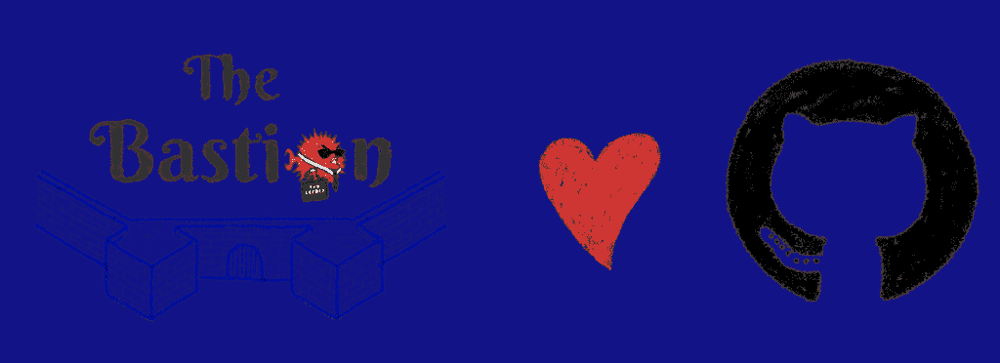

我们要开源了！我们非常高兴与您分享这一消息，并在堡垒的生命周期中标志着这一新的里程碑。我们认为这是升级到下一个主要版本 3.00.00 的绝佳理由！显然，所有以前的版本都是内部专用的。

代码可以在 GitHub 上获得，从现在开始，我们也将所有非 OVHcloud 特定的开发转移到那里。

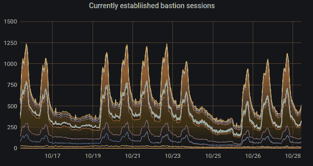

该文档也可以在线获得(也可以作为 reStructuredText 文件离线获得)，我们鼓励您阅读它。对于最没有耐心的人来说，如果你想尝试一下，docker hub 上还有一个 Docker 图片:the*TL；GitHub 上 *README.md* 的 DR* 部分会带你入门。

许多更高级的特性(如 PIV 支持、2FA/MFA 支持、*领域*的概念、HTTPS 代理等。)还没有完全记录下来，但是所有的基础知识都已经有了。我们将在接下来的几周/几个月内加强这一点。一些功能也没有开源，比如我们在上一篇文章中提到的 db 插件。但它最终会成为开源版本。

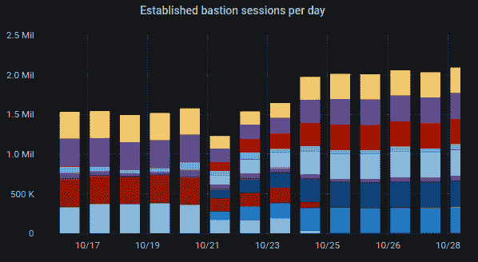

我们希望它对社区有用，就像对我们一样，我们迫不及待地想听到你的消息！GitHub 页面在这里的[。](https://ovh.github.io/the-bastion/)

**快速连接和重放示例**

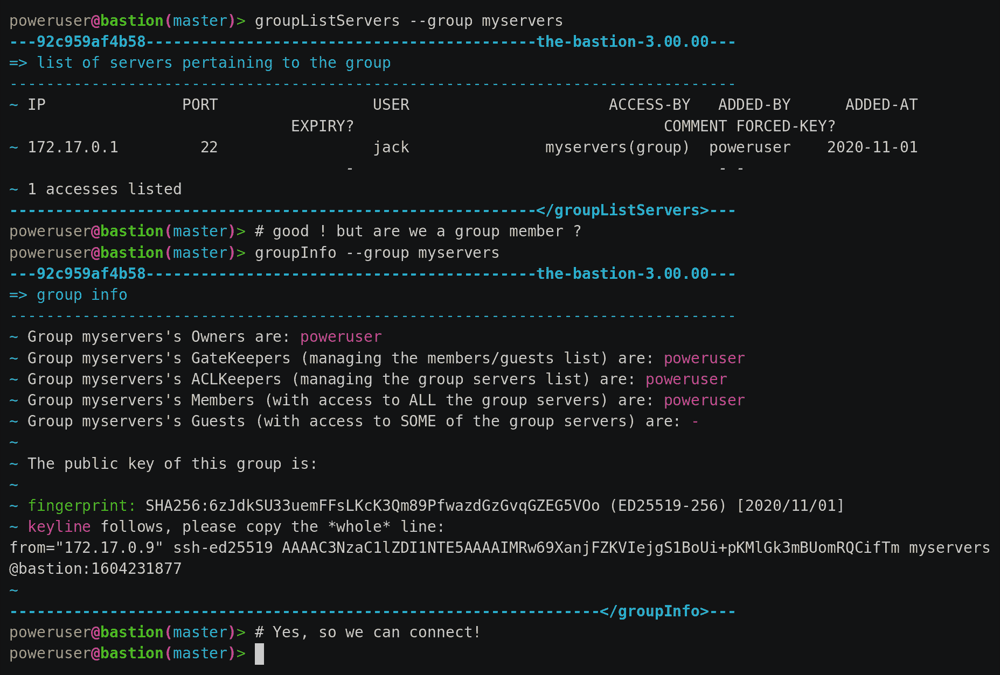

**安装、升级、使用堡垒**

请参阅在线文档，或在`**doc/**`文件夹中找到的相应文本版本。

欢迎使用 Bastion 文档！

等等，堡垒到底是什么？(约 140 个字符)

所谓的**堡垒**是被运营团队(如系统管理员、开发人员、开发人员、数据库管理员等)用作单一入口点的机器。)安全地连接到基础设施的其他机器，通常使用 ssh。

堡垒为整个基础设施提供了*认证*、*授权*、*可追溯性*和*可审计性*的机制。

又一个 SSH 中继主机/跳转主机/网关？

不，堡垒是完全不同的野兽。

这些与 Bastion 之间的关键技术差异是，它严格地站在您和远程服务器之间，在过程中操作协议中断，这实现了一些独特的功能，如 tty 记录、适当的访问可审计性、内置的访问和组管理命令、自始至终的责任委托等。

高级用途甚至包括做其他事情，而不仅仅是连接到远程服务器。

这对于“简单”的 jumphost 来说是不可能的。更多的技术细节在这里。

好吧，告诉我更多！

本文档分为几个部分。第一个是堡垒的主要功能、原则和用例的[展示](https://ovh.github.io/the-bastion/presentation/index.html)。

**演示文稿**

*   原则
*   特征
*   安全性
    *   核心安全原则
    *   可审计性

**原则**

**注**

宣布发布的博客帖子的第二部分很好地解释了堡垒的大部分原理。链接如下。

*   第 1 部分–起源
*   第 2 部分-代表团头晕
*   第 3 部分–安全是核心
*   第 4 部分–新时代

**特性**

*   具有组角色委托的个人和组访问方案，以确保团队自治，而无需安全权衡
*   入口和出口连接之间的 SSH 协议中断(参见其他安全措施)
*   通过几乎没有外部依赖实现自力更生(见其他安全措施)
*   交互式会话记录(在标准`**ttyrec**`文件中)
*   非交互式会话记录(stdout 和 stderr 通过`**ttyrec**`)
*   通过 syslog 提供广泛的日志支持，便于 SIEM 使用
*   在入口连接端支持 MOSH
*   支持`scp`直通，从/向远程服务器上传和/或下载文件
*   支持`netconf` SSH 子系统穿越
*   在入口连接端支持 Yubico PIV 密钥证明检查和执行
*   支持领域，在可能是两个不同公司的两个堡垒之间创建信任，分离身份验证和授权阶段，同时仍然实施本地策略
*   对于不支持公钥认证的传统设备，支持在出口端进行 SSH 密码自动登录，同时仍然在入口端强制进行正确的公钥认证
*   对于不支持 SSH 的旧设备，支持在出口端进行 telnet 密码自动登录，同时仍然在入口端强制进行正确的 SSH 公钥身份验证
*   支持具有中间人身份验证和授权处理的 HTTPS 代理，用于入口和出口密码解耦(主要用于网络设备 API)

**安全**

**安全原则的核心**

即使是最保守、最谨慎、最偏执的编码过程，代码也会有缺陷，所以不应该盲目信任。因此，堡垒不信任自己的代码。它利用操作系统安全原语来获得额外的安全性，如下所示。

*   使用众所周知且值得信赖的 UNIX 自主访问控制:
    *   堡垒用户被映射到实际的系统用户
    *   堡垒组映射到实际的系统组
    *   所有的代码在允许任何动作之前不断地检查权限
    *   UNIX DAC 被用作安全带来防止操作成功，即使代码被欺骗而允许它
*   bastion 主脚本被声明为 bastion 用户的系统外壳:
    *   没有用户在系统上拥有真正的(`bash`)shell 访问权限
    *   所有代码都在非特权用户的系统帐户权限下运行
    *   即使用户可以逃到一个真正的 shell，他也不能连接到他无权访问的机器，因为他没有对 SSH 密钥的文件系统级读取权限
*   代码是模块化的
    *   主代码主要检查权限，记录动作，并允许`ssh`访问其他机器
    *   所有被称为**插件**的辅助命令都位于与主代码分离的模块中
    *   模块可以是**开放**或**受限**
        *   只有根据需要被特别授权的帐户才能运行特定的受限插件
        *   这由代码检查，也由 UNIX DAC 强制执行(该插件只能由特定于该插件的系统组读取和执行)
*   所有需要扩展系统权限的代码都从主代码中分离出来，放在名为**助手**的模块中
    *   助手在`sudo`下单独运行
    *   `sudoers`配置附加到特定于该命令的系统组，根据需要授予帐户
    *   辅助程序只能由特定于该命令的系统组读取和执行
    *   助手路径和它们的一些不可变参数在`sudoers`配置中被硬编码
    *   Perl 污染模式(`-T`)用于所有在`sudo`下运行的代码，通过立即停止执行来防止任何用户输入干扰逻辑
    *   在`sudo`下运行的代码不信任它的调用者，并重新检查每个输入
    *   非特权代码和特权代码之间通信是使用 JSON 完成的

**可审计性**

*   堡垒管理员必须使用堡垒的逻辑连接到自身来管理它(或者更好地，使用另一个堡垒来这样做)，这确保了所有情况下的可审计性
*   每个访问和操作(无论允许还是拒绝)都记录有:
    *   `syslog`，也应该发送到远程系统日志服务器，以确保即使是堡垒管理员也不能篡改他们的踪迹，和/或
    *   便于搜索的本地`sqlite3`数据库
*   该代码用于多个 PCI-DSS、ISO 27001、SOC1 和 SOC2 认证环境的生产中

第二节解释了如何[让堡垒运行](https://ovh.github.io/the-bastion/installation/index.html)，包括如果你想快速上手，如何用 Docker 搭建一个快速游乐场。

**安装&设置**

如果您只是从以前的版本升级，请改为阅读升级。

**得到了傀儡？**

我们发布了一个 Puppet 模块来处理堡垒配置和先决条件。GitHub repo 在这里是，我们的模块已经发布到[傀儡锻造](https://forge.puppet.com/modules/goldenkiwi/thebastion)。当然，它的用法是完全可选的，但是如果您选择使用它，下面的一些步骤将由 Puppet 完成。因此，您可能只想考虑以下步骤:

*   操作系统
*   获取代码
*   加密/主页
*   (跑木偶)
*   手动创建我们的第一个堡垒帐户

**操作系统**

每个版本都测试了以下 Linux 发行版，但是因为这是一个安全产品，所以我们强烈建议您在您最喜欢的操作系统的最新稳定版本上运行它:

*   Debian 10 (Buster)，9 (Stretch)
*   rhel/centos 8 . x(2011 年 3 月 8 日、2004 年 2 月 8 日、1911 年 1 月 8 日)、7 . x(2009 年 9 月 7 日、2003 年 8 月 7 日、1908 年 7 月 7 日)
*   Ubuntu lt 20.04、18.04、16.04
*   OpenSUSE Leap 15.3*，15.2*

*:请注意，这些版本没有现成的 MFA 支持，因为它们缺少打包版本的`pamtester`、`pam-google-authenticator`或两者都有。当然，你可以自己编译。任何其他所谓的现代 Linux 版本都不会在每个发行版中进行测试，但是不需要或只需要很小的调整就可以工作。

每个版本还测试了以下操作系统:

*   FreeBSD/HardenedBSD 12.1**

**:请注意，这些插件支持部分 MFA，因为它们减少了可用的 **`pam`** 插件。可以配置对附加密码或 TOTP 因子的支持，但不能同时配置两者。该代码实际上已知可以在 FreeBSD/HardenedBSD 10+上工作，但它只在 12.1 下定期测试。

其他 BSD 变体部分工作，但不受支持和鼓励，因为它们对补充组的最大数量有严格限制(导致组成员和受限命令检查的问题)，没有文件系统级 ACL 支持，并且缺少 MFA:

*   OpenBSD 5.4+版本
*   NetBSD 7+

在任何情况下，您都应该将它安装在一台适当安全的机器上(包括但不限于:`iptables` / `pf`、已安装软件和守护程序的精简集、一般系统加固等)。).如果你使用 Debian，遵循 [CIS](https://www.cisecurity.org/benchmark/debian_linux/) 加固指南是一个好的开始。我们有一个工具来检查是否符合这些准则。如果您使用 Debian 并且还没有自己的加固模板，这个脚本应该可以帮助您提高速度，并确保您的加固主机随着时间的推移保持加固，通过您可能希望通过 cron 设置的每日审计。

已经非常小心地编写了安全的、经过测试的代码，但是如果您的机器是一条黑客高速公路，这当然是没有价值的。确保堡垒代码下面的所有层(操作系统和运行它的硬件)是你的工作。

**获取代码**

bastion 代码通常位于`/opt/bastion`下。你可以直接使用`git clone`，或者获取最新版本的 tarball。

*   使用 **git** :

**git 克隆 https://github.com/ovh/the-bastion/opt/bastion
git-C/opt/bastion check out $(git-C/opt/bastion tag | tail-1)**

*   使用 tarball:

获取最新版本的压缩包，可以在那里找到[，然后解压它:](https://github.com/ovh/the-bastion/releases/latest)

**mkdir-p/opt/bastion
tar-c/opt/bastion-zxfv 3 . 04 . 00 . tar . gz**

代码支持托管在文件系统层次结构的其他地方，但是不鼓励这样做，因为您可能需要调整许多需要绝对路径的配置文件(特别是 sudoers.d、cron.d、init.d)。您应该以诸如`bin`、`lib`等目录结束。直属`/opt/bastion`。

**安装需要的包**

对于受支持的 Linux 发行版(见上文)，您可以简单地运行:

**/opt/bastion/bin/admin/packages-check . sh-I**

根据您的环境，您可以添加其他参数来安装可选软件包:

*   `-s`安装`syslog-ng`(建议，我们有它的模板文件)
*   安装开发软件所需的软件包(在生产中无用)
*   `-t`安装`ovh-ttyrec`

注意,`-t`假设您已经编译了`ovh-ttyrec`,并使其对您的发行版库可用。如果你还没有，你可以使用下面的助手:

**/opt/bastion/bin/admin/install-tty rec . sh-a**

这将检测你的发行版，然后下载并安装 [ovh-ttyrec](https://github.com/ovh/ovh-ttyrec) 的`.deb`或`.rpm`包。如果您的发行版不处理这些包类型，它将退回到安装预编译的静态二进制文件。当然，您可以自己打包它，并使它对您自己的内部存储库可用，而不是这样安装它。

如果你打算使用 Bastion 的 PIV 功能，你还需要安装`yubico-piv-checker` [助手工具](https://github.com/ovh/yubico-piv-checker):

/opt/bastion/bin/admin/install-yubi co-PIV-checker . sh-a

**加密/首页**

严格地说，这一步是可选的，但是如果跳过这一步，要知道所有的 SSH 私有密钥和会话记录都将以不加密的方式存储在`/home`分区上。当然，如果分区加密已经由您使用的操作系统模板处理，或者如果您的操作系统的存储层通过其他方式加密，您可以跳过这一部分。

首先，在你的桌子上生成一个安全的密码(但不要太复杂，这样你就可以在周日凌晨 3 点的黑暗中，通过虚拟专用网上的虚拟桌面和虚拟专用网上的虚拟机管理程序在控制台上输入密码)，并将其保存到一个安全的位置:`pwgen -s 10`。

然后，您可以使用助手脚本来完成此操作，它将指导您完成整个过程:当提示输入密码短语时，输入刚才选择的密码短语。

**/opt/bastion/bin/admin/setup-encryption . sh**

如果您得到一个 cryptsetup 错误，您可能需要在脚本中的`cryptsetup luksFormat`命令中添加`--type luks1`。如果您的内核没有为 LUKS2 启用必要的特性，就会发生这种情况。

**设置堡垒和系统配置**

下面的脚本将为您做到这一点。这里有几种可能性。

*   如果您正在安装一台新机器(还没有人将它用作堡垒)，那么您可以重新生成全新的主机密钥，并直接强化 ssh 配置，而不会有任何副作用:

**/opt/bastion/bin/admin/install–new-install**

*   如果您正在升级一台现有的机器(从该软件的以前版本)，并且已经有一些人将它用作堡垒，那么如果您更改主机密钥，他们将不得不在连接时确认更改，也就是说，这一点也不透明。为了避免这样做并且不触及 ssh 配置或主机键，请使用以下命令:

**/opt/bastion/bin/admin/install–升级**

如果你使用了`--upgrade`，那么**热情地**建议你自己加强配置，使用我们的模板作为基础。例如，如果你使用的是 Debian 10:

**vim diff/opt/bastion/etc/ssh/ssh _ config . debian 10/etc/ssh/ssh _ config
vim diff/opt/bastion/etc/ssh/sshd _ config . debian 10/etc/ssh/sshd _ config**

对于其他受支持的发行版，在同一目录中还有其他模板。

*   如果您想要对安装脚本管理的内容以及您自己(或您可能拥有的任何配置自动化系统)管理的内容进行细粒度控制，您可以查看所有细粒度选项:

**/opt/bastion/bin/admin/install–help**

**查看配置**

基本配置文件已经复制，您应该检查主配置并根据需要进行修改:

**vim/etc/bastion/bastion . conf**

**检查代码是否能在你的机器上运行**

该脚本将验证是否安装了所有必需的模块:

**/opt/bastion/bin/dev/perl-check . sh**

**手动创建我们的第一个堡垒账户**

只需启动这个脚本，将用户名替换为您想要使用的用户名:

**/opt/bastion/bin/admin/setup-first-admin-account . sh 用户名自动**

您只需要指定要添加到这个新帐户的公共 SSH 密钥。它将被创建为一个堡垒管理员，所有受限制的命令都将被授予。

**注**

这个命令还会给你一个所谓的 *bastion 别名*，这是你经常用来连接到 bastion 的命令，并通过它连接到你的基础设施，实际上取代了你以前使用的 ssh 命令。帐户创建时公布的别名可以在`**bastion.conf**`中配置，当然用户可以根据自己的意愿对其进行重命名，但是建议尽量缩短该命令，因为人们会经常使用它。

如果您想创建其他管理员帐户，可以重复该操作。所有其他帐户都应该由 bastion 管理员(或者更准确地说，是被授权使用 *accountCreate* 命令的人)使用 bastion own 命令创建。但是在*使用堡垒*一节中会有更多的介绍。

既然您的 bastion 已经安装好了，您可以查看[高级安装](https://ovh.github.io/the-bastion/installation/advanced.html)文档，或者使用 bastion 部分前往[。](https://ovh.github.io/the-bastion/using/index.html)

**高级安装**

本节将进一步解释如何设置您的堡垒。你应该先完成[基本安装](https://ovh.github.io/the-bastion/installation/basic.html)。

**加密&签名 GPG 密钥**

堡垒使用 2 对 GPG 密钥:

*   *堡垒 GPG 键*
    *   **私钥**被**堡垒**用来给**签署**文件
    *   **公钥**被**管理员**用来**验证**签名并证明文件的不可否认性和不可篡改性
*   管理员 GPG 键
    *   **公钥**被**堡垒**用来**加密**备份和文件
    *   当需要恢复操作时，**管理员**使用**私有**密钥来**解密**备份和 ttyrec 文件

**生成堡垒 GPG 密钥**

生成一个 GPG 密钥，堡垒将使用它来签署文件，这可能需要一段时间，尤其是在服务器空闲时:

**/opt/bastion/bin/admin/setup-gpg . sh–生成
gpg:目录`/root/。gnupg '创建了
gpg:生成 gpg 密钥，这需要一些时间。
没有足够的随机字节可用。请做一些其他的工作，给
操作系统一个收集更多熵的机会！(还需要 39 个字节)
…………++++++
gpg:/root/。GnuPG/trust db . gpg:trust db created
gpg:key a 4480 f 26 标记为最终受信任
gpg: done
gpg:检查 trustdb
gpg:需要 3 个边缘，需要 1 个完整，PGP 信任模型
gpg:深度:0 有效:1 签名:0 信任:0-，0q，0n，0m，0F，1u
配置文件/etc/bastion/Osh-encrypt-rsync . conf**

当它工作时，您可以继续下面的部分。

**生成并导入管理员 GPG 密钥**

你应该在 bastion 上导入一个或多个用于加密的**公共** GPG 密钥。如果你还没有一个 GPG 键，你可以生成一个。因为这是管理员 GPG 密钥，所以不要在堡垒上生成它。管理员的桌子上(你？)，可以运行例如:

**my Name = ' John Doe '
Email = ' JD @ example . org '
bastion = ' mybastion 4 . example . org '
pass =`pwgen -sy 12 1`
echo "密钥的密码短语将是:$ pass "
printf " Key-Type:RSA \ n Key-Length:4096 \ nSubkey-Type:RSA \ n "
" Name-Real:% s \ n Name-Comment:% s \ n Name-Comment 请做一些其他的工作，给操作系统一个收集更多熵的机会！(还需要 119 个字节)
…..++++++
gpg:密钥 D2BDF9B5 被标记为最终可信
gpg: done**

当然，相应地调整`myname`、`email`和`bastion`变量。在安全的保险箱中记下密码。所有 bastions 管理员都将需要它，如果他们以后要解密 ttyrec 文件以供检查，并且还需要解密备份以进行恢复的话。当密钥生成完成后，使用您刚刚生成的正确的密钥 ID，通过`gpg -a --export D2BDF9B5`获得公钥。将它复制到您的剪贴板，然后回到 bastion，在下面的提示中粘贴它:

**/opt/bastion/bin/admin/setup-gpg . sh–import**

另外，将管理员的专用 GPG 密钥导出到安全保管库中(如果您希望管理员共享相同的密钥):

**gpg-导出-秘密-密钥-装甲 D2BDF9B5**

**旋转、加密&备份 ttyrec 文件**

按照上面的“设置加密和签名 GPG 密钥”一节，您应该已经在适当的位置准备好了所有需要的 GPG 密钥。

配置文件位于`/etc/bastion/osh-encrypt-rsync.conf`中。您可以忽略`signing_key`、`signing_key_passphrase`和`recipients`选项，因为当您生成 GPG 密钥时，通过将配置文件放到`/etc/bastion/osh-encrypt-rsync.conf.d`目录中，这些选项已经被自动填充。那里的任何文件都优先于全局配置文件。

完成配置后，您可能希望通过运行以下命令来测试它:

**/opt/bastion/bin/admin/Osh-encrypt-rsync . pl–config-test**

或者甚至更进一步，以模拟运行模式启动脚本:

**/opt/bastion/bin/admin/Osh-encrypt-rsync . pl–模拟运行**

**配置密钥，账户&组远程备份**

从备份中恢复堡垒所需的一切(密钥、帐户、组等)。)默认情况下每天在`/root/backups`中备份。如果您遵循了上面的“设置加密&签名 GPG 密钥”一节，这些备份将被自动加密。

如果您想将这些备份推送到远程位置，我们强烈建议您这样做，您必须指定备份归档到的远程位置。配置文件是`/etc/bastion/osh-backup-acl-keys.conf`，你要指定`PUSH_REMOTE`和`PUSH_OPTIONS`。

要验证脚本是否能够正确地远程连接(并验证远程主机密钥)，请手动启动脚本:

**/opt/bastion/bin/admin/Osh-backup-ACL-keys . sh
远程推送备份文件(/root/backups/backup-2020-05-25 . tar . gz . gpg……
备份-2020-05-25 . tar . gz . gpg
100% 21MB 20.8 MB/s 00:00**

还要验证扩展名是`.gpg`，如上所示，这表明脚本成功地加密了备份。

**日志/系统日志**

建议将 syslog 用于堡垒应用程序日志。这可以在`/etc/bastion/bastion.conf`中用参数`enableSyslog`进行配置。

有一个默认的`syslog-ng`配置，如果你碰巧使用它的话。该文件可以在存储库中以`etc/syslog-ng/conf.d/20-bastion.conf.dist`的名称找到。请阅读文件中的注释，以了解如何将其正确集成到您的系统中。

**集群(高可用性)**

bastions 可以在具有 N 个实例的集群中工作。在这种情况下，有一个*主*实例，其中可以使用任何修改命令(创建帐户、删除组、授予访问权限)，以及 N-1 个*从*实例，其中仅允许*只读*动作。请注意，任何实例都可以用于连接基础设施，因此实际上所有实例都可以同时使用。您可以设置一个 DNS 循环主机名，并声明所有实例 IP，以便客户端自动选择一个随机实例，而不必依赖另一个外部组件，如负载平衡器。注意，如果这样做，您将需要所有实例共享相同的 SSH 主机密钥。

**建立奴隶堡垒**

在设置从属 bastion 之前，您应该让两个 bastion 启动并运行(遵循正常的安装文档)。

**上从**

`passwd`和`group`文件的同步可能会对新安装的机器产生不利影响，在新安装的机器上，软件包的安装顺序不同于主机上的安装顺序，因此对于相同的用户有不同的 uid。已知以下命令可以修复在这种情况下可能出现的所有问题，在传统的 Debian 机器上，安装了`puppet`、`postfix`、`ossec`和`bind`(忽略任何*文件或目录未找到*消息):

**chown-R puppet:puppet/var/lib/puppet/var/log/puppet/run/puppet
chgrp puppet/etc/puppet
chown-R postfix/var/spool/postfix
chown root:root/var/spool/postfix
chown-R root:root/var/spool/postfix/{ PID/{ etc，lib，dev，usr }
chgrp-R postdrop/var/spool/postfix/{ public**

然后，在从机上，将`/etc/bastion/bastion.conf`文件中的`readOnlySlaveMode`选项设置为`1`:

**vim/etc/bastion/bastion . conf**

这将指示 bastion 拒绝任何修改插件，因此更改只能通过主实例完成。

然后，将主实例上的`~root/.ssh/id_master2slave.pub`中的主堡垒同步公共 SSH 密钥文件附加到从实例上的`~bastionsync/.ssh/authorized_keys`中，前缀如下:`from="IP.OF.THE.MASTER",restrict`

因此，该文件应该如下所示:`from="198.51.100.42",restrict ssh-ed25519 AAA[...]`

注意，如果您使用的是 7.2 版之前的旧 OpenSSH，前缀应该改为:`from="IP.OF.THE.MASTER",no-port-forwarding,no-agent-forwarding,no-X11-forwarding,no-pty,no-user-rc`。

**上主**

*   通过在`root`帐户下启动以下命令，检查密钥设置是否正常工作:

**rsync-vaA–numeric-ids–dry-run–delete–filter " merge/etc/bastion/Osh-sync-watcher . rsync filter”-rsh " ssh-I/root/。ssh/id _ master 2 slave "/bastion sync @ IP。. SLAVE:/**

*   检查它没有试图同步太多的东西(如果你的`/home`中有奇怪的东西，你可能想要编辑`/etc/bastion/osh-sync-watcher.rsyncfilter`来排除那些东西)
*   一旦你对输出满意，不用`--dry-run`再试一次
*   完成后，立即再次运行它以确保它仍然工作，因为`/etc/passwd`和`/etc/group`将在从属服务器上被覆盖
*   然后，编辑主服务器上的配置:

**vim/etc/bastion/Osh-sync-watcher . sh**

*   然后，将脚本配置为在引导时启动，并手动启动它:

**systemctl 启用 osh-sync-watcher
systemctl 启动 osh-sync-watcher**

*   您可以检查日志(如果您配置了`syslog`,那么日志文件取决于您的 syslog 守护进程配置)

**tail-F/var/log/bastion/Osh-sync-watcher . log**

**杂项**

**创建 SSHFP 记录**

如果您想使用`SSHFP`(对于堡垒，您应该这样做)，生成记录并在 DNS 中发布它们:

**awk 'tolower($1)~/^hostkey$/ { system(" ssh-keygen-r bastion . name-f " $ 2)} '/etc/ssh/sshd _ config**

**强化 SSH 配置**

您可以使用以下脚本:

**/opt/bastion/bin/admin/check-ssh-hardening . pl**

注意，这个脚本并不检查所有内容，只检查几项。如果您想要对您的 SSH 配置进行完整的审计，还有其他工具可用。使用我们的 SSH 模板也是一个好的开始。

该脚本还支持为您的安装生成定制模块。以下命令将生成 8192 位大小的模数。请注意，这需要几个小时:

**/opt/bastion/bin/admin/check-ssh-hardening . pl–generate-moduli 8192**

**2FA 根认证**

堡垒支持 TOTP(基于时间的一次性密码)，以进一步保护高姿态访问。本节介绍在堡垒上配置 2FA 根认证。也可以为普通的 bastion 用户启用 TOTP，但这将在另一节中介绍。要启用 2FA 根身份验证，请在 bastion 上运行:

**script-c " Google-authenticator-t-Q UTF8-R3-r15-s/var/OTP/root-w2-E4-D "/root/二维码**

当然，你可以检查`--help`并相应地调整选项。上面给出的例子有一些缺省值，但是如果需要的话，你可以调整一下。现在，使用 TOTP 应用程序，用你的手机闪现这个二维码。您可能希望将二维码复制到某个安全的地方，以备在其他手机上使用，方法是导出二维码的`base64`版本:

**gzip-c/root/qrd | base64-w150**

将它复制到您的密码管理器中(例如)。然后您可以删除`/root/qrcode`文件。

然后，您有两个配置调整要做。

*   首先，确保您已经安装了提供的`/etc/pam.d/sshd`文件，或者至少安装了相应的行，以便在您的配置中启用 TOTP pam 插件。
*   其次，确保您的`/etc/ssh/sshd_config`文件调用 PAM 进行根认证。在提供的模板中，有一个注释片段可以做到这一点。未注释的代码片段如下所示:

# **已经为 root 配置了 2FA，所以我们为它强制 pubkey+PAM
匹配用户 root
AuthenticationMethods public key，keyboard-interactive:pam**

注意，首先将使用通常的 publickey 方法，然后控制权将传递给 PAM。这就是应用`/etc/pam.d/sshd`配置的地方。

现在，下次您尝试以 root 用户身份通过 ssh 登录时，应该会要求您提供 TOTP。如果新配置出现问题，请确保保留您已经打开的现有连接，以便能够在不退回到控制台访问的情况下修复问题。

一旦完成测试，您还可以(并且可能应该)使用 TOTP 保护对您机器的直接根控制台访问，包括类似下面的代码片段:

# **TOTP 配置
auth[success = 1 default = ignore]PAM _ Google _ authenticator . so secret =/var/OTP/$ { USER }
auth requisite PAM _ deny . so
# TOTP 配置结束**

在你的`/etc/pam.d/login`文件里。

当然，当使用 TOTP 时，这对于确保您的服务器通过 NTP 正确同步至关重要

**升级**

**一般升级说明**

*   首先，检查下面是否有针对您的版本的特定升级说明。
*   当你准备好了，更新代码，如果你正在使用`git`，你可以签出最新的标签:

**(umask 0022&CD/opt/bastion&git fetch&&git check out $(git tag | tail-1))**

*   在升级模式下运行安装脚本，以便它可以对新版本所需的系统进行调整:

**/opt/bastion/bin/admin/install–升级**

注意，如果您使用的是 Puppet、Ansible、Chef 等基础设施自动化工具，并且不希望更新脚本触及您自己管理的一些文件，那么您可以使用`**--managed-upgrade**`而不是 **`--upgrade`。**如果需要，查看`**--help**`以获得更细粒度的升级路径。

**特定版本升级说明**

**2000 年 4 月 3 日至 2021 年 7 月 2 日**

从先前版本升级的途径很简单，但是在点击升级按钮之前，您可能需要了解一些变化:

*   一些 EOL 操作系统已经被放弃:Debian 8，Ubuntu 14.04，OpenSUSE 15.0 和 15.1。这意味着，虽然软件可能仍然工作，但这些操作系统不再是测试的一部分，可能会在任何未来的升级中中断。
*   HTTPS 代理的默认日志记录级别已降低。如果要保留完整的请求和响应日志记录，请检查 log_request_response 和 log_request_response_max_size 配置选项。

**3 . 03 . 01–2021/03/25**

没有具体的升级说明。

**3 . 03 . 00–2021/02/22**

没有具体的升级说明。

**3 . 02 . 00–2021/02/01**

从先前版本升级的途径很简单，但是在点击升级按钮之前，您可能需要了解一些变化:

**主配置文件现在支持正确的布尔值**

对于许多配置选项，以前您会指定“1”来启用某个功能，指定“0”来禁用它。这已被更改为在`/etc/bastion/bastion.conf`中使用正确的*真*和*假* json 值。当然，与“0”和“1”的向后兼容性将会一直保持，所以即使你保持你的配置不变，这个版本或以后的版本也不会出现问题。

**日志得到了增强**

所有的连接和插件执行都发出两个日志，一个*打开*和一个*关闭*日志。我们现在将连接的所有细节添加到*关闭*日志中，这些细节以前只在相应的*打开*日志中可用。这样，不再需要将两个日志与它们的 uniqid 相关联来获得所有数据:使用 *close* 日志就足够了。如果由于某种原因*关闭*日志无法发出(kill -9、系统崩溃等)，则*打开*日志仍然存在。)，或者如果*打开*和*关闭*日志是几个小时、几天或几个月。

一个额外的字段**持续时间**被添加到*关闭*日志中，这代表连接持续的秒数(精确到毫秒)。

两个新字段 **globalsql** 和 **accountsql** 被添加到 *open* 类型的日志中。如果我们成功地登录到相应的日志数据库，则这些消息将包含“ok ”;如果它被禁用，则包含“no ”;如果我们在尝试插入行时遇到错误，则包含错误$aDetailedMessage。 *close* 类型的日志也有新的 **accountsql_close** 字段，但是缺少 **globalsql_close** 字段，因为我们从来没有在这个事件上更新全局数据库。在*关闭*日志中，我们还可以有值**丢失**，表明我们无法更新数据库中的访问日志行，因为相应的*打开*日志无法插入它。

用于*关闭*类型日志的 **ttyrecsize** 日志字段已被删除，因为它从未完全实现，并且如果 ttyrec 日志循环发生，则包含虚假数据。它也已经从 sqlite 日志数据库中删除。

除了 syslog 之外，*打开*和*关闭*事件现在被推送到我们自己的日志文件，如果启用了对这些文件的日志记录(参见 [enableGlobalAccessLog](https://ovh.github.io/the-bastion/administration/configuration/bastion_conf.html#enableglobalaccesslog) 和 [enableAccountAccessLog](https://ovh.github.io/the-bastion/administration/configuration/bastion_conf.html#enableaccountaccesslog) ),以前*关闭*事件仅被推送到 syslog。

enableGlobalAccessLog 不再使用`**/home/osh.log**`文件，而是将全局日志写入`**/home/logkeeper/global-log-YYYYMM.log**`。

使用 enableGlobalSqlLog 启用的全局 sql 文件现在按年月而不是按年拆分为`**/home/logkeeper/global-log-YYYYMM.sqlite**`。

**2003 年 1 月 3 日至 2020 年 12 月 15 日**

没有具体的升级说明。

**2008 年 1 月 2 日至 2020 年 12 月 3 日**

没有具体的升级说明。

**2004 年 1 月 1 日至 2020 年 12 月 3 日**

没有具体的升级说明。

**3 . 01 . 00–2020/11/20**

引入了一个新的 bastion.conf 选项: *interactiveModeByDefault* 。如果在您的配置文件中不存在，它的值默认为 1 (true)，当用户没有指定任何命令就连接时，它会改变堡垒的行为。当这种情况发生时，它现在会显示帮助，然后让用户进入交互模式(如果该模式已启用)，而不是显示帮助并以错误消息中止。如果您想保留以前的行为，请将其设置为 0 (false)。

此版本中添加了 SELinux 模块，以确保 TOTP MFA 在 SELinux 处于强制模式的系统下正常工作。只要在系统上检测到 SELinux，就会自动安装该模块。如果您不想使用这个模块，请在您的/opt/bastion/bin/admin/install 升级调用中指定–no-install-selinux-module(有关更多详细信息，请参考通用升级说明)。

**3 . 00 . 02–2020/11/16**

没有具体的升级说明。

**v 3 . 00 . 01–2020/11/06**

如果您以前使用现在已废弃的`**build-and-install-ttyrec.sh**`脚本安装了`**ttyrec**`，您可能想知道从这个版本开始，该脚本已经被`**install-ttyrec.sh**`所取代，它不再就地构建，而是更喜欢下载并安装预构建 **`rpm`或`deb`** 包。

如果您之前手动构建并安装了`**ttyrec**`，并且想要使用新的软件包，您可能想要手动卸载您之前构建的 ttyrec 程序(删除安装在`**/usr/local/bin**`中的二进制文件)，并调用`**install-ttyrec.sh -a**`下载并安装合适的软件包。

从软件的角度来看，这不是强制性的，也不会改变什么。

**3 . 00 . 00–2020/10/30**

初始公开版本，无具体升级说明。

**使用 Docker 的沙盒**

这是一个在几秒钟内测试堡垒的好方法，但是如果你真的想在生产中使用容器化，请阅读 FAQ。

沙盒镜像可用于以下架构:`**linux/386**`、`**linux/amd64**`、`**linux/arm/v6**`、`**linux/arm/v7**`、`**linux/arm64**`、`**linux/ppc64le**`、`**linux/s390x**`。

*   让我们运行 docker 图像:

**docker run-d-p 22–name bastion test ovh com/the-bastion:sandbox**

或者，如果您喜欢自己构建 docker 映像，您可以:使用下面的两个命令。当然，如果您已经键入了上面的`**docker run**`命令，您可以跳过下面的命令:

**码头工建置-f 码头工/码头工。debian10 -t 堡垒:debian10。
码头运行-d-p22–名称 bastiontest bastion:debian10**

配置第一个管理员帐户(准备好您的公共 SSH 密钥)

**docker exec-it bastion test/opt/bastion/bin/admin/setup-first-admin-account . sh power user auto**

我们现在已经开始使用默认配置运行了！让我们设置一个方便的 bastion 别名，并测试`info`命令:

**PORT = $(docker PORT bastion test | cut-d:-F2)
alias bastion = " ssh power user @ 127 . 0 . 0 . 1-TP $ PORT—"
bastion–Osh 信息**

它应该以堡垒管理员的身份欢迎您，这意味着您可以访问所有命令。让我们进入互动模式:

**堡垒-i**

这对于连续调用几个`**--osh**`插件很有用。现在我们可以请求帮助来查看所有插件:

**$ >求助**

第三部分从不同角色的角度，如堡垒用户、群组所有者、堡垒管理员等，重点介绍如何使用堡垒。

第四部分是关于堡垒本身的适当管理。如果你即将成为负责管理你公司堡垒的人，你应该仔细阅读那篇文章！

第五部分是所有[插件](https://ovh.github.io/the-bastion/plugins/index.html)的完整参考，这些插件是用于与 bastion 帐户、组、访问、凭证等交互的命令。