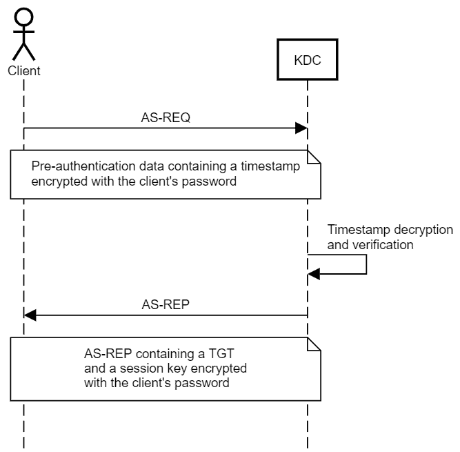
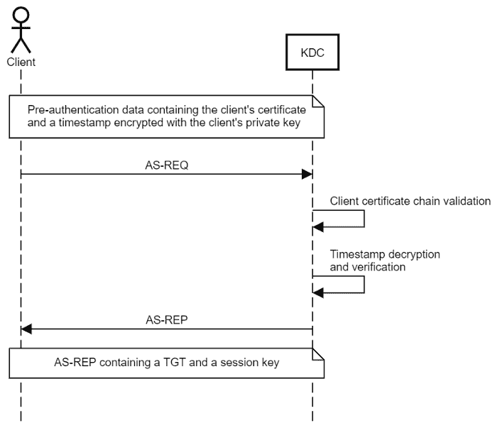
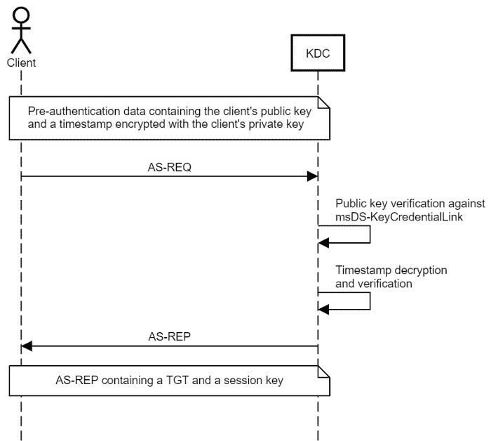
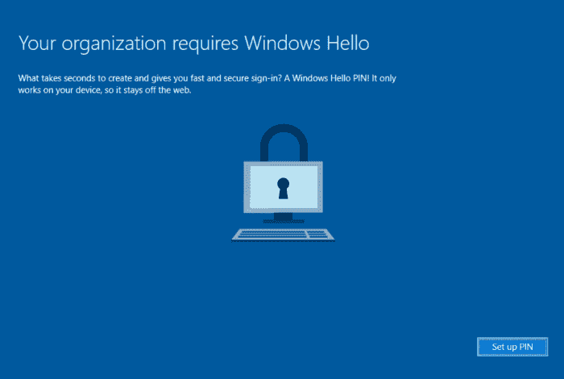
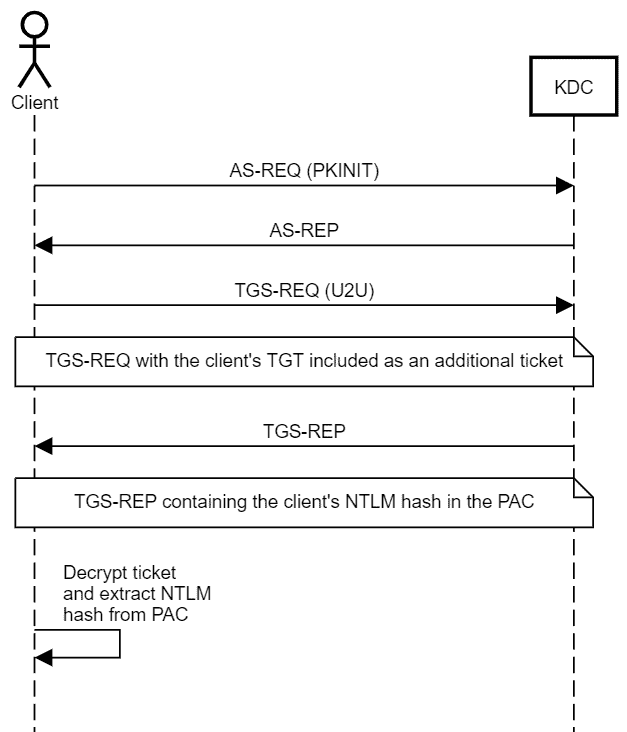
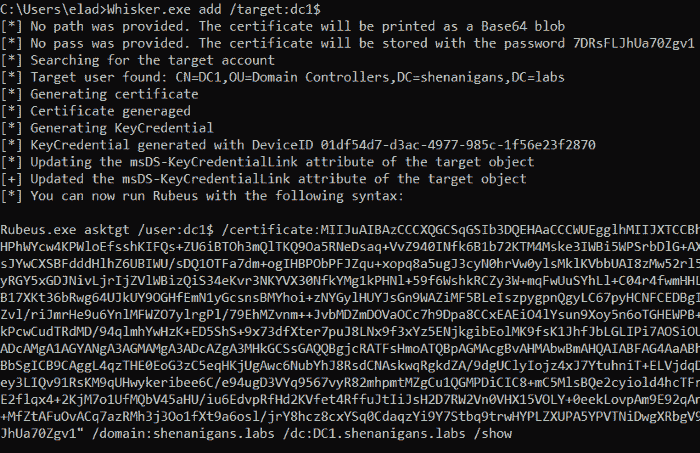
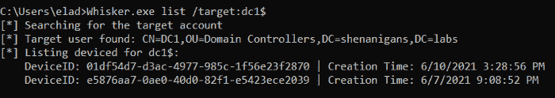
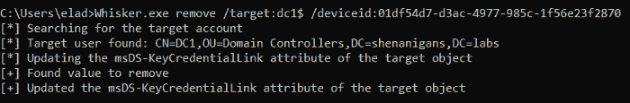
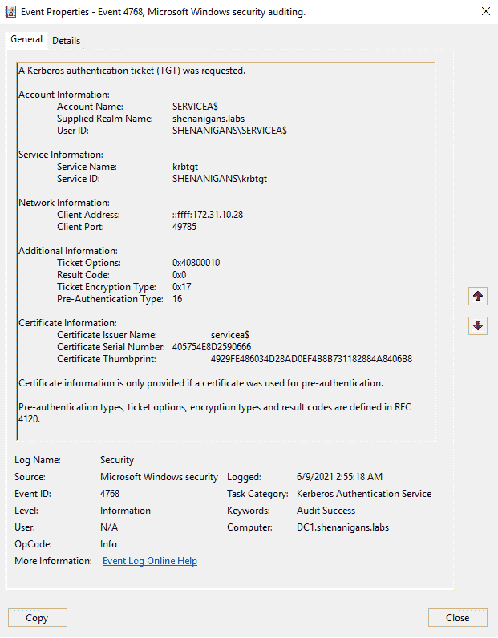

# Whisker:一个 C#工具，用于通过操纵 msDS-KeyCredentialLink 属性来接管 Active Directory 用户和计算机帐户

> 原文：<https://kalilinuxtutorials.com/whisker/>

**Whisker** 是一个 C#工具，用于通过操纵 Active Directory 用户和计算机帐户的 **`msDS-KeyCredentialLink`** 属性来接管它们，有效地将“影子凭证”添加到目标帐户中。

这个工具基于 Michael Grafnetter (@MGrafnetter)的 DSInternals 的代码。

要使此攻击成功，环境中必须有一个运行在 Windows Server 2016 上的域控制器，并且该域控制器必须有一个服务器身份验证证书，以允许 PKINIT Kerberos 身份验证。

更多细节可以在影子凭证:滥用关键信任帐户映射接管。

**影子凭证:滥用关键信任账户映射进行账户接管**

针对 Active Directory 中的用户和计算机对象的基于 DACL 的攻击技术已经存在多年。如果我们破坏了对用户帐户拥有授权的帐户，我们可以简单地重置他们的密码，或者，如果我们想减少干扰，我们可以设置一个 SPN 或禁用 Kerberos 预身份验证，并尝试烘烤该帐户。对于计算机帐户来说，这有点复杂，但 RBCD 可以完成这项工作。

这些技术有它们的缺点:

*   重置用户密码是破坏性的，可能会被报告，并且根据交战规则(ROE)可能是不允许的。
*   烘烤是耗时的，并且依赖于具有弱密码的目标，而事实可能并非如此。
*   RBCD 很难理解，因为有人(我)没能就此写一篇清晰简洁的帖子。
*   RBCD 要求控制具有 SPN 的帐户，并且创建新的计算机帐户来满足该要求可能会导致检测，并且在实现权限提升之前无法清除。

Will Schroeder (@harmj0y)和 Lee Christensen (@tifkin [_](https://twitter.com/tifkin_) )最近发表的关于 AD CS 的工作让我想到了在 Kerberos 中使用公钥加密进行初始身份验证(PKINIT)的其他技术，Windows Hello for Business 是显而易见的候选者，这让我(重新)发现了一种替代用户和计算机对象接管的技术。

**Tl；博士**

可以将“密钥凭证”添加到目标用户/计算机对象的属性 msDS-KeyCredentialLink 中，然后使用 PKINIT 作为该帐户执行 Kerberos 身份验证。

简单地说:这是一个针对用户和计算机的更容易和更可靠的接管原语。

一个操作这种技术的工具已经和这篇文章一起发布了。

**以前的工作**

当我查看 Key Trust 时，我发现 Michael Grafnetter (@MGrafnetter)已经发现了这种滥用技术，并在黑帽欧洲 2019 上进行了展示。他对这种用户和计算机对象接管技术的发现在某种程度上被忽视了，我相信这是因为这种技术只是他演讲主题的引子。Michael 在他的演讲中清楚地展示了这种滥用，并指出它会影响用户和计算机。在他的演讲中，Michael 解释了 WHfB 的一些内部工作原理和密钥信任模型，我强烈推荐观看。

Michael 还维护了一个名为 DSInternals 的库，它方便了对这种机制的滥用，等等。我最近将 Michael 的一些代码移植到了一个新的 C#工具上，这个工具叫做 Whisker，用于手术中的植入。更多信息请见下文。

什么是 PKINIT？

在 Kerberos 身份验证中，在 KDC(Active Directory 环境中的域控制器)向客户端提供票证授予票证(TGT)之前，客户端必须执行“预身份验证”，该票证随后可用于获取服务票证。预认证的原因是，如果没有预认证，任何人都可以获得用从客户端密码派生的密钥加密的 blob，并试图离线破解它，就像在 AS-REP 烘焙攻击中所做的那样。

客户端通过用它们的凭证加密时间戳来执行预认证，以向 KDC 证明它们具有该帐户的凭证。使用时间戳而不是静态值有助于防止重放攻击。

对称密钥(秘密密钥)方法是最广泛使用和已知的一种方法，它使用从客户端密码派生的对称密钥，也称为秘密密钥。如果使用 RC4 加密，这个密钥将是客户机密码的 NT 散列。KDC 拥有客户端密钥的副本，可以解密预认证数据来认证客户端。KDC 使用相同的密钥来加密与 TGT 一起发送给客户端的会话密钥。

PKINIT 是不太常见的非对称密钥(公钥)方法。客户端有一个公钥-私钥对，用它们的私钥加密预认证数据，KDC 用客户端的公钥解密。KDC 也有一个公钥-私钥对，允许使用以下两种方法之一来交换会话密钥:

*   Diffie-Hellman 密钥传送
    Diffie-Hellman 密钥传送允许 KDC 和客户端安全地建立共享会话密钥，该密钥不能被执行被动中间人攻击的攻击者截获，即使攻击者拥有客户端或 KDC 的私钥，(几乎)也能提供完美的前向保密性。我说 _ 几乎 _ 是因为会话密钥也存储在 TGT 的加密部分，它是用 KRBTGT 帐户的秘密密钥加密的。
*   **公钥加密密钥交付**
    公钥加密密钥交付使用 KDC 的私钥和客户端的公钥来封装由 KDC 生成的会话密钥。

传统上，公钥基础设施(PKI)允许 KDC 和客户端使用由一个实体签名的数字证书来交换它们的公钥，该实体是双方先前已经建立信任的实体，即证书颁发机构(CA)。这是证书信任模型，最常用于智能卡身份验证。

PKINIT 不可能在每个 Active Directory 环境中都开箱即用。关键(双关语)是 KDC 和客户端都需要一个公钥-私钥对。但是，如果环境有可用的 AD CS 和 CA，默认情况下，域控制器将自动获取证书。

**没有 PKI？没问题！**

微软还引入了密钥信任的概念，以在不支持证书信任的环境中支持无密码认证。在密钥信任模型下，PKINIT 身份验证是基于原始密钥数据而不是证书建立的。

客户端的公钥存储在 Windows Server 2016 中引入的名为 msDS-KeyCredentialLink 的多值属性中。该属性的值是密钥凭证，它们是序列化的对象，包含诸如创建日期、所有者的可分辨名称、代表设备 ID 的 GUID 以及公钥等信息。它是一个多值属性，因为一个帐户有几个链接的设备。

这种信任模式消除了使用无密码身份验证为每个人颁发客户端证书的需要。但是，域控制器仍然需要用于会话密钥交换的证书。

这意味着如果您可以写入用户的 msDS-KeyCredentialLink 属性，就可以获得该用户的 TGT。

**用于业务供应和认证的 Windows Hello】**

Windows Hello for Business (WHfB)支持多因素无密码身份验证。

当用户注册时，TPM 会为用户帐户生成一个公钥-私钥对，私钥永远不会离开 TPM。接下来，如果在组织中实现了证书信任模型，则客户端发出证书请求，以从环境的证书颁发机构获取可信证书，用于 TPM 生成的密钥对。但是，如果实现了密钥信任模型，公钥将存储在帐户的 msDS-KeyCredentialLink 属性中的新密钥凭据对象中。私钥受 PIN 码保护，Windows Hello 允许用生物认证因素(如指纹或面部识别)替换 PIN 码。

当客户端登录时，Windows 会尝试使用其私钥执行 PKINIT 身份验证。在密钥信任模式下，域控制器可以使用存储在客户端的 msDS-KeyCredentialLink 属性中的相应 NGC 对象中的原始公钥来解密其预身份验证数据。在证书信任模式下，域控制器将验证客户端证书的信任链，然后使用其中的公钥。预身份验证成功后，域控制器可以通过 Diffie-Hellman 密钥传递或公钥加密密钥传递来交换会话密钥。

注意，我在这里有意使用术语“客户机”而不是“用户”,因为这种机制适用于用户和计算机。

NTLM 怎么样？

PKINIT 允许 WHfB 用户，或者更传统的智能卡用户，执行 Kerberos 身份验证并获得 TGT。但是如果他们需要访问需要 NTLM 认证的资源呢？为了解决这个问题，客户端可以获得一个特殊的服务票，该服务票在加密的 NTLM 补充凭证实体中的特权属性证书(PAC)内包含它们的 NTLM 散列。

PAC 存储在票证的加密部分，并且票证使用为其发布的服务的密钥进行加密。在 TGT 的情况下，票证是使用 KRBTGT 帐户的密钥加密的，用户应该无法解密。要获得用户可以解密的票证，用户必须对自己执行 Kerberos 用户到用户(U2U)身份验证。当我第一次读到 RFC 关于这种机制的标题时，我心想，“这是否意味着我们可以滥用这种机制来 Kerberoast 认证任何用户帐户？那一定好得不像真的”。的确如此——Kerberos 认证的风险被考虑在内，U2U 服务票据使用目标用户的会话密钥而不是他们的秘密密钥进行加密。

这给 U2U 设计带来了另一个挑战——每次客户端进行身份验证并获得 TGT 时，都会生成一个新的会话密钥。此外，KDC 没有维护活动会话密钥的存储库—它从客户端的票证中提取会话密钥。那么，KDC 在响应 U2U·TGS 的请求时应该使用什么会话密钥呢？解决方案是发送一个 TGS 请求，其中包含目标用户的 TGT，作为“附加票证”。KDC 将从 TGT 的加密部分提取会话密钥(因此不是真正完美的前向保密)并生成新的服务票。

因此，如果一个用户从它自己请求一个 U2U 服务票，他们将能够解密它并访问 PAC 和 NTLM 散列。

这意味着，如果您可以写入用户的 msDS-KeyCredentialLink 属性，就可以检索该用户的 NT 哈希。

根据 MS-PAC，仅当执行了 PKINIT 认证时，NTLM 补充凭证实体才被添加到 PAC。

早在 2017 年，Benjamin Delpy (@gentilkiwi)向 Kekeo 引入了代码，以支持使用这种技术检索账户的 NTLM 哈希，它将在即将发布的版本中添加到 Rubeus。

**虐待**

当滥用密钥信任时，我们会有效地向帐户添加替代凭据，或“影子凭据”，从而允许获得用户/计算机的 TGT 和随后的 NTLM 哈希。即使用户/计算机更改了密码，这些影子凭据也会持续存在。

滥用计算机对象的密钥信任需要在获得帐户的 TGT 和 NTLM 散列之后的附加步骤。通常有两种选择:

*   伪造一张 RC4 银票来冒充相应主机的特权用户。
*   使用 TGT 调用 S4U2Self 将特权用户模拟到相应的主机。此选项要求修改获得的服务票，以便在服务名称中包含服务类别。

密钥信任滥用还有一个额外的好处，那就是它不会将访问权委托给另一个可能会受到威胁的帐户—它仅限于攻击者生成的私钥。此外，它不需要创建一个可能很难清理的计算机帐户，直到权限提升完成。

**须晶**

在这篇文章的同时，我发布了一个叫做“胡须”的工具。基于来自 Michael 的 DSInternals 的代码，Whisker 提供了一个 C#包装器，用于在约定上执行这种攻击。Whisker 使用 LDAP 更新目标对象，而 DSInternals 允许使用 LDAP 和 RPC 以及目录复制服务(DRS)远程协议更新对象。

触须有四个功能:

*   添加—此函数生成一个公钥-私钥对，并向目标对象添加一个新的密钥凭据，就像用户从新设备注册到 WHfB 一样。

list-此函数列出目标对象的 msDS-KeyCredentialLink 属性的所有条目。

Remove —此函数从 DeviceID GUID 指定的目标对象中删除密钥凭据。

Clear 此函数从目标对象的 msDS-KeyCredentialLink 属性中删除所有值。如果目标对象合法地使用 WHfB，它将中断。

**要求**

这项技术需要满足以下条件:

*   至少一个 Windows Server 2016 域控制器。
*   安装在域控制器上用于服务器身份验证的数字证书。
*   Active Directory 中的 Windows Server 2016 功能级别。
*   危及拥有对目标对象的 msDS-KeyCredentialLink 属性进行写入的委派权限的帐户。

**检测**

检测这种技术有两个主要机会:

*   如果 PKINIT 身份验证在环境中不常见，或者对于目标帐户不常见，则当证书信息属性不为空时,“请求了 Kerberos 身份验证票证(TGT)”事件(4768)可能表示异常行为，如下所示:

如果 SACL 配置为审核目标帐户的 Active Directory 对象修改，并且更改 msDS-KeyCredentialLink 的主体不是 Azure AD Connect 同步帐户或 ADFS 服务帐户，则“目录服务对象被修改”事件(5136)可能指示异常行为，Azure AD Connect 同步帐户或服务帐户通常将充当密钥设置服务器并合法地为用户修改此属性。

**预防**

通常，主动审计高特权帐户的所有入站对象控制是一种好的做法。正如权限低于域管理员的用户不应该能够重置域管理员组成员的密码一样，不太安全或不太“可信”，权限较低的用户不应该能够修改特权帐户的 msDS-KeyCredentialLink 属性。

更具体的预防控制是添加访问控制条目(ACE ),以拒绝主体 EVERYONE 修改任何不打算在密钥信任无密码身份验证中注册的帐户的属性 msDS-KeyCredentialLink，尤其是特权帐户。但是，具有 WriteOwner 或 WriteDACL 权限的攻击者将能够覆盖此控件，使用合适的 SACL 可以检测到这一点。

**用途**

**向目标对象的 msDS-KeyCredentialLink 属性添加新值**

**Whisker.exe add/target:computer name $/domain:const oso . local/DC:dc1 . contoso . local/path:C:\ path \ to \ file . pfx/password:P @ ss word 1**

**/目标:**必输。设置目标名称。计算机对象应该以“$”符号结尾。

**/域:**可选。设置目标完全限定域名(FQDN)。如果未提供，将尝试解析当前用户的 FQDN。

**/DC:<IP/主机名>** 可选。设置目标域控制器(DC)。如果未提供，将尝试以主域控制器(PDC)为目标。

**/路径:**可选。设置存储生成的用于身份验证的自签名证书的路径。如果没有提供，证书将被打印为 Base64 blob。

**/密码:**可选。为存储的自签名证书设置密码。如果未提供，将生成一个随机密码。

**从目标对象的 msDS-KeyCredentialLink 属性中删除一个值**

**Whisker.exe remove/target:computer name $/domain:const oso . local/DC:dc1 . contoso . local/remove:2de 4643 a-2e0b-438 f-a99d-5cb 058 b 3254 b**

**/目标:**必输。设置目标名称。计算机对象应该以“$”符号结尾。

**/设备 ID:** 必选。设置要从目标对象的属性 msDS-KeyCredentialLink 中移除的值的 DeviceID。必须是有效的 GUID。

**/域:**可选。设置目标完全限定域名(FQDN)。如果未提供，将尝试解析当前用户的 FQDN。

**/DC:<IP/主机名>** 可选。设置目标域控制器(DC)。如果未提供，将尝试以主域控制器(PDC)为目标。

**清除目标对象的 msDS-KeyCredentialLink 属性的所有值**

**Whisker.exe clear/target:computer name $/domain:const oso . local/DC:dc1 . contoso . local**

**/目标:**必输。设置目标名称。计算机对象应该以“$”符号结尾。

**/域:**可选。设置目标完全限定域名(FQDN)。如果未提供，将尝试解析当前用户的 FQDN。

**/DC:<IP/主机名>** 可选。设置目标域控制器(DC)。如果未提供，将尝试以主域控制器(PDC)为目标。

*警告:清除为无密码验证配置的帐户的 msDS-KeyCredentialLink 属性将导致中断。*

**列出目标对象的 msDS-KeyCredentialLink 属性的所有值**

**Whisker.exe 列表/目标:计算机名$/域:const oso . local/DC:dc1 . contoso . local**

**/目标:**必输。设置目标名称。计算机对象应该以“$”符号结尾。

**/域:**可选。设置目标完全限定域名(FQDN)。如果未提供，将尝试解析当前用户的 FQDN。

**/DC:<IP/主机名>** 可选。设置目标域控制器(DC)。如果未提供，将尝试以主域控制器(PDC)为目标。

[**Download**](https://github.com/eladshamir/Whisker#remove-a-value-from-the-msds-keycredentiallink-attribute-of-a-target-object)