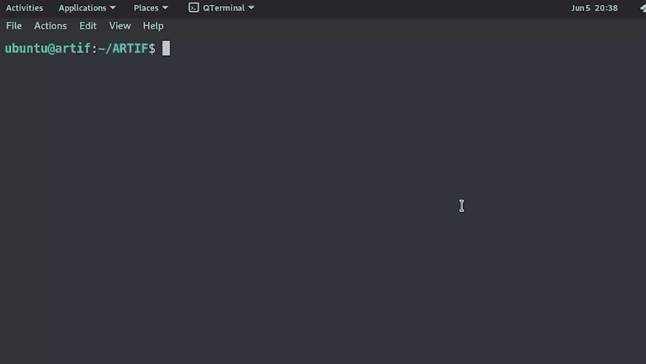
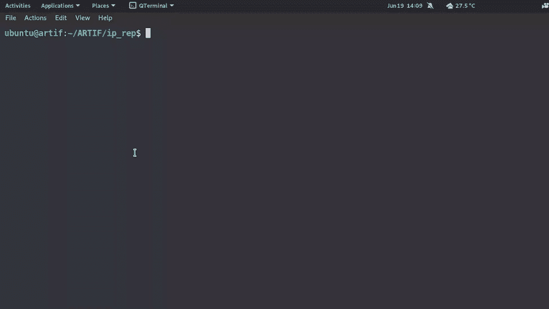
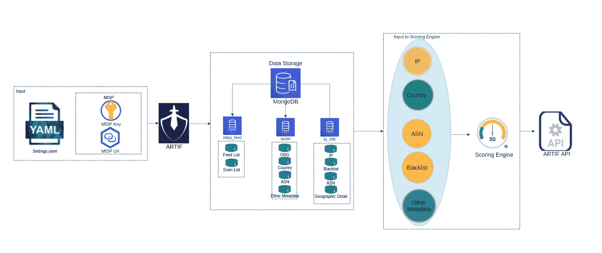

# ARTIF:一种先进的实时威胁情报框架，根据 IP 信誉和历史数据识别威胁和恶意 Web 流量。

> 原文：<https://kalilinuxtutorials.com/artif/>

**ARTIF** 是一个全新的高级实时威胁情报框架，它在 MISP 之上添加了另一个抽象层，以根据 IP 信誉和历史数据识别威胁和恶意 web 流量。它还通过基于不同因素收集、处理和关联可观察到的情况，执行自动浓缩和威胁评分。

ARTIF 的主要特点包括:-

*   评分系统:用威胁元数据丰富 IP 地址，包括可作为安全团队采取行动的阈值的威胁分数。
*   容器化:ARTIF 使用容器进行部署，因此易于部署。
*   模块化架构:该项目是基于插件的，可以通过修改 MISP 的威胁源轻松扩展。实际服务不会停机，因为这些是在线更新。
*   警报:扩展功能，提供与 slack 的无缝集成，用于主动警报。它还提供了更好的攻击分析和可视化。

一些使用案例:-

*   威胁检测
*   记录和监控
*   用户特征分析
*   警报自动化

为什么使用 ARTIF？实时威胁英特尔框架可以帮助识别恶意 IP，即使它们不在 MISP 中。这有助于组织通过提供到达其服务器的恶意 web 流量的透明度来建立第一层防御。

*   默认情况下，52 个已配置的开源威胁源拥有一个包含 70 万 IP 地址的数据库。
*   延迟约为 180 毫秒，比商业产品快 10 倍以上。
*   存储历史 IP 以供分析，并在基于过去记录和模式的评分中使用。
*   除了其他元数据之外，为每个 IP 添加分数。

**先决条件**

*   什么是 MISP，如何安装？

摘自 MISP : *MISP 是一个开源软件解决方案，用于收集、存储、分发和共享有关网络安全事件分析和恶意软件分析的网络安全指标和威胁。MISP 由事件分析师、安全和 ICT 专业人员或恶意软件逆转者设计，旨在支持他们的日常运营，高效共享结构化信息。*

可以使用源代码或其预建的 AWS 映像来安装 MISP。更多关于 MISP 安装的信息可以在他们的网站上找到。

*   我们需要订阅 maxmind，以便为 IP 填充元数据。要添加子键，请编辑 docker-compose.yaml

**maxmind:
image:maxmind Inc/geoi update
环境:
geoi update _ ACCOUNT _ ID:xxxxx
geoi update _ LICENSE _ KEY:xxxxxxxxxxxxxxxxx**

**安装**

*   使用 git 克隆存储库或下载 zip 文件

**git 克隆 https://github . com/cred-club/artif/**

*   通过将工作目录更改为 ARTIF 文件夹并启动 docker 容器来构建 docker。

**sudo docker-复合构建
sudo docker-复合构建**

3.  设置 MISP 和访问 MISP 仪表板，并获得 MISP 密钥。现在编辑 config.yaml 并添加 MISP 关键字和 MISP URL 值。在这里，MISP 密钥将是你在 MISP 的 API 密钥，而 MISP URL 将是 MISP 所在的 URL。

下面是一个 config example.yaml 供你参考。只需用您的值替换相应的值。

**凭证:
MISP _ URL:" https://127 . 0 . 0 . 1 "
MISP _ KEY:" qwertyuiopasdfghjk "**

*   现在运行下面的命令，使用-s 参数指定 update_check.py 文件的完整绝对路径

**python 3/home/user/ARTIF/IP _ rep/feed _ in gestor/update _ check . py-s**

*   现在运行不带-s 参数的相同命令。

**python 3/home/user/ARTIF/IP _ rep/feed _ in gestor/update _ check . py**

*   通过运行下面的命令，使用 Django 的内置支持添加 crontab

**python3 manage.py crontab 添加**

*   从 ip_rep 目录启动 Django 服务器。

**python 3 manage . py runserver**

这将打开端口 8000，该端口可用于获取 IP 地址的元数据。您现在可以尝试获取任何特定 IP 的威胁分值。

**卷发 127.0.0.1:8000/ip/？ip=x.x.x.x**

输出是

{"is_IoC": false，" is_Active": false，" metadata": {"asn": "AS165** "，" country": "XXX "，" org": "XXX"}，" score": 80.14671726301682，" description": "XXX "，" blacklists ":"，" type ":"，" historical":false，decision ":"无需操作" }

该分数代表 IP 的风险较低，因为威胁分数较高。分数越高，非恶意 IP 就越少。

**注意:**对于 ARTIF 安装，建议使用 8GB RAM 的实例。

设置 docker 容器

启动 ARTIF

**添加自定义订阅源**

ARTIF 支持与 MISP 同步。它同步 MISP 源，从 settings.yaml 中选择最近的配置，所有从 MISP 修改的新事件都反映在 settings.yaml 中。要添加新的 IP，只需登录到 MISP 并点击添加源页面。一旦添加了 IP，cronjob 将根据它的时间表选择它，并自动进行处理。

**技术细节**

ARTIF 是一个威胁框架，对于组织内部流量的可见性非常有用。它完全是用 python 编写的，从各种提要中收集 IP 上的情报。然后，它将此数据发送到关联引擎，关联引擎会生成威胁分值，其中历史数据也是计算威胁分值时考虑的因素之一。

每当一个新的 IP 访问该服务时，celery worker 就会被分配一个任务，通过与关联引擎协调来更新其在数据库中的分数，关联引擎又会从多个来源收集数据。为了确保数据不是过时的(默认的“过时时间”值是 24 小时)，我们为数据库中在过去的“过时时间”内没有更新的每个 IP 运行一个 worker。与所有其他参数一样，该值也是可配置的。由于威胁分值计算是所有这一切的关键，所以我们非常重视它。除了众所周知的威胁源(如 MISP、Cortex、Alien Vault、VirusTotal 和流行的 IPs 黑名单)之外，我们还可以根据业务和安全使用案例添加自定义源，其中客户忠诚度也可以用作威胁分值计算的参数。

为了便于配置，ARTIF 需要以下输入来自行运行:

*   MISP 实例中的提要
*   用于与 MISP 实例通信的 MISP 键
*   使用 MISP 键连接到 MISP 实例的 MISP URL

在运行时，数据被处理并存储在 MongoDB 容器中。MongoDB 容器包含 3 个重要的数据库，用于存储 feed 中的 IP 信息及其元数据，如 country/ASN、Org 等。如果在数据库中找不到该 IP，这意味着它是一个到达服务器的新 IP，其信息不在 MISP。然后，我们使用算法和各种其他参数(如地理位置、ASN 和 Org)来计算特定 IP 的风险分值。关于评分引擎的更多信息可以在这里找到。

ARTIF 具有跟踪旧提要的附加功能。默认配置每 24 小时补充一次最新的提要。24 小时后，旧的饲料被转移到另一个集合，并添加最新的饲料。为了便于操作，我们在输出中添加了一个名为“historical”的字段，它告诉我们该 IP 在历史上是否是坏的。假值表示 IP 最近被添加到馈送中，而真值表示 IP 已经存在于较旧的馈送中，因此它是历史上恶意的 IP。

默认情况下，所有历史 IP 将在 7 天后从数据库中删除。

**用法/示例**

您需要使用 update_check.py 来调用 ARTIF，它是 ARTIF 的主干。

Ubuntu @ localhost:~/ARTIF/IP _ rep/feed _ ingestor $ python 3/home/user/ARTIF/IP _ rep/feed _ ingestor/update _ check . py-h
用法:update _ check . py[-h][-S[S]]-k[KEY]-m MISP
IP 信誉程序
可选参数:
-h，–help 显示此帮助消息并退出
-s [S]仅在首次运行时需要

您还可以通过运行以下命令来查看 cron 作业

**python 3 manage . py crontab show**

这将自动更新订阅源。默认情况下，每隔 24 小时，它会检查 MISP 的最新饲料，并补充与饲料新的 IP 数据库。调度程序还会删除超过 7 天的 IP。

[**Download**](https://github.com/CRED-CLUB/ARTIF#adding-custom-feeds)