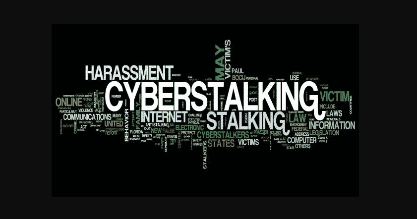

# 网络跟踪者:如何保护自己

> 原文：<https://kalilinuxtutorials.com/cyberstalkers-how-to-protect-yourself/>

现代通信技术是影响人类的最先进和最有影响力的发明之一。

然而，它*确实*有阴暗面。

即使我们很小心，互联网的开放性也可能导致你成为网络跟踪的受害者。

本罪是指利用互联网或其他电子方式恐吓、恐吓或骚扰一个团体或个人。网络跟踪案件之间的共同要素包括监控某人的物理位置、在线活动、公开发布虚假指控或身份盗窃。

网络跟踪者可能使用即时消息、电子邮件或电话来跟踪他们的目标受害者。值得庆幸的是，像[芥末 IT](https://www.mustardit.co.uk/) 这样的公司提供的专业 IT 咨询服务可以帮助你远离这种威胁，让你自己和你的企业免受伤害。

以下是保护自己不成为受害者的方法。

## **不要分享个人信息**

网络平台有各种用途。例如，你可以用它们来宣传你的品牌或你自己。在这样做的时候，你可能会(有意或无意地)泄露你的行踪——只需要一张有可识别元素的照片，以及一个有时间的恶意的人。

虽然减少你在网上的出现可能不是一个选择，但你可以通过小心泄露个人信息来最小化网络跟踪的风险。

您希望避免在此类平台上分享您的联系人、位置或地址。对这些细节的疏忽会导致言语骚扰，在更严重的情况下，会导致敲诈或巨大的个人风险。

你可能想避免在社交媒体平台上分享你的真实姓名，尤其是在信息仪表盘和论坛上。坚持使用公司或匿名角色，只在安全的网络上与可信用户讨论个人细节。

## 经常更改密码

不要低估不同密码的影响。跟踪者有各种方法试图侵入受害者的账户，密码通常是你的第一道防线。这就是为什么他们必须*强壮*和*鲜明*的原因。

生成密码时，避免使用生日或出生地等个人信息。专家进一步建议经常更换密码。你可以每月或每三个月做一次。

建议您 1)设置密码更改提醒，2)使用易于记忆且不太可能被他人猜到的短语来生成密码。

此外，考虑您的密码长度——仅增加几个字符的长度就可能导致恶意用户更难生成的[密码。](https://www.scientificamerican.com/article/the-mathematics-of-hacking-passwords/)

例如，一个标准的 12 个字符的密码比一个 6 个字符的密码要多花 72 万亿倍的计算时间来猜测。如果黑客的计算机用 1 秒钟就能猜出每一个可能的 6 个字符的组合，那么 12 个字符的组合将需要惊人的 200 万年才能猜出来！

为了获得额外的保护，利用你的社交媒体、电子邮件提供商或银行的双因素认证(2FA)。在这种情况下，如果有人知道你的密码，他们需要输入 PIN，你会收到一个关于试图访问你的帐户的警告。

最后，不要把密码写在纸上，也不要和陌生人分享。

## **隐藏你的 IP 地址**

许多服务和应用程序会将您的 IP 地址透露给正在与之通信的人。虽然这可能看起来微不足道，但这些信息与你的数据有直接关系，并且是一个老练的网络跟踪者的首要目标。

例如，您的 IP 与您在家收到的互联网账单和您的信用卡交易相关联。这意味着网络跟踪者可以使用你的 IP 地址来定位你的物理地址和信用卡信息——没有你的同意，你不想让任何人知道。

幸运的是，您可以使用虚拟专用网络(VPN)来隐藏您的 IP 地址。该服务的工作，以掩盖你的实际 IP 地址，并取代它与您的首选位置。这样，你就像在一个不同的国家，网络窃听器无法确定你正在传输或接收的任何数据。

## **更新软件**

当谈到网络跟踪防范时，保持软件更新可能不是首先想到的事情。然而，当谈到防止信息泄露时，你可能会惊讶地知道[定期更新](https://www.tripwire.com/state-of-security/security-awareness/what-cyberstalking-prevent/)是至关重要的。新形式的间谍软件每周都会出现，而第一道防线往往是我们内置的安全软件。

网络安全团队孜孜不倦地修补安全漏洞，帮助确保您的数据安全。它们对移动设备尤其重要——被入侵的手机可以让网络跟踪者窥探你的私人谈话，访问你的数据，甚至确定你的 GPS 位置。

幸运的是，自动更新计划使这一过程变得轻而易举——只要确保启用它们。

## 定期在网上搜索你的名字

您可能不会发布关于您自己的信息，但是您无法阻止朋友发布您的照片和其他关于您的信息。

通过定期进行互联网搜索来保护您的身份和姓名。这样做将有助于你防止跟踪者通过网页或博客传播关于你的虚假信息——如果你的个人项目或工作有公众形象，这将非常有帮助。

防止这种情况的发生只需要你采取一点主动，但是逆转由恶意网络跟踪者造成的公关灾难可能要困难得多。

在网上偶然发现关于自己的虚假信息时，您可以联系服务器或网站管理员，要求删除内容，并可能识别出滥用您身份的人。