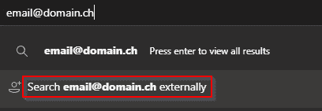
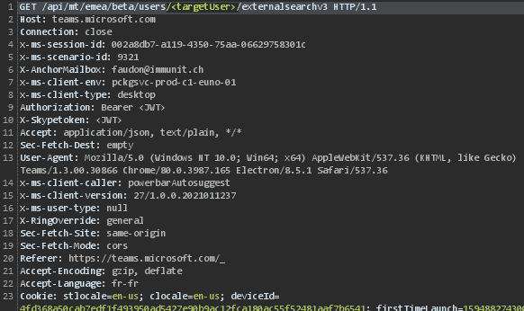
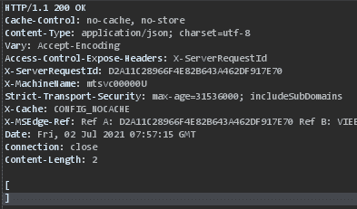
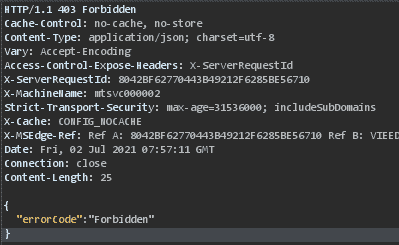
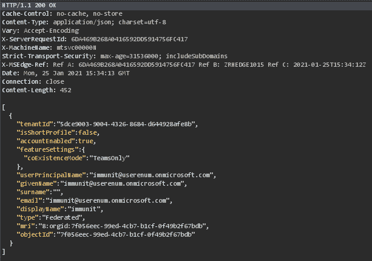
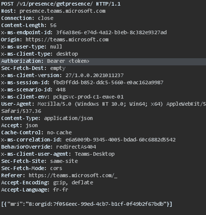
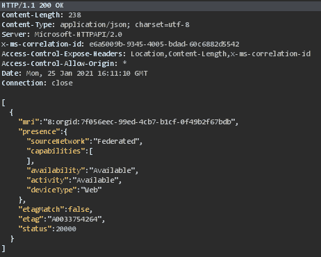
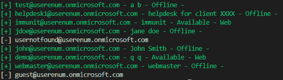
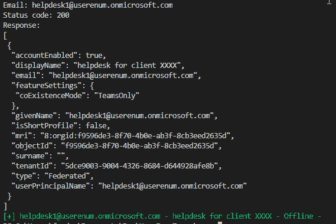

# TeamsUserEnum:使用 Microsoft Teams API 的用户枚举

> 原文：<https://kalilinuxtutorials.com/teamsuserenum/>

**TeamsUserEnum** ，有时用户枚举在评估的侦察过程中有时会很有用。该工具将确定一个电子邮件是否在团队中注册。更多细节请访问 immunIT 的博客。

**微软团队用户枚举**

疫情增加了协作工具的使用。微软团队也不例外:2020 年 3 月至 10 月，日活跃用户数量增长了 4 倍，达到 1.15 亿用户。当然，任何技术使用的增加都会带来安全隐患。在本帖中，我们将展示微软团队可能容易受到用户枚举的攻击，这取决于配置。

**什么是用户枚举？**

用户枚举是一个安全弱点，使得攻击者能够确定特定的用户名是否有效。最常见的用户枚举形式体现在身份验证或用户管理过程中。如果服务器在用户有效时和无效时返回不同的响应，恶意参与者可以使用暴力在系统中建立有效用户的列表。

在撰写本文时，一些 Microsoft 产品和服务容易受到用户枚举的攻击。读者将在下面找到一些允许在这些平台上枚举用户的现有工具:

*   Outlook Web Access: msmailprobe
*   Exchange: msmailprobe
*   Onedrive: onedrive_user_enum
*   Skype / Lync: lyncsmash
*   O365:食肉动物和 Go365

上述产品的漏洞在互联网上有详细介绍，我们将集中讨论微软团队。

为什么它很重要？

由于这些产品通常暴露在互联网上，并使用内部活动目录进行身份验证，因此攻击者可以将它们作为目标来枚举内部用户。当然，这需要一份潜在用户的名单，但在大多数情况下，使用 LinkedIn 或 documents 元数据(PDF、word 文档等)这样的社交网络将提供足够的材料。获取用户列表是入侵测试或真正攻击的侦察阶段的重要组成部分。这允许针对特定用户的更高级的攻击。例如，攻击者可以:

*   尝试使用普通密码进行智能暴力；
*   如果配置了锁定策略，攻击者可以通过在多个帐户上提交错误的密码来拒绝服务；
*   针对特定用户开展网络钓鱼活动。

一旦找到有效的凭据，恶意用户就可以访问敏感信息。没有用户枚举，这些攻击要困难得多，因为攻击者必须猜测用户名和密码。

团队呢？

至于上面讨论的产品，在微软的在线协作软件 Microsoft Teams 上也可以进行用户枚举。团队公开了一个允许寻找外部用户的功能。它可以被滥用来列举组织的内部用户。

了解团队发出的请求将有助于我们理解返回了什么信息，并使请求自动化。由于 Teams 使用系统代理，我们只需将 Burp 设置为代理，以便检查对 Microsoft API 的所有请求。当搜索外部用户时，图 2 所示的请求被发送到 Teams API。

我们注意到三种不同的行为:

*   用户不存在(即使在“外部访问”被禁用的情况下)或用户没有 office 365 许可证启用:响应为空，状态代码为 200

*   如果设置“外部访问”(参见补救部分)被禁用(非默认)并且用户存在:响应为空，状态代码为 403

*   用户存在:响应包含 json 数据

在用户存在的情况下，显示名称字段可以带来关于目标的更多信息。例如，如果用户 John Doe 的电子邮件地址是 jdoe@acme.com，则显示名称可以显示名字。

启用“外部访问”设置(详见补救部分)后，我们可以使用先前请求中的用户 ID (mri)检索(图 2 和图 3)来了解目标用户的状态以及用于连接的设备(移动、桌面、web)。在拟定网络钓鱼/红队场景时，这些信息非常有用。例如，可以呼叫目标公司的帮助台服务，要求不在办公室的员工重置密码。

下面是对 Teams API 的请求，用于获取用户使用的设备的状态。

下面的响应显示用户是通过 web 界面连接的。

总而言之，这些 API 端点允许检查电子邮件地址是否存在于组中，并获得显示名称，根据配置，您还可以获得存在和用于连接的设备类型。

**补救**

防止这种情况的最佳方法是在 Microsoft Teams 管理中心配置外部访问。

如上所述，默认情况下允许两个选项。这两个选项允许不同组织的用户通过搜索功能找到彼此，并与团队或 Skype 进行交流。

如果您没有用例联系或被组织外的人联系，您应该禁用以上两个选项。否则，您应该禁用这些选项，并将您与之通信的域列入白名单。

**工具**

immunIT 开发了一个工具(https://github.com/immunIT/TeamsUserEnum ),可以从列表中快速列举有效用户。

**用途**

**1 用法:
2 UserEnumTeams userenum[Flags]
3
4 Flags:
5-e，–电子邮件字符串电子邮件地址
6 -h，–userenum 的帮助帮助
7 -t，–令牌字符串不记名令牌(cookie authtoken)
8 -u，–包含电子邮件地址的用户字符串文件
9
10 全局标志:
11 -v，–详细冗长**

可以在域 https://teams.microsoft.com/.的 cookie *authtoken* 中检索令牌

**例题**

枚举列表 emails.txt 以获取有效列表。

**1
。\ UserEnumTeams userenum-u emails . txt-t " eyj 0 exaioijkv 1 qilcjub 25 jzsi 6 ilpnc 3 fvtnjdeujaytbjz 3 rxsmfsnuzwvjru……vkixytcir 3 gj 9 rmpahpxiszsmopisam 7 sdocg "**

获取一封电子邮件的团队 API 的 json 响应。

**。\ userenumteam userenum-u help desk 1 @ userenum . onicrosoft . com-t " eyj 0 exioijkv 1 qilcjub 25 jzsi 6 ilpnc 3 fvtnjdeuytbjz 3 rxsmfsnzwvjru……vkixytcir 3 g9 rmpaxizsmeopisam 7 sdocg "-v**

[**Download**](https://github.com/immunIT/TeamsUserEnum)