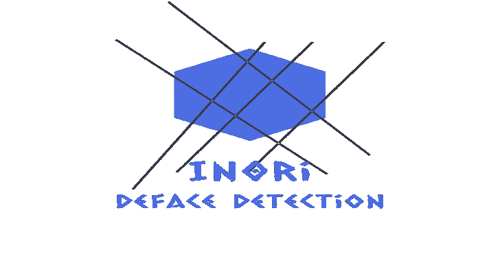

# In0ri:深度学习的污损检测

> 原文：<https://kalilinuxtutorials.com/in0ri/>

In0ri 是一个利用图像分类卷积神经网络的污损检测系统。

**简介**

当监控一个网站时，In0ri 将定期对该网站进行截图，然后将其通过一个预处理器，该预处理器会将图像尺寸缩小到 250x250px，并在将其传递到分类器之前对图像进行数值化。分类器的核心是一个卷积神经网络，它被训练来检测网站的污损。如果被监控的网站确实遭到破坏，In0ri 将通过电子邮件向用户发出警告。

**要求**

*   Python3(版本> =3.6)
*   码头工人
*   坞站-合成

**安装**

**克隆存储库**

**git 克隆 https://github.com/J4FSec/In0ri.git
CD in 0ri**

**配置电子邮件凭据以从**发送通知和代理密钥

编辑文件`**FlaskApp/sendEmail.py**`

**EMAIL _ ADDRESS = " foo @ Gmail . com "
EMAIL _ PASSWORD = " $ uper $ ECU repa $ $ word "**

**配置电报通知**

编辑文件`**chatbot.py**`

**CHAT_ID= 'foo' #频道 ID 发送通知到
TOKEN = 'bar' # Bot token 从@BotFather** 检索

**从 0ri 开始**

**坞站-合成 up -d**

**用途**

In0ri 有两种部署和使用方式:

*   通过定期访问 url 来运行 crontab。
*   在 web 服务器上运行的内部代理

**第一种方法:URL 检查**

访问`**https://<serverIP>:8080/**`上的 WebUI，点击“注册”,然后填写表格并提交。

**第二种方法:内部代理**

访问`**https://<serverIP>:8080/**`上的 WebUI，点击“注册”,然后填写表格并提交。

点击“创建代理”，然后填写表格并检查您的电子邮件中代理的**键**。

在您希望被 In0ri 监控的 web 服务器上，从 Github 资源库下载代理文件夹

安装内部代理所需的软件包

**python3 -m pip 安装看门狗
python3 -m pip 安装请求**

编辑代理所在文件夹中的文件`**config.json**`

**纳米配置. json**

在 WebUI 上注册代理后，会向您的电子邮件发送一个`**key**``**rootPath**`是您想要监控的 web 应用程序的根目录`**exludePath**`是您想要从扫描中排除的子文件夹`**apiServer**`是 In0ri 的 API 服务器的 URL`**serverIP**`是 In0ri 的 API 服务器的 IP。

**{
" id ":" 01 ",
" key ":" 123123123 ",
" root path ":"/var/www/html "，
"excludePath ":"，
" API server ":" http://:8088/check defage "
}**

并运行代理:

**python3 agent.py**

[**Download**](https://github.com/J4FSec/In0ri)