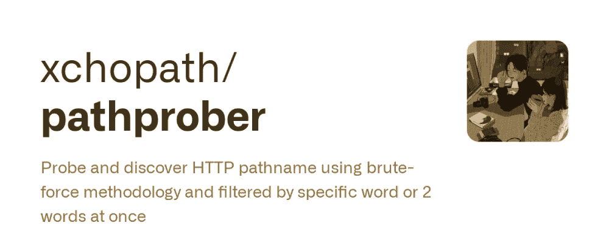
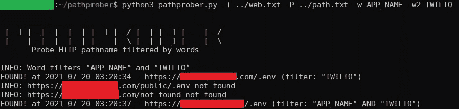

# Pathprober:使用强力方法探测和发现 HTTP 路径名，并通过特定的单词或两个单词进行过滤

> 原文：<https://kalilinuxtutorials.com/pathprober/>

**Pathprober** 是一个探测器，它使用强力方法发现 HTTP 路径名，并立即通过特定单词或两个单词进行过滤。

强制网站目录或 HTTP 路径名并使用 HTTP 响应代码进行验证不再适用。这个工具将帮助您执行渗透测试，因为它可以验证目录使用特定的字或两个字一次，结果将更加准确。

它将帮助你找到:

*   网站管理员/登录面板
*   某些路径中的凭据
*   第三方令牌
*   等等

**安装**

**git 克隆 https://github.com/xchopath/pathprober
CD 路径探测器/**

**要求**

**pip 3 install-r requirements . txt**

**支持**

*   多个 URL 目标(在由换行符分隔的文件中)或单个 URL 目标
*   多路径(在文件中用换行符分隔)或单路径
*   1 个单词或 2 个单词(过滤器)
*   将有效结果保存到另一个文件
*   多线程

**样品用途**

多目标、多路径和多个单词:

**python 3 path prober . py-T target . txt-P path . txt-w " APP _ NAME "-w2 " DB _ PASSWORD "**

单个目标、多条路径和单个单词:

**python 3 path prober . py-t https://redacted.com/-P path . txt-w " APP _ NAME "**

多目标、单路径、多单词，并将输出保存到文件:

**python 3 path prober . py-T target . txt-p/。env-w " APP _ NAME "-w2 " TWILIO "-o output . txt**

**需要更多帮助？**

**bash:~/path prober $ python 3 path prober . py–help
_*_*_ _*_
|]| | | | | |]|/| | | |]|*/| | | | | | | | \ | | \
Probe HTTP pathname filtered by words
用法:path prober . py[-h][-T https://example.com][-P pathname][-T target . txt][-P path . txt][-w Word][-w2 Word][-o output . txt]
path prober–使用蛮力方法探测并发现 HTTP pathname，并一次性按特定单词或 2 个单词进行过滤
可选参数:
-h， –help 显示此帮助信息并退出
-T https://example.com
单个网站目标
-p 路径名单个路径名
-T target.txt 多目标用换行符分隔
-P 路径. txt 多路径名用换行符分隔
-w 单词一个你想在路径中查找的单词
-w2 单词一个你想在路径中查找的第二个单词
-o 输出. txt 将结果保存到文件**

[**Download**](https://github.com/xchopath/pathprober)