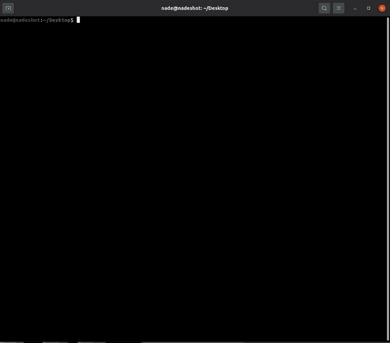

# Ppmap:一个用 GO 编写的扫描/开发工具，通过利用已知的小工具来利用原型污染 XSS

> 原文：<https://kalilinuxtutorials.com/ppmap/>

**Ppmap** 是一个用 GO 编写的简单扫描器/开发工具，它自动利用已知和现有的小工具(检查全局上下文中的特定变量)通过原型污染执行 XSS。注意:该程序仅利用已知的小工具，但不包括代码分析或任何高级原型污染利用，其中可能包括自定义小工具。

**要求**

确保安装了铬/铬合金:

**sudo sh-c ' echo " deb http://dl.google.com/linux/chrome/deb/ stable main ">>/etc/apt/sources . list . d/Google . list '
wget-q-O–https://dl-ssl.google.com/linux/linux_signing_key.pub | sudo apt-key add-
sudo apt-get 更新
sudo apt-get 安装 google-chrome-stable**

确保安装了 chromedp:

**去 github.com/chromedp/chromedp 吧**

**安装**

*   自动地
    *   在这里下载已经编译好的二进制文件
    *   给它执行`**chmod +x ppmap**`的权限
*   手动(自己编译)
    *   克隆项目:
        `**git clone https://github.com/kleiton0x00/ppmap.git**`
    *   将目录更改为 ppmap 文件夹:
        `**cd ~/ppmap**`
    *   构建二进制
        `**go build ppmap.go**`

**用法**

使用该程序非常简单，您可以:

*   扫描目录/文件(甚至只是网站):`**echo 'https://target.com/index.html' | ./ppmap**`
*   或者端点:`**echo 'http://target.com/something/?page=home' | ./ppmap**`

对于批量扫描:
`**cat url.txt | ./ppmap**`其中 **url.txt** 包含列中的所有 url。

**演示**

作为演示的一部分，您可以在以下网站上随意测试该工具:
https://msrkp.github.io/pp/2.html
https://ctf.nikitastupin.com/pp/known.html

[**Download**](https://github.com/kleiton0x00/ppmap)