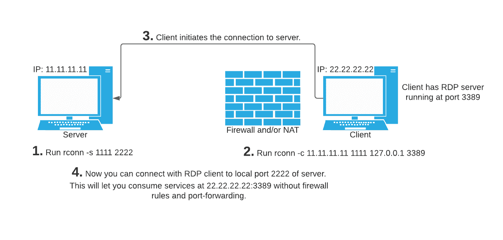

# Rconn : Rconn 是一个用于创建通用反向连接的多平台程序

> 原文：<https://kalilinuxtutorials.com/rconn/>

Rconn(r[everse]conn[connect])是一个用于创建反向连接的多平台程序。它允许您使用 NAT 和/或防火墙后面的服务，而无需添加防火墙规则或端口转发。这是通过创建从防火墙/NAT 后的节点到本地机器上的端口的连接来实现的，然后在您的机器上暴露一个端口，通过该端口您可以连接到防火墙/NAT 后的服务。所有流量都通过防火墙/NAT 后的机器打开的初始连接进行路由。

**大楼**

构建用: **`go build`。**

**解释**

假设你的 IP 地址是 11.11.11.11，你在防火墙/NAT 后有一台 22.22.22.22 机器，你想通过 RDP 连接到它。首先，你必须确保你的 RDP 服务器正在运行，通常是在 3389 上。现在的问题是你不能从外面连接到 3389，因为 NAT 或防火墙。然后，在您的本地机器上，您必须运行这个: **`rconn -s 1111 2222`** ，在防火墙/NAT 后的机器上，您必须运行这个: **`rconn -c 11.11.11.11 1111 127.0.0.1 3389`** 现在，您可以使用 RDP 客户端连接到您自己的端口 2222，这实际上与连接到 22.22.22.22:3389 是一样的。

通常大多数防火墙允许所有出站流量，但如果不是这样，那么你可以尝试 80 或 443，而不是 1111。

[**Download**](https://github.com/jafarlihi/rconn)