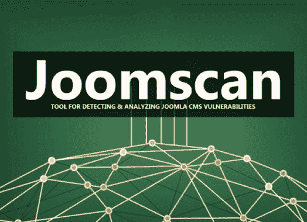

# 设计用来识别和扫描 CMS Joomla 中的版本、配置文件的工具！

> 原文：<https://kalilinuxtutorials.com/juumla/>

Juumla 是一个 python 工具，用来识别当前的 Joomla 版本并扫描可读的 Joomla 配置文件。

**安装/开始使用**

如何安装和使用 Juumla 的快速指南。

*   **克隆存储库–git 克隆 https://github.com/oppsec/juumla.git**
*   **安装库–pip 3 Install-r requirements . txt**
*   **运行 Juumla–python 3 main . py-u https://example.com**

**码头工人**

如果您想在 Docker 容器中运行 Juumla，请遵循以下命令:

*   **克隆存储库–git 克隆 https://github.com/oppsec/juumla.git**
*   建立形象——sudo docker Build-t juumla:最新。
*   **运行容器–sudo docker 运行 juumla:最新**

**先决条件**

*   python3
*   用`**pip3 install -r requirements.txt**`安装库

**特性**

*   快速扫描
*   RAM 和 CPU 使用率低
*   识别 Joomla 版本
*   配置文件检测
*   开源

[**Download**](https://github.com/oppsec/juumla)