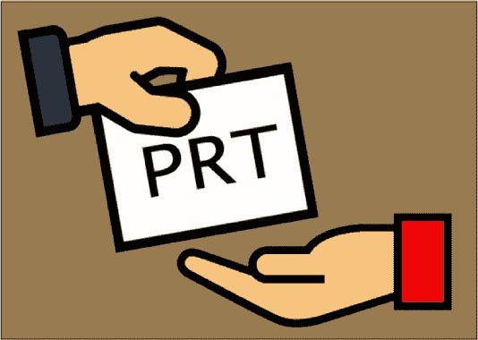

# 令牌策略:Azure JWT 令牌操作工具集

> 原文：<https://kalilinuxtutorials.com/tokentactics/>

**TokenTactics** 是一个 Azure JSON Web Token(“JWT”)操作工具集。

Azure 访问令牌允许您作为使用设备代码登录的用户向某些端点进行身份验证。即使他们使用多因素身份认证。一旦您拥有用户的访问令牌，就有可能访问某些应用程序，如 Outlook、SharePoint、OneDrive、MSTeams 等。

例如，如果您有一个 Graph 或 MSGraph 令牌，那么您可以连接到 Azure 并转储用户、组等。然后，根据条件访问策略，您可以切换到 Azure 核心管理令牌并运行 AzureHound。然后，切换到 Outlook 令牌，阅读/发送电子邮件或 MS 团队，阅读/发送团队消息！

有关 Azure 令牌类型的更多信息，请参见 Microsoft 身份平台访问令牌

resources 文件夹中有一些对端点的请求示例。还有一个针对设备代码网络钓鱼的示例网络钓鱼模板。

您也可以在 AAD 内部使用这些令牌。我们强烈建议去看看这个神奇的工具。

**安装和使用**

`**Import-Module .\TokenTactics.psd1**`

`**Get-Help Get-Azure-Token**`

`**RefreshTo-SubstrateToken**`

**生成设备代码**

用户登录后，您将看到 JWT，它将保存在 response 变量中。要访问访问令牌，请在 PowerShell 窗口中使用`**$response.access_token**`来显示令牌。你也可以用 **`$response.refresh_token`显示刷新令牌。**提示:你会希望刷新令牌不断刷新到新的令牌！

**DOD/Mil 设备代码**

`**Get-AzureToken -Client DODMSGraph**`

**刷新或切换令牌**

`**RefreshTo-OutlookToken -domain myclient.org -refreshToken ey..**`

`**$OutlookToken.access_token**`

**连接**

`**Connect-AzureAD -AadAccessToken $response.access_token -AccountId user@myclient.org**`

**清除令牌**

`**Clear-Token -Token All**`

**命令**

**Get-Command-Module Token tactics
CommandType Name Version Source
——————————————
函数 Clear-Token 0 . 0 . 1 Token tactics
函数 Dump-OWAMailboxViaMSGraphApi 0 . 0 . 1 Token tactics
函数 Forge-user agent 0 . 0 . 1 Token tactics
函数 Get-AzureToken 0 . 0 . 1 Token tactics
函数 Get-TenantID 0 . 0 . 1 Token tactics
函数 Open-owamailboxinbrowin refresh to-MSManageToken 0 . 0 . 1 token tactics
函数 refresh to-MSTeamsToken 0 . 0 . 1 token tactics
函数 refresh to-o365 suite UX token 0 . 0 . 1 token tactics
函数 refresh to-office appstoken 0 . 0 . 1 token tactics
函数 refresh to-office management token 0 . 0 . 1 token tactics
函数 refresh to-outlook token 0 . 0 . 1 token tactics
函数 refresh to-substrator**

[**Download**](https://github.com/rvrsh3ll/TokenTactics)