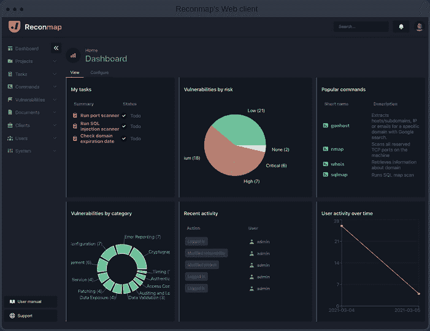
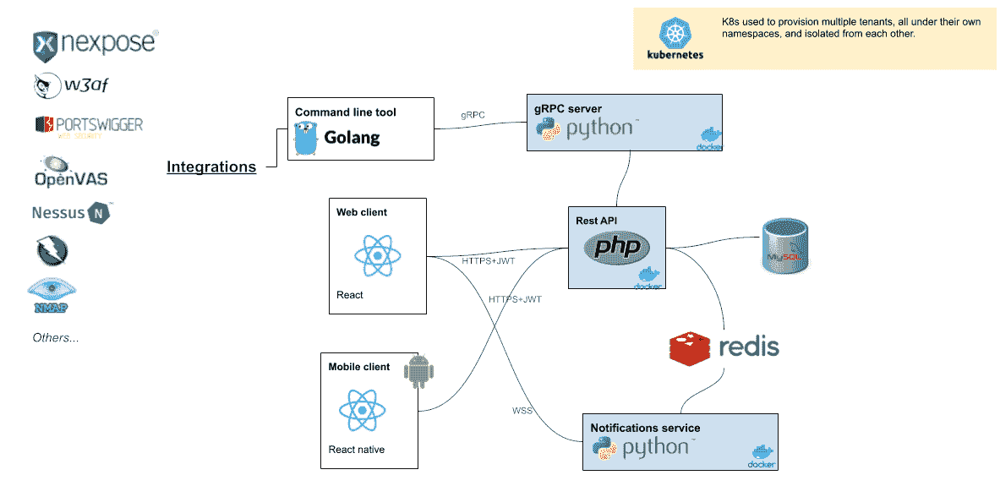
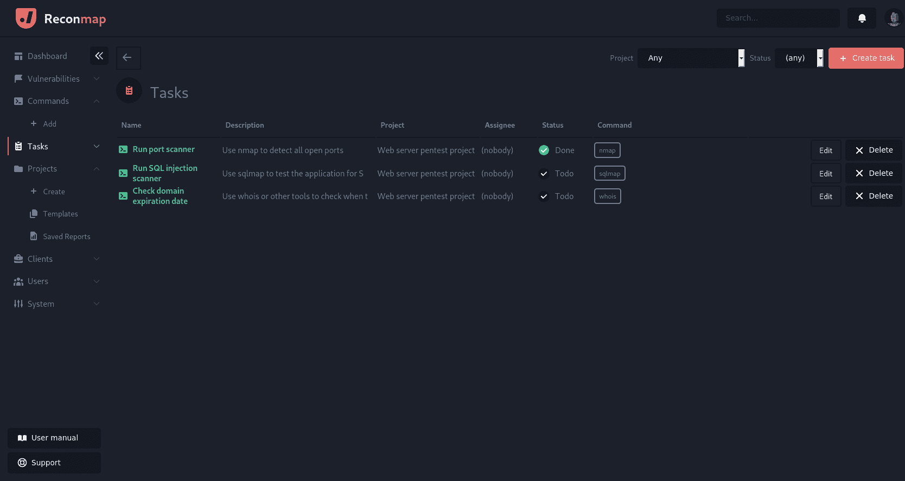
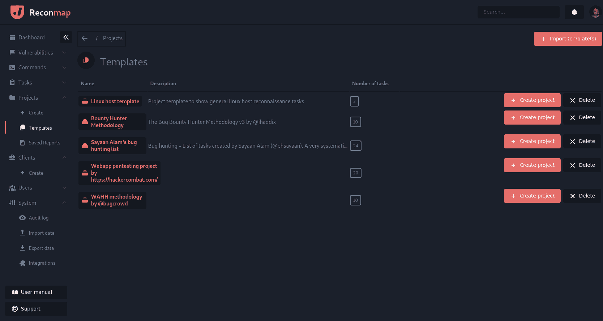
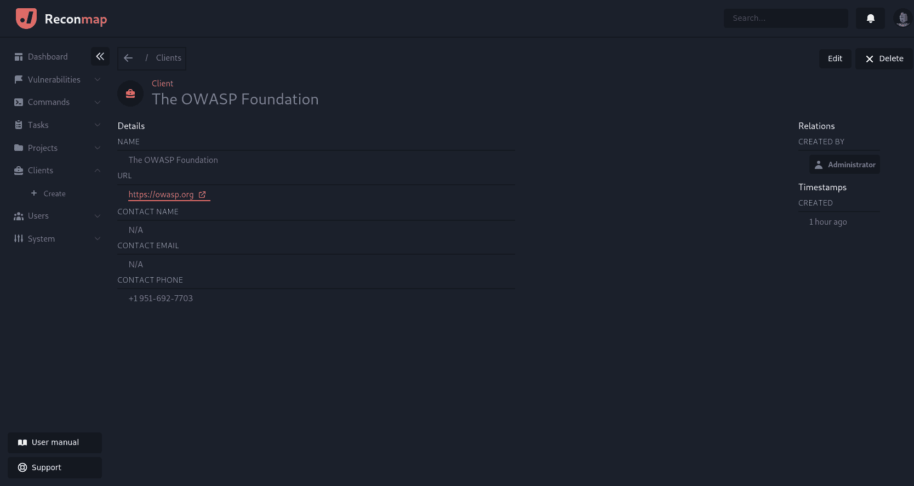
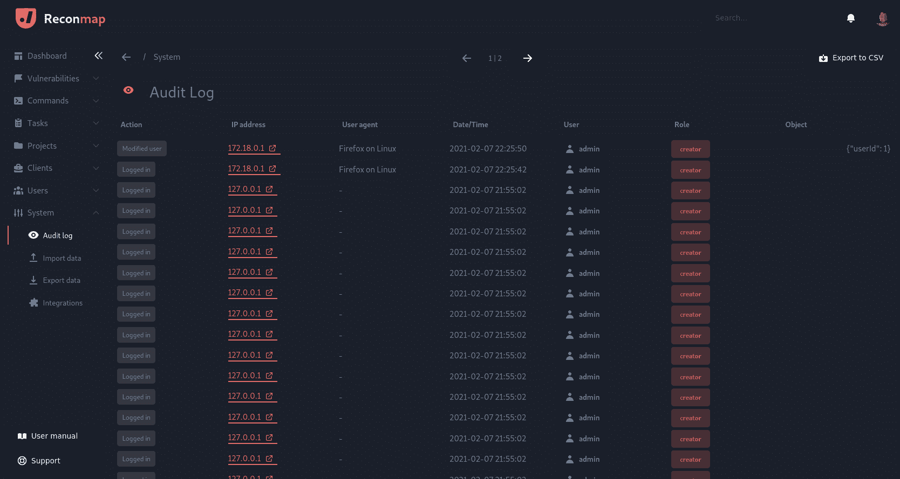
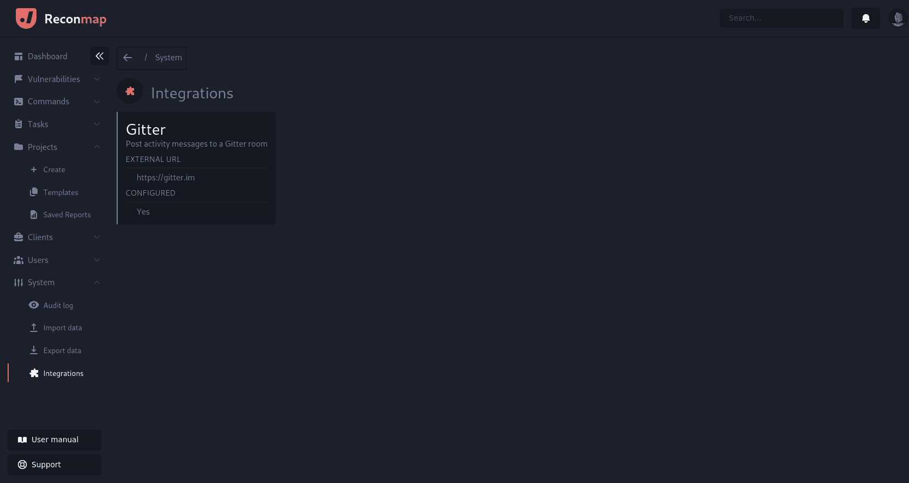

# VAPT(漏洞评估和渗透测试)自动化和报告平台

> 原文：<https://kalilinuxtutorials.com/reconmap/>

[ Automation And Reporting Platform")](https://1.bp.blogspot.com/-0AiT7AWJ1_8/YQEgWCWLiRI/AAAAAAAAKQo/ANvRspppOQ4G3IyL15qcTFA2qrWDdsSvQCLcBGAsYHQ/s1791/68747470733a2f2f7061737465616c6c2e6f72672f6d656469612f342f372f34373830633330373233663930636664353665633064303536353535623765362e706e67%2B%25281%2529.png)

**Reconmap** 是一个漏洞评估和渗透测试(VAPT)平台。它帮助软件工程师和 infosec 专业人员在安全项目上进行合作，从规划到实施和记录。该工具的目标是在尽可能短的时间内从侦察到报告。

**要求**

*   码头工人
*   复合坞站

**文档**

去 https://reconmap.org 找用户，管理员和开发者手册。

**开源漏洞评估和测试管理平台**

Reconmap 是一个面向信息安全专业人员的开源协作平台，允许他们为多个目标和客户规划、执行和记录渗透测试项目的所有阶段。

#漏洞管理#渗透测试#vapt

**历史**

有一个不成文的规定，说第三次手动做一件事之后，就应该*自动化*这件事。在完成第四或第五次五旬节报告后，我们得出了相同的结论。如果存在用于管理安全项目及其报告的工具，那么可以省去大量的样板文件和重复工作。我们在开源社区上寻找这样的工具，令我们惊讶的是，没有多少完整的 pentest 报告生成工具，具有我们所寻找的文档、支持和功能集的水平。

这就是我们的历史，我们生来就是为了用优雅的方式摆脱一些不必要的繁琐工作。我们希望为所有信息安全专业人士(个人或团队)提供一些价值，他们发现自己花在报告上的时间与实际安全工作上的时间一样多。

**关于名字**

我们选择重新映射名称有两个原因:

*   pentest 工作通常从侦察阶段开始(简称为 **recon** )，以所有漏洞、利用和建议的报告结束(T2 地图)。
*   Reconmap 的名称中包含单词 **nmap** ，这是对我们最喜欢的网络映射工具的致敬。

**开发**

**版本控制**

所有重新映射的代码都是公开的。以下是最重要的 Github 链接:

*   Github 组织

**仓库**

*   REST API–PHP 后端
*   网络客户端
*   CLI–Golang 命令行
*   网站–该网站

**架构**

重新映射架构非常简单。我们有一个用 PHP8.4 编写的 RESTful API 和一堆用 React 和 React native 编写的客户端。这些信息存储在 MySQL 8.0 服务器中，我们通过 Rabbitmq 进行后台处理和信息传递。

命令自动化是使用 Docker API 和 Golang 客户端完成的。

**路线图**

*   版本 1
*   版本 2
*   版本 3

**第一版**

**开发中**

| **发布日期** | 2020 年 4 月 |
| **任务** | github 上的视图 |

**特色**

*   漏洞管理
*   任务
*   项目
*   客户
*   模板
*   报告
*   REST API
*   Docker 部署选项

**第二版**

**策划**

| **发布日期** | 2020 年十月 |
| **任务** | [在 github 上查看](https://github.com/orgs/reconmap/projects/1) |

**特色**

*   代理(在不连接到终端的情况下运行自动化)
*   人工智能和机器学习。自动分配漏洞分值，检测风险等等。
*   更好的分析。
*   桌面应用程序(基于电子)
*   gRPC API
*   Kubernetes 部署选项

**第三版**

**策划**

| **发布日期** | 2021 年 2 月 |
| **任务** | [在 github 上查看](https://github.com/orgs/reconmap/projects/3) |

**特色**

*   报告引擎
*   与 Solr 集成以获得更强大的搜索功能
*   使用 Keycloak 进行身份管理
*   附加市场
*   (其他待定)

**故障排除**

错误发生的原因有很多。从环境差异到权限，再到软件版本的差异等等。在这里，您可以找到一些资源，可以帮助您解决有关重新映射的问题。如果这些笔记仍然让你面临一个问题，请联系 Gitter 上的我们，我们将很乐意帮助你。

**服务器日志**

服务器日志显示所有类型的警告和错误，应该是您在解决 Reconmap 问题时的第一站。它的位置是后端 API Docker 容器中的`**/var/log/nginx/error.log**`。

如果您想查看该文件的最后几行，请运行以下 Docker 命令:

**$ docker exec recon map-back end-API tail/var/log/nginx/error . log**

**示例输出**

#**0/var/www/web app/src/Services/config loader . PHP(12):JSON _ decode()
# 1/var/www/web app/public/index . PHP(26):recon map \ Services \ config loader->loadFromFile()
# 2 { main }
在/var/www/web app/src/Services/config loader . PHP 第 12 行抛出“从上游读取响应头时，客户端:172.19.0.1{ main }()/var/www/web app/public/index . PHP:0 PHP 消息:PHP 2。recon map \ Services \ config loader->loadFromFile()/var/www/web app/public/index . PHP:26 PHP 消息:PHP 3 .file _ get _ contents()/var/www/web app/src/Services/config loader . php:12 PHP 消息:PHP 致命错误:未捕获类型错误:json_decode()期望参数 1 为字符串，bool 在/var/www/web app/src/Services/config loader . PHP:12
堆栈跟踪:
# 0/var/www/web app/src/Services/config loader . PHP(12):JSON _ decode()
# 1/var/www/web/web**

**应用程序日志**

在服务器日志之后是应用程序日志。它的位置是`API_FOLDER/logs/application.log`，类似于服务器日志，在这里您可以看到由 API 或后端作业生成的警告和错误。

**示例输出**

**[2020-10-29 12:26:01]克朗。调试:正在运行队列处理器{ " class ":" recon map \ Tasks \ EmailTaskProcessor " }[]
[2020-10-29 12:26:01]cron。调试:运行队列处理器{ " class ":" recon map \ Tasks \ TaskResultProcessor " }[]
[2020-10-29 12:26:21]http。警告:过期令牌[][]
[2020-10-29 12:26:21]http。警告:过期令牌[][]
[2020-10-29 12:26:21]http。警告:过期令牌[] []**

**特性**

*   具有分析功能的简单仪表板
*   搜索所有数据(项目、漏洞、任务等)
*   用户和角色(包括客户对项目的访问)
*   双因素认证(2FA/MFA，TOPT)
*   安全命令数据库和自动化
*   漏洞数据库
*   任务管理器
*   项目和模板
*   客户管理
*   导出/导入数据
*   支持降价的笔记
*   项目、漏洞和任务的附件(文档、截图)
*   Rest API:轻松地将 Reconmap 与外部工具和脚本集成在一起。
*   自定义(白标)报告生成(HTML，PDF)
*   审计日志
*   可通过插件扩展
*   Web 和移动客户端
*   深色/浅色主题
*   免费和开源
*   还有更多！

**集成**

| 综合 | 统一资源定位器 |
| --- | --- |
| Acunetix | https://twitter.com/acunetix |
| Amap | https://www.thc.org/thc-amap/ |
| 蛛形纲动物 | https://twitter.com/ArachniScanner |
| arp 扫描 | http://linux.die.net/man/1/arp-scan |
| 牛肉 | https://twitter.com/beefproject |
| 布鲁特斯 | https://github.com/rajeshmajumdar/BruteXSS |
| 打嗝，打嗝 | https://twitter.com/Burp_Suite |
| 核心冲击，核心冲击 | https://twitter.com/CoreSecurity |
| 挖苦 |   |
| Dirb | http://tools.kali.org/web-applications/dirb |
| 目录搜索 |   |
| Dnsenum | https://github.com/fwaeytens/dnsenum |
| Dnsmap | https://github.com/makefu/dnsmap |
| Dnsrecon | https://github.com/darkoperator/dnsrecon |
| Dnswalk | https://github.com/leebaird/discover |
| 邪恶等级 | http://twitter.com/infobytesec |
| 凶猛的 | http://tools.kali.org/information-gathering/fierce |
| Fruitywifi | http://www.fruitywifi.com/index_eng.html |
| 文件传输协议（File Transfer Protocol 的缩写） |   |
| 幽灵 | http://www.aldeid.com/wiki/Goohost |
| hp3 | http://tools.kali.org/information-gathering/hping3 |
| 水螅 | https://www.thc.org/thc-hydra |
| 豁免帆布 | http://www.immunityinc.com/products/canvas/ |
| Ip360 |   |
| 琳妮丝 | https://cisofy.com/lynis/ |
| 列表 URL |   |
| 马耳他之鹰 | https://www.paterva.com/web6/products/maltego.php |
| masscan | https://twitter.com/ErrataRob |
| 水母体 | http://h.foofus.net/?page_id=51 |
| Metagoofil | https://code.google.com/p/metagoofil/downloads/list |
| Metasploit | https://twitter.com/metasploit |
| Ndiff | https://nmap.org/ndiff/ |
| 涅索斯 | https://twitter.com/tenablesecurity |
| 网猫 | http://netcat.sourceforge.net/ |
| 网络发现 |   |
| 网络火花 | https://twitter.com/Netsparker |
| 网络火花云 |   |
| Nexpose，Nexpose 企业 | https://twitter.com/rapid7 |
| Nikto | https://cirt.net/Nikto2 |
| Nmap | https://twitter.com/nmap |
| Openvas | https://twitter.com/openvas |
| pasteamalyzer | https://github.com/Ezequieltbh/pasteAnalyzer |
| 偷窥狂 | https://bitbucket.org/LaNMaSteR53/peepingtom/ |
| 砰 |   |
| 保法止 | http://packetstormsecurity.com/files/14232/propecia.c.html |
| 质量卫士 | https://www.qualys.com/ |
| 侦察 | https://hackertarget.com/recon-ng-tutorial/ |
| 视网膜 | http://www.beyondtrust.com/Products/RetinaNetworkSecurityScanner/ |
| 翻转装置 | http://sourceforge.net/projects/complemento/files/ |
| 哨兵 |   |
| 肖丹 | https://twitter.com/shodanhq |
| 鲣鱼 | https://code.google.com/p/skipfish/ |
| sqlcmap | https://twitter.com/sqlmap |
| SSHdefaultscan | https://github.com/atarantini/sshdefaultscan |
| SSLcheck |   |
| 分析 | https://github.com/nabla-c0d3/sslyze |
| 子列表 3r | https://github.com/aboul3la/Sublist3r |
| 用于远程联接服务的标准协议或者实现此协议的软件(可为动词) |   |
| Theharvester | https://github.com/laramies/theHarvester |
| Traceroute |   |
| W3af 的 | https://twitter.com/w3af |
| 麋鹿 | http://wapiti.sourceforge.net/ |
| 巫术崇拜者 |   |
| 网络模糊器 | http://gunzip.altervista.org/g.php?f=projects#webfuzzer |
| 网络检查 | https://resources.infosecinstitute.com/webinspect/#gref |
| Wfuzz | https://wfuzz.readthedocs.io/en/latest/index.html |
| whois |   |
| WPScan | https://wpscan.org/ |
| Xsssniper | https://github.com/gbrindisi/xsssniper |
| X1，Onapsis | https://twitter.com/onapsis |
| 活力 | https://twitter.com/zaproxy |

**演示**

演示服务器有 4 个用户来显示不同的权限级别。这些用户的凭据是:

| 用户名 | 密码 | 作用 |
| --- | --- | --- |
| 管理 | admin123 | 管理人员 |
| 快点，快点 | 在 123 个中 | 超级用户 |
| 用户 | 用户 123 | 用户 |
| 顾客 | cust123 | 客户 |

**看着它工作**

**Web 客户端演示**

如果你更喜欢看**重新映射**演示，点击下面的播放按钮。

[https://www.youtube.com/embed/7gOcDTzvirg?feature=oembed](https://www.youtube.com/embed/7gOcDTzvirg?feature=oembed)

**截图**

**漏洞**

**任务**

**项目模板**

**客户端表单**

**审计日志**

**集成**

**如何通过简单的两步在本地跑步**

*   首先你需要启动你的 docker 容器

**$ docker-合成 up -d**

*   之后，在 http://localhost:3001 打开您的浏览器

[**Download**](https://github.com/reconmap/reconmap)