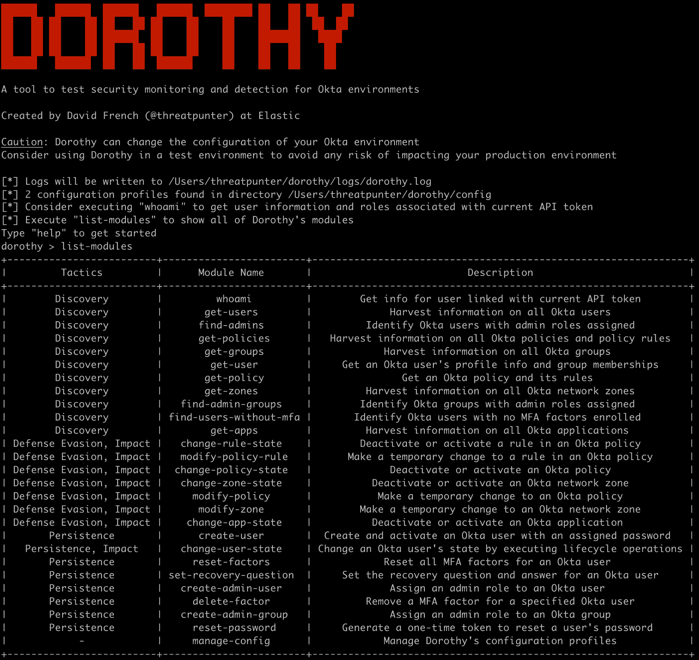
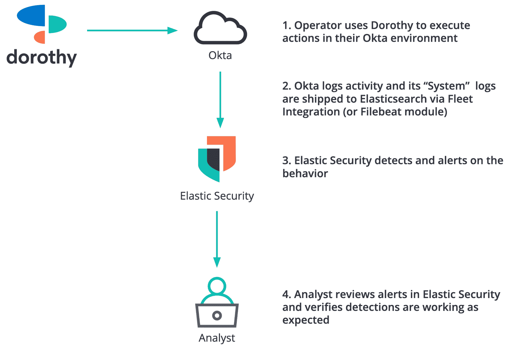
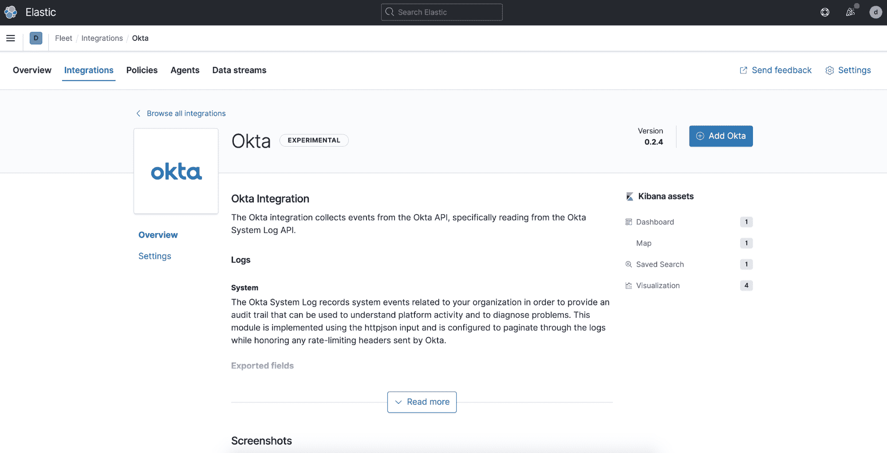
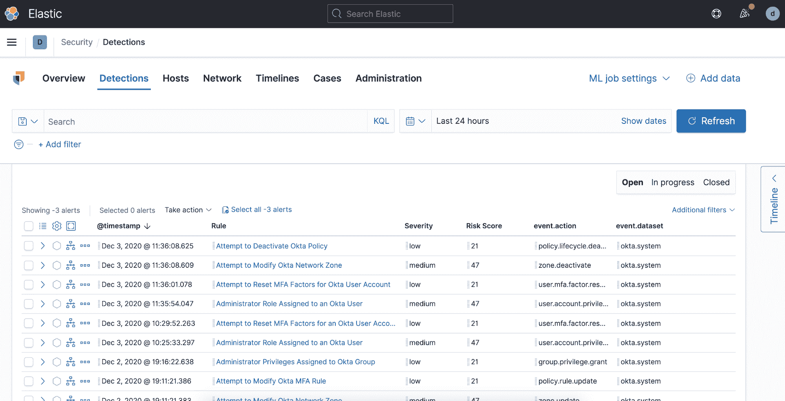
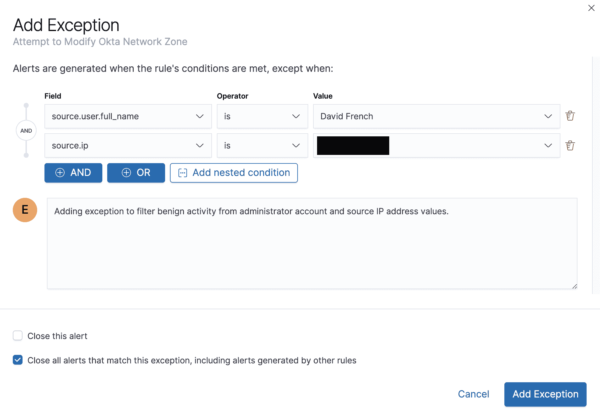

# Dorothy:测试 Okta 环境安全监控和检测的工具

> 原文：<https://kalilinuxtutorials.com/dorothy/>

**Dorothy** 是一款帮助安全团队测试其 Okta 环境监控和检测能力的工具。Dorothy 有几个模块来模拟攻击者在 Okta 环境中操作时可能采取的操作，以及安全团队应该能够审计的操作。这些模块被映射到相关的米特 ATT & CK 战术，如坚持，防御规避和发现。

在这篇博文或这个演示中，了解更多关于桃乐茜的信息以及如何开始使用它。

**使用 Dorothy 和 Elastic Security 测试您的 Okta 能见度和探测能力**

当组织中的利益相关者接触时，很少有安全团队能够自信地证明日志记录和警报功能正在按预期工作。对于身份和访问管理、用户工作效率和文件存储等使用情形，组织变得更加分散和依赖云产品。与此同时，对手已经扩展了他们在云环境中的操作能力。安全团队能够监控这些系统是否被滥用，以保护其组织的数据免受攻击，这一点至关重要。

Dorothy 是一个免费的开放工具，可以帮助安全团队测试 Okta 单点登录(SSO)环境的可见性、监控和检测能力。我们将展示如何使用 Dorothy 来执行测试，以及如何使用我们的免费和开放的检测规则，使用弹性安全来警告相关和可疑的行为。

**什么是 Okta SSO？**

对于那些不熟悉的人，Okta SSO 是一个基于云的身份管理解决方案，允许用户使用单个用户帐户对其组织内的各种系统和应用程序进行身份验证。告知最终用户他们只需记住*一个*用户名和密码，而不是十个或更多，这降低了他们养成不良密码习惯的风险，并使系统管理员能够实施更强有力的密码策略。此外，可以在 Okta 中配置多因素身份验证(MFA)策略，这提高了攻击者的准入门槛。当许多攻击者发现 MFA 在其目标的网络或用户帐户中被强制执行时，他们会继续寻找更容易的目标。

虽然 SSO 解决方案可以为组织提供便捷的用户体验并降低网络安全风险，但这些集中式系统为许多系统和应用程序提供了一种万能钥匙，并且通常是攻击者的诱人目标。安全团队了解 Okta 环境中的正常行为非常重要，这样他们可以更容易地识别可疑活动。

**认识多萝西**

Dorothy 有 25 个以上的模块来模拟攻击者在 Okta 环境中操作时可能采取的行动以及安全团队应该监控、检测和警告的行为。所有模块都映射到相关的 MITRE ATT & CK 战术，如坚持，防御闪避，发现，和冲击。

Dorothy 的创建是为了帮助防御者测试他们的安全可见性和控制，并不提供任何模块来获得初始访问权限或提升 Okta 环境中的权限。要使用 Dorothy 执行操作，需要一个有效的 Okta API 令牌，该令牌与分配了一个或多个管理员角色的用户相关联。

为菜单和模块之间的导航提供了带有上下文帮助的用户友好的外壳界面，帮助引导用户通过模拟的入侵者场景。其他功能包括管理与单个 Okta 环境的连接的配置文件，以及详细的日志记录，可以选择将事件索引到 Elasticsearch 中，以提供使用 Dorothy 执行的操作的审计跟踪。

**使用 Dorothy 在 Okta 环境中执行动作**

在这一节中，我们将演示如何在 Okta 环境中执行 Dorothy 的一些模块。下面的图 2 显示了弹性安全用户的典型工作流。在这次演示之后，您应该可以轻松地前往 Dorothy 的 GitHub 资源库，并遵循项目 wiki 中的“入门”步骤。

" T0 "是什么意思？

让我们站在攻击者的角度，想想他们在 Okta 环境中可能会采取什么行动。作为一个有初步立足点的攻击者，我的第一个问题是关于我拥有 API 令牌的用户。让我们通过 Dorothy 的`whoami`命令来模拟这个攻击者动作，查看相关用户的登录 ID、上次登录时间和上次密码更改。

现在我们对我们控制的用户帐户有了更好的了解，我们将列出 Dorothy 的模块，并在进行下一步之前查看帮助菜单。

**发现**

Dorothy 有几个发现模块，我们可以用它们来模拟攻击者可能获得的关于 Okta 环境的知识。在获得初始访问权限后，对手通常会花时间了解环境的详细信息，这些信息对于他们在计划下一步之前确定自己的方向至关重要。

让我们通过收集以下信息，尝试获得一些关于 Okta 环境的知识:

*   用户–在选择控制、修改或保留哪些帐户以避免被检测时，每个用户的姓名、登录 id、电子邮件地址、密码恢复问题和状态的列表将非常有用
*   策略–Okta 策略用于控制安全元素，包括密码复杂性和 MFA 要求，以及允许用户使用的设备。如果我们决定削弱目标的安全配置的某些组件，这些知识将会派上用场
*   区域–网络区域可用于定义 Okta 环境的安全边界。与策略类似，此信息有助于我们了解环境的配置方式，并在实施任何允许或阻止流量的更改之前做出明智的决策

最后，我们将执行`find-admins`模块来枚举每个 Okta 用户的角色，并确定哪些用户被分配了一个或多个管理员角色。

其他有助于信息收集任务的发现模块包括`**find-users-without-mfa**`用于查找仅使用用户名和密码进行身份验证的用户，以及`**find-admin-groups**`用于识别分配了一个或多个管理员角色的用户组。

**坚持**

一旦攻击者获得了对其目标环境的访问权，他们可能会寻找机会建立持久性。持久性有助于攻击者在失去最初立足点的情况下保持访问。当安全团队检测到他们的存在并禁用攻击者正在使用的受损用户帐户或在网络边界阻止他们的通信时，对手可能会失去访问权的一个常见示例。

拥有一个或多个持久性机制意味着，如果攻击者的一条路径被阻塞或中断，攻击者将能够继续他们的任务。在这个例子中，我们将使用 Dorothy 的`create-user`和`create-admin-user`模块来创建一个 Okta 用户，并为这个新用户分配一个管理员角色。接下来，我们将为另一个 Okta 用户创建一个恢复问题，这样我们就可以完成为该用户重置密码的过程，并作为另一种持久化方法来控制他们的帐户。

Dorothy 有其他持久性模块来帮助我们了解攻击者可能采取的步骤，例如`**reset-factors**`删除用户注册的身份验证因素，以及`**reset-password**`生成一次性链接来重置用户的密码。

**防御闪避**

对手将试图执行防御规避技术，以避免在整个任务中被发现。例如，攻击者可能试图禁用安全日志记录，以使安全团队对他们的恶意行为视而不见。

至此，我们已经了解了环境，并配置了几种形式的持久性。让我们执行 Dorothy 的`**change-policy-state**`和`**change-zone-state**`模块来削弱“目标”的安全控制。

其他以防御规避为主题的模块可以激活、停用或修改其他 Okta 对象，如应用程序和单个策略规则。

我们将在这里停止虚构的攻击场景，但是如果您想了解 Dorothy 还能做什么，请前往 GitHub 库。

**利用弹性安全检测可疑行为**

在本节中，我们将演示 Okta 的系统日志如何支持我们的免费检测规则来监视可疑行为并向团队发出警报。

Okta 的系统日志提供了在组织环境中观察到的活动的审计跟踪。这包括用户登录或更改密码、管理员更改配置等活动。该数据源对于安全监控、调查、合规性和响应活动非常有用。

**用车队摄取 Okta 系统日志**

Fleet 在 Kibana 中提供了一个基于 web 的 UI，用于添加和管理流行服务和平台的集成，包括 Okta、AWS、Azure、Google Cloud Platform、Google Workspace 等。Fleet 的 Okta 集成提供了一种简单的方法来摄取和规范化 Okta 的系统日志事件。

Okta Filebeat 模块也适用于已经使用 Beats 的团队。

**使用弹性安全的免费检测规则检测可疑行为**

弹性安全保护团队研究对手的贸易手段，以便开发针对终端、云和网络平台的检测和防范措施。我们的检测规则是免费的，是与更广泛的安全社区一起开放开发的。

我们的 Okta 规则利用索引化的系统日志事件，这些事件被规范化为弹性通用模式(ECS ),并向安全团队发出相关和可疑行为的警报。

下面的图 8 显示了在 Dorothy 被用来模拟攻击者在 Okta 环境中操作时可能采取的行动之后，弹性安全中的一些警报。

那些讨厌的假阳性怎么办？向弹性安全性中的规则添加例外来过滤常规和预期行为非常简单。此功能包括一个关闭所有匹配异常的警报的选项，以节省您的时间

**和多萝西一起测量你的云量**

Okta 和其他身份管理解决方案经常成为对手的攻击目标，但通常监控不力。我们创建 Dorothy 作为一种工具，帮助安全团队了解对手如何在 Okta 环境中运作，进一步帮助他们测试我们免费开放的检测规则的可见性和有效性。

您可以通过访问该项目的 wiki 来了解如何开始使用 Dorothy。如果你还不是一个弹性安全用户，你可以今天注册一个免费的云试用，并查看我们的免费检测规则。

[**Download**](https://github.com/elastic/dorothy)