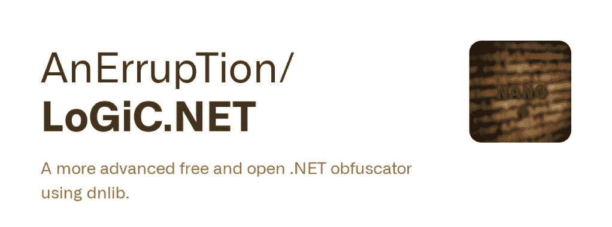
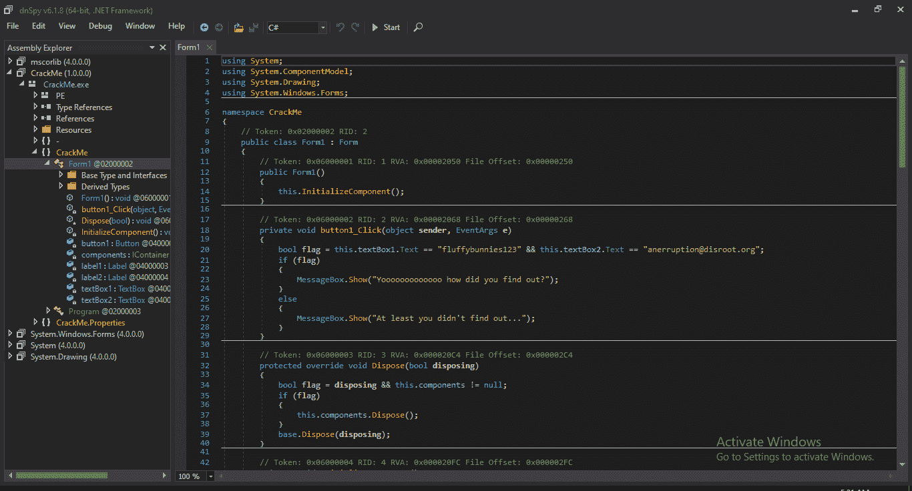
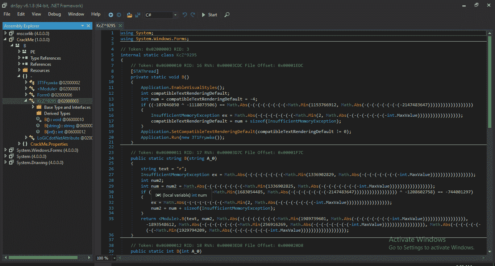

# LoGiC.NET:更先进的自由和开放。使用 Dnlib 的. NET 混淆器

> 原文：<https://kalilinuxtutorials.com/logic-net/>

LoGiC.NET 是一个免费的开源软件。NET obfuscator，它使用 dnlib 来帮助那些想了解模糊处理如何处理比 Goldfuscator 更复杂的模糊处理的人。

**混淆前**

**混淆后**

**依赖关系**

dnlib v3.3.2:恢复 NuGet 包，它就可以工作了(如果还没有的话)。SharpConfigParser:https://github.com/AnErrupTion/LoGiC.NET/raw/master/sharpconfigparser . dll

**当前特征**

*   重命名方法、参数、属性、字段和事件。
*   添加代理呼叫。
*   加密字符串。
*   编码。
*   添加垃圾方法。
*   防止应用程序篡改。
*   添加控制流。
*   还有更多！

[**Download**](https://github.com/AnErrupTion/LoGiC.NET)