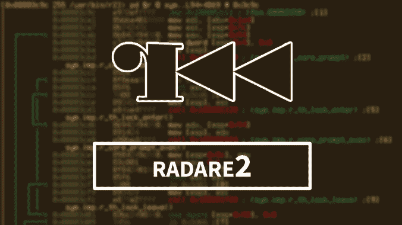

# Radare2:类似 UNIX 的逆向工程框架和命令行工具集

> 原文：<https://kalilinuxtutorials.com/radare2/>

**radar 2**是 Radare 的从头重写。它提供了一套库、工具和插件来简化逆向工程任务。

radare 项目最初是一个简单的命令行十六进制编辑器，专注于取证，随着时间的推移，添加了更多的功能来支持可脚本化的命令行低级工具，以便从本地硬盘驱动器、内核内存、程序、远程 gdb 服务器进行编辑，并能够分析、仿真、调试、修改和反汇编任何二进制文件。

*   从 **Git** 安装 r2(克隆 repo 并运行`**sys/install.sh**`)或使用`**pip install r2env**`
*   阅读官方雷达 2 书
*   COMMUNITY.md 参与
*   CONTRIBUTING.md 一般规则
*   DEVELOPERS.md 根据您的需求改进 r2
*   SECURITY.md 上的漏洞报告说明
*   USAGE.md 进行介绍性会话
*   INSTALL.md 说明

**git 克隆 https://github.com/radareorg/radare2
radar E2/sys/install . sh**

**插件**

您需要的大多数插件都可以在 r2 的安装中找到，但是您可以在 r2pm 包管理器中找到更多。

**r2pm update #初始化并更新软件包数据库
r2pm install [pkg] #安装软件包**

一些安装最多的软件包是:

*   原生 ghidra 反编译器插件:`**pdg**`命令
*   基于 esil 和 z3 的 esilsolve 符号执行 r2 插件
*   基于 js 写的 r2 的 r2dec 反编译器`**pdd**`
*   r 芙烈达弗里达 io 插件`**r2 frida://0**`
*   iaito 官方图形界面(Qt)

**操作系统**

Windows(从 XP 开始)、Linux、Darwin、GNU/Hurd、苹果的{Mac、I、iPad、watch}OS、Android[蜻蜓、Net、免费、开放] BSD、Z/OS、QNX、Solaris、俳句、FirefoxOS。

**建筑**

i386、x86-64、ARM、MIPS、PowerPC、SPARC、RISC-V、SH、m68k、m680x、AVR、XAP、S390、xcore、CR16、HPPA、ARC、Blackfin、Z80、H8/300、V810、V850、CRIS、XAP、PIC、LM32、8051、6502、i4004、i8080、Propeller、tricore、CHIP-8、LH5801、T8200、GameBoy、SNES、SPC700、MSP430、xtender

**文件格式**

ELF、Mach-O、Fatmach-O、PE、PE+、MZ、COFF、OMF、TE、XBE、BIOS/UEFI、Dyldcache、DEX、ART、CGC、Java 类、Android boot image、Plan9 可执行文件、ZIMG、MBN/SBL bootloader、ELF coredump、MDMP (Windows minidump)、WASM (WebAssembly binary)、Commodore VICE emulator、QNX、WAD、OFF、Game Boy (Advance)、任天堂 DS ROMs 和任天堂 3DS 公司、各种文件系统。

[**Download**](https://github.com/radareorg/radare2)